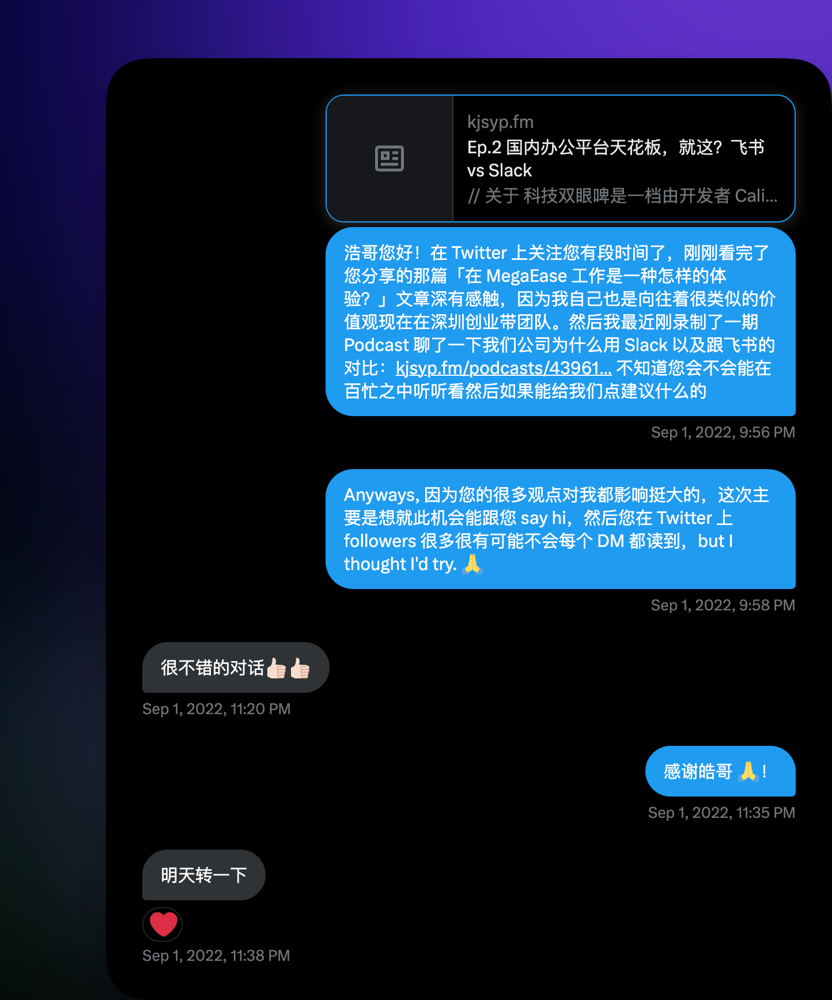
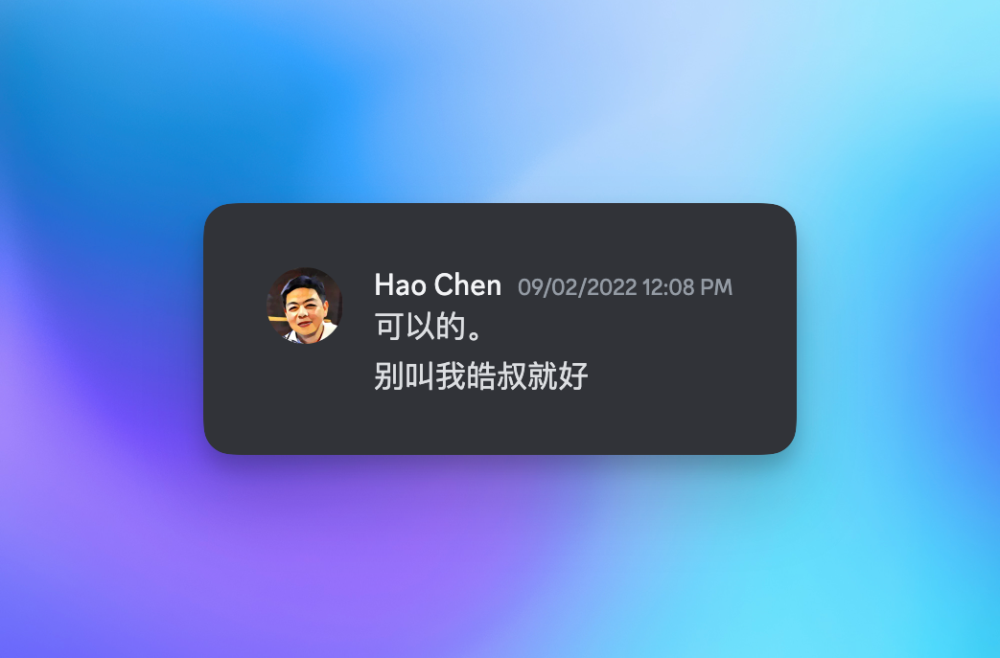
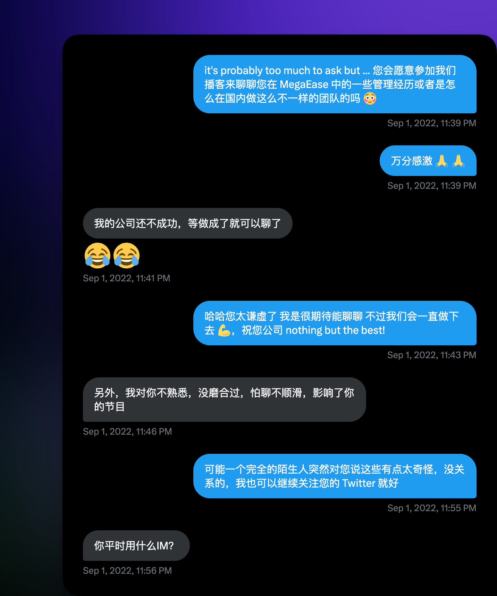
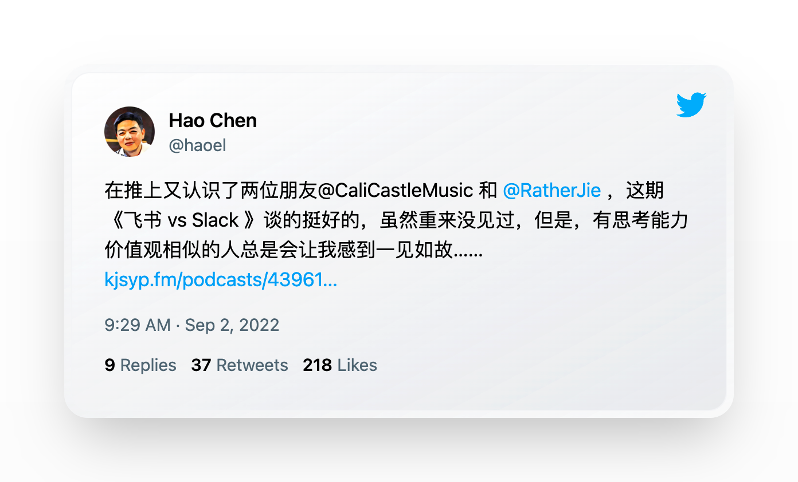
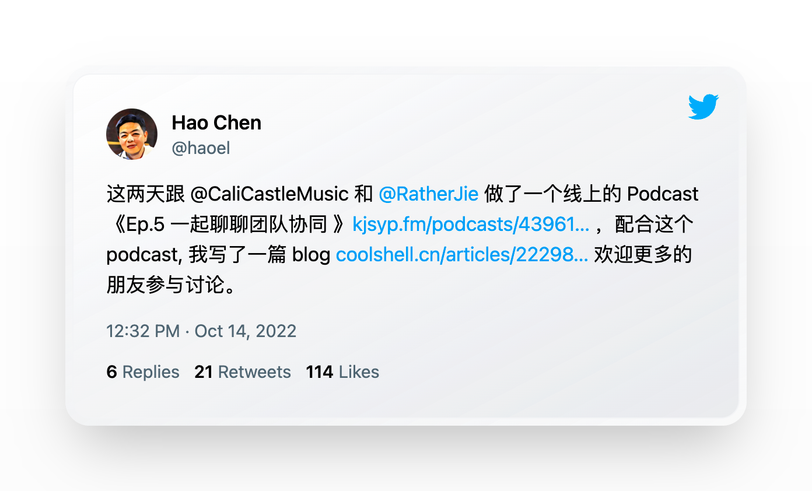
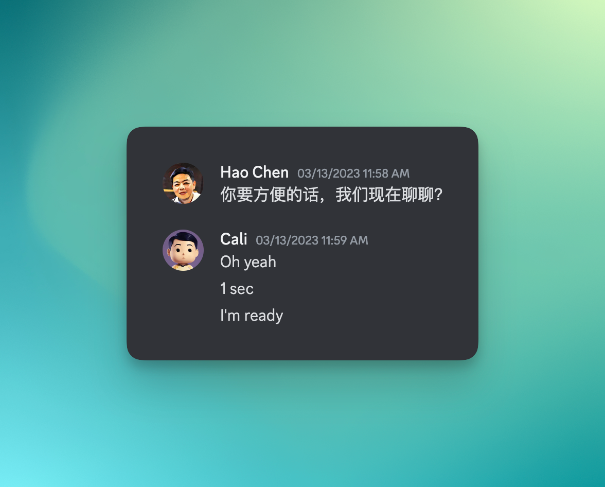
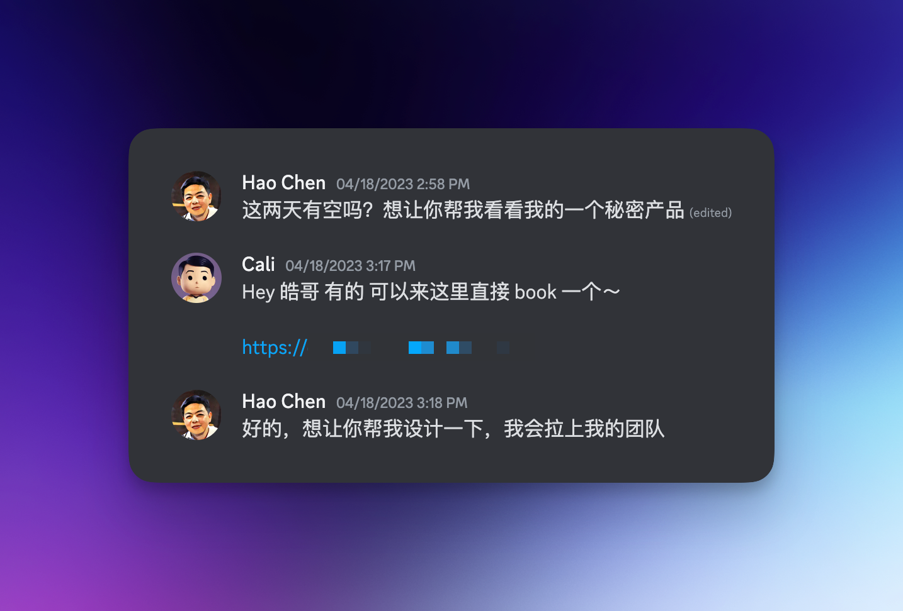
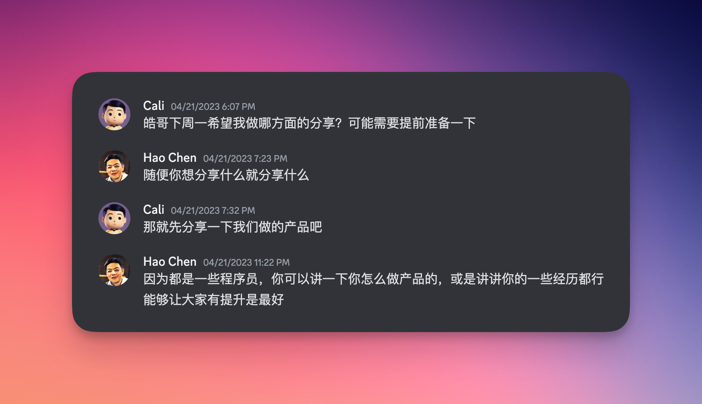
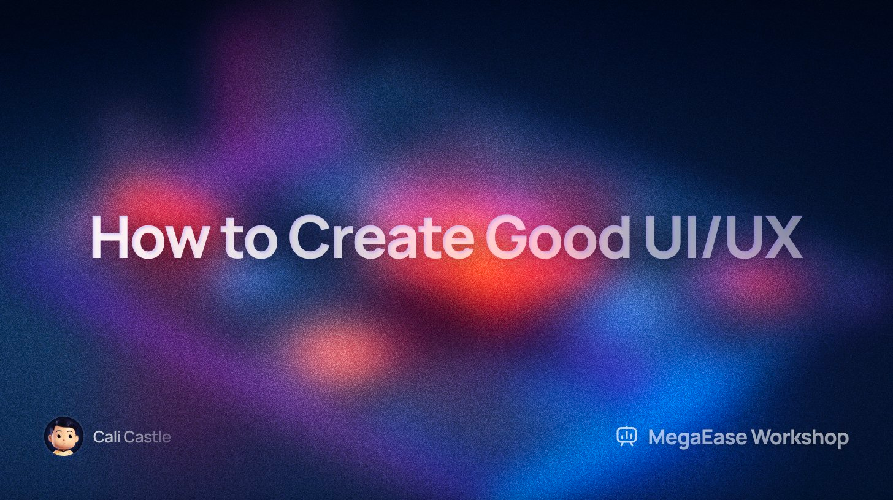
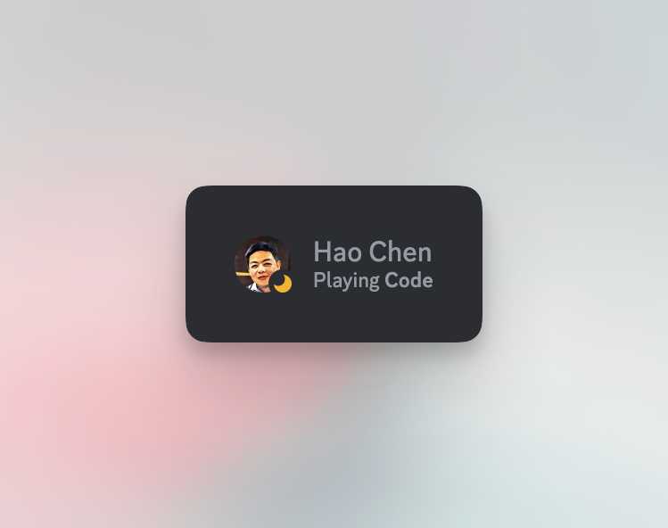

# 陈皓：以磊落之心，点亮科技之光

> 陈皓，他直言不讳，他热爱分享，他痴迷技术，他保持原则。他曾是我的导师，也是我的朋友。如今，他离开了这个世界，但他没有离开我们。

当我昨天在 [Twitter](https://twitter.com/ghosTM55/status/1657946836643241985?s=20) 上看到 Thomas 和 Kevin 确定陈皓逝世的推文时，我整个人进入了惊慌失措模式，拒绝接受这个事实。我低下了头来，在电脑前的我第一次这么沮丧，手撑着额头，稍微有些颤抖。

我从得知了这条消息以后，一天都打不起精神来，感觉失去了挚友，一切都来的太过突然。

这其实是我第一次写博客，虽然第一次就是一篇非常严肃和沉重的主题，但是我还是决定用第一篇文章来致敬他。

很合适也很伤感。

## 初识

陈皓，左耳朵耗子，我相信这个名字对于大部份搞技术的人来说并不陌生。

但可能跟绝大多数人不太一样，我当时没有早早地悉知他在技术届的影响，这可能跟我一直学习和搜索的内容都是英文和外国人为主的原因有关，一直以来对国内的圈子还不太了解。

我 2020 年从美国回来到国内以后，我开始在 Twitter 上逛起了中文圈，并且很快了解到了他，一言不合地按了关注按钮，然后才慢慢知道他的履历，看了他的 [coolshell 博客](https://coolshell.cn/)。 ”哇，这真是一位技术大牛，很谦虚又很有想法，很有原则“，我内心由衷的感叹到。

快进到 2022 年 9 月，当时我刚刚开始创业了 10 个月，刚刚开始尝试将自己的想法录制成播客作为媒介跟大家分享。我那会儿做播客的心态就是，跟志同道合的人们产生共鸣。在前几集录制完成后，我希望能够推广一下自己，想着如果能获得业内 KOL 人士的帮助的话自然便会助力我的播客推广。

9 月 1 号那晚，我不要脸地尝试给几个我认为是大佬的 Twitter 发送了私信，并没有抱任何希望。我觉得试一下吧，无论结果如何，都要比不尝试的好。

谁曾想，2 个多小时过后，我的 Twitter 应用迎来了罕见的通知。

我记得当时我是不敢相信自己的眼睛，陈皓回复我了？！而且还被认可了？（是的，第一条信息开头我就打错了“皓“字）

我脑海里无数个 wtf 飞过。

得到所崇拜的人给予认可，可谓是我的人生目标。

我跟 Kevin 一样，在 Kevin [写的纪念文章](https://blog.kevinzhow.com/posts/in-memory-of-haoel/zh)中说到称呼陈皓为“皓哥”，其实我也是，称呼他为哥我觉得挺亲切的，也不希望一上来就叫”叔“，感觉这字总会附带一丝疏离感。

欣喜若狂的我还在消化、接受事实中，除了发一百条谢谢，我也不知道能如何更贴切地表达我的感动了。

我还厚着脸皮问皓哥愿不愿意做客一期加入我们一起聊。

从皓哥的回复“我的公司还不成功，等做成了就可以聊了”的字里行间都流露出着他的谦卑与不自大。

其实也是，素不相识的人上来就邀请做客，我也是有点过分了，但皓哥的回复出发点竟然是“怕影响了我的节目”，我是非常愧疚发出个问题的。

## 成为好友

也正是如此，我们之间的友谊才刚开始建立起来，从此以后在 Discord 上会时不时聊聊天。

第二天一大早，果真，皓哥转发了我们我们的播客，还说到“虽然从来没见过，但是，有思考能力价值观相似的人总是会让我感到一见如故”，我热泪盈眶。

的确是这样的，很多人认为皓哥的观点和看法很“犀利”，但在我看来这些所谓“犀利”的观点往往是塑造自我价值的利器。我自己从皓哥身上也学到很多东西，比如自己要相信自己所做的事情，自我信念很重要。

通过皓哥发推的推广，成功让我体验了一番当（1 千粉的）“明星”是什么滋味，头一回看到通知 tab 上面的蓝色数字变成 20+，所以你可以说之所以我现在被更多的人所知道，皓哥在这里的确有着很大的功劳。

经过一个月的磨合，我跟皓哥沟通次数越来越多，我们慢慢的成为了生活中的朋友，我们见面也都发生在 Google Meet 上。我还记得当时要跟皓哥线上见面前的心情是非常激动的，没想到见面后开始聊了一会儿发现，他是那么的接地气。

快进一个月，我一开始的梦想实现了——皓哥做客我们的「科技双眼啤」播客，并且一起围绕团队协同与企业文化的话题展开了有意思的想法、观点碰撞。在录制完成后第二天，皓哥在 Discord 上跟我说，他同时[写好了一篇博客](https://coolshell.cn/articles/22298.html)，准备等我剪完了音频以后一起发布出去。

皓哥跟我们聊的基本上全部观点和价值观，也都是我所信仰的价值观，完完全全的契合了。

从畸形的国内公司开会文化，到国内“协同” IM 软件都是围绕着人而不是话题，企业文化喜欢“监控员工”等等观点我也是深有感触的。我们所聊的内容也都是为我在创造佐玩公司文化的时候，形成了一盏灯塔。我会时不时的停下来，思考一下，公司这么运作是不是应该的，对员工是不是公平的，怎样优化管理与协同方式才能最大化我们每个人的满意度和团队士气呢？

再后来一个月后，根据我读了很多次皓哥的博客文章「[MegaEase 的远程工作文化](https://coolshell.cn/articles/20765.html)」中写到的总结和管理方法，以及 [Rework 这本书](https://basecamp.com/books/rework)的影响下，我最终做出决定让公司也全面地推向了远程制度。

从这之后，我跟皓哥也会经常聊创业、公司、团队管理、产品、技术等各种话题。每次跟他的聊天都给我同一种感觉：亲切，耿直。我也从他创业做 MegaEase 以来的点点滴滴（比如招聘怎么挑选人才，有哪些关键因素需要把关等等）中学到了很多特别多的干货。

其实给我感触最深的是，我之前通过国内的应试教育下学到的东西少之甚少，真正在积攒知识的时期一个是在创业团队的工作职场中，一个是打开社交圈与更多优秀的人聊天中。

我也给皓哥看了我们正在开发还没有上线的产品，他非常喜欢，我还记得他说我们的设计是他见过最好看，最有外国范儿的，能得到他的高度赞扬，是我能得到最高兴的评价了。

## 最后的互动

后来，让我备感荣幸的一件事发生了，皓哥想让我帮忙看看他们在秘密开发的产品，并且愿意让我来提供设计相关的建议。我觉得，这比任何口头上的认可都更要有份量。

在我跟他和团队线上讨论完以后，我真的非常的兴奋，我心想：“我终于可以利用自己擅长的力所能及来回报皓哥了”，我也是全心全意地准备好来帮皓哥做些什么。

然而，很遗憾，很痛心，前段时间公司业务比较繁忙，我还没有来得及开始处理产品设计，他就离开了这个世界。我还没来得及贡献一己之力，他就离开了这个世界。

我备感愧疚。

在上次线上讨论的结尾，皓哥问我愿不愿意下周一在他公司 MegaEase 的每周分享会上，分享一下我的东西，比如我是如何做产品的，讲讲我的经历或者设计方面如何提升。

我在摄像头前显得很稳重，回答到：“好啊，没问题”。

其实我的内心是：“百分之百！我能被邀请来做分享是我的荣幸，太感谢了！”

然后因为五一节即将到来，我们推迟了分享会到五一节后。

快进到 5 月 8 号晚上 8 点，我把准备好的幻灯片打开，非常紧张地加入了分享会的腾讯会议。

还算圆满，[我分享了很多设计小技巧](https://twitter.com/thecalicastle/status/1655421012530569216?s=20)，希望能够帮助到更多的人。

也正是皓哥帮我提供了这样一个分享会的平台，让我坚信我所做的事情是有价值的。

## 反思

读到皓哥去世的新闻之后，我不禁进行自我反思。

假如我第二天不在了，会怎么样？

当然，我肯定不能跟皓哥的贡献和影响力去比，如果我以后能达到他的一百分之一，我都知足了。我顶多在 Twitter 上会变成大部份人看到的过客。

但其实，最重要的是那些爱我、在乎我的人。

我的老婆，我即将出生的孩子，我的父母，我的家人，我的同事，我的挚友…

如果我不在了，对于他们的打击会是无比巨大的。

那么也正因为如此，我必须要竭尽全力让自己避免这种情况发生，那么我对自己的健康把控，不就是对爱我在乎我的人最大的安慰和承诺么？

我希望自己能够留下足够份量的遗产，那么就得确保这条路我能一直走下去抵达终点。

钱，产品，AI 颠覆与否，这都不是最重要的。

最重要的是你自己。

所以我会跟自己说，请为了自己和你关心的人活着，不要为了这世上的噪音活着。

## 结尾

此时此刻，在我翻阅所有 Discord 聊天记录的时候，他的状态仍然是在“玩 VS Code”。也许他逝世前最后开着的 app 就是 VS Code，但无论如何我相信不管是谁回首他的人生，都会从中获取启发和知识。

他以磊落的心，点亮了科技的光。他的故事，他的精神，将永远在我们心中闪耀，感谢他为我们带来的灵感和力量。

我希望能从他身上学习，以他的精神为指引，共同创造一个更美好的科技未来。

我相信陈皓影响了千千万万的人，我只是那其中一个。

谢谢您，皓哥。

希望天堂上没有代码，在另一个世界，不需要创业。

您可以好好休息了，我也会不断地去发扬您的热爱分享精神。

芝兰生于深谷，不以无人而不芳。

君子修身养德，不以穷困而改志。

您是我的榜样。
