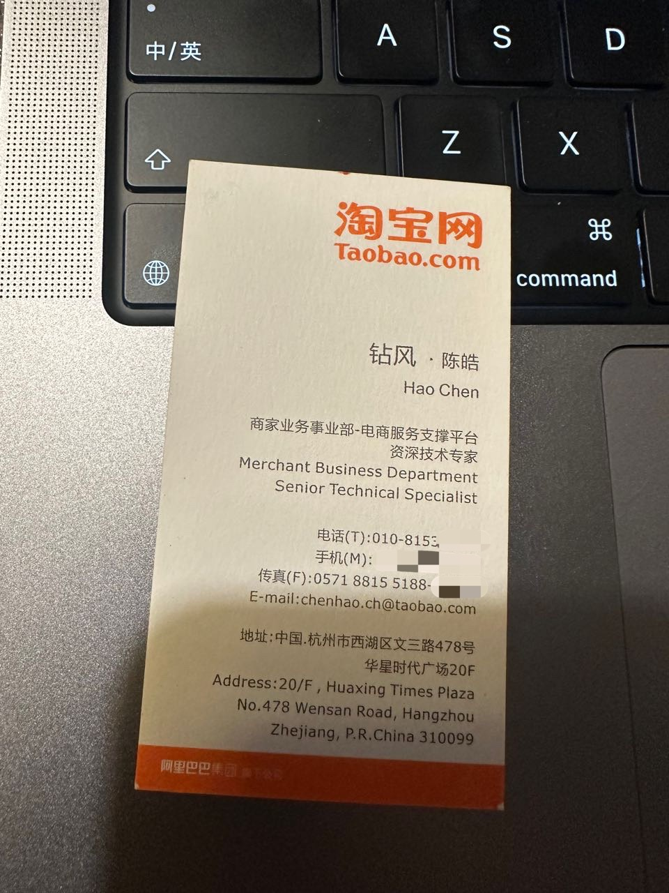

# 纪念左耳朵耗子

工作之后基本没再写过公开的文字了。最近得知陈皓先生的消息，看到很多同事、大V也都在写文章或者朋友圈纪念，有幸和陈皓先生有过一面之缘的我，也一下子被拉回到了那天的记忆当中...

## 奇妙的缘分

那是 2013 年初秋的某天，在北京阿里巴巴公司的办公场所里，我穿着绿色的格子衬衫，被 HR 领着来到一个类似休闲吧的角落。HR 说我的二面面试官还在上一轮面试中，让我在此稍等。我环顾四周，突然看到一个熟悉又陌生的面孔，左耳朵耗子，正在那里面试别人。熟悉是因为他博客和微博上好像有他的照片，他的博客我可太熟了，陌生是因为没见过真人。我心里想：『OMG，那是大 V 左耳朵耗子，该不会他是我的二面面试官吧，我完蛋了...』。

不出我所料，很快我就被 HR 领到了耗子叔面前...

我：我认识你，你是左耳朵耗子，我一直看你的博客和微博，今天终于见到真人了 :) 没想到您来阿里了。

耗子叔：一直看我微博不知道我来阿里了？

我：...

就这样本来想刷一下印象分的开场结果弄巧成拙了...

## 灵魂的拷问

尴尬的开场之后，耗子叔也没在意，马上开始看我的简历，并开始问一些基础问题。

耗子叔：你说说 XXX 的原理

我：这个 XXX 我只是使用，原理了解一些，但不深入。

耗子叔：那你说说对 YYY 的了解

我：我用 YYY 做了 balabala，但是没有看过源码。

由于当时确实技术功底还不是很好，加上看到技术大牛的紧张，我的回答基本都是主动缴械投降式。显然这样的表现是不好的。只见耗子叔眯眯笑，停顿了几秒，说：『你这也不深入，那也不了解，那你告诉我，你到底有啥深入了解的？』

现在看来这是一个标准的开放性问题，但是当时对于还没毕业的我，我觉得是个直击灵魂的问题。是啊，做了这么多努力走到这里，我到底有啥拿得出手的东西？我沉默了好一会儿，说：『我对分布式系统设计了解的还比较多』。然后我就滔滔不绝的和耗子叔说起了我对分布式系统设计的了解，并磕磕绊绊的完成了一个区域库存扣减的分布式系统设计。

## 意外的惊喜

很快面试结束了，忘了是如何结尾的，反正当时我觉得自己表现的不太好。我正怀着忐忑的心情在等电梯下楼，突然一个自带气场的身影靠了过来，是耗子叔，他也要下楼（可能是去抽烟）。

我：您好。

耗子叔：你好。（沉默了几秒）。小伙子还是不错的，就是很多东西不深入，有点浮躁。

我：是的是的，基础没打好。（内心：完了完了，看来是没过...）

电梯快到了，耗子叔像是想起什么似的，从口袋里掏出一张名片，说：这是我的名片，我在杭州办公，到杭州了打我电话。说完就下了电梯。

我接过名片，心里反复琢磨着那句『到杭州打我电话』。那一刻，我知道，我面试应该是通过了。

## 永远的记忆

一晃，快十年了，但那天的记忆仿佛就发生在昨天一样清晰。对于陈皓先生，那可能只是一次普通的面试，我也只是他众多粉丝中的一个。但是对于我，那天是我人生中非常重要的一天，因为那天我通过了阿里巴巴的校招面试，我和阿里巴巴的缘分也一直持续到现在。

人们常说，爱听老歌，是因为怀念年少时的自己。忘不了这段经历，也正是因为想记住那个一去不复返的青春时光。

耗子叔，在我的记忆里，你永远活着。

至今，那张名片我还保存着，我想我也会一直保存下去...

Lowei 05/16/2023
