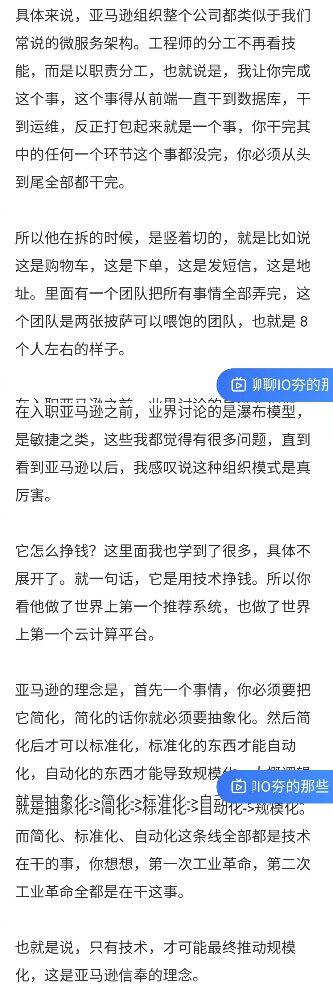

# 我与皓哥的故事

知道皓哥还是在极客时间的专栏 **[左耳听风](http://gk.link/a/10sBp)** 上，在阅读这个专栏的时候，皓哥会引用自己博客 [coolshell.cn](https://www.coolshell.cn/) 上的文章，所以我也阅读了很多皓哥的博客上的文章，其中几篇文章是非常发人深省的，如 《[别让自己“墙”了自己](https://coolshell.cn/articles/20276.html)》、《[如何超过大多数人](https://coolshell.cn/articles/19464.html)》、《[程序员如何把控自己的职业](https://coolshell.cn/articles/20977.html)》、《[“努力就会成功”](https://coolshell.cn/articles/19271.html)》等。接下来我会分两个部分跟大家分享我与皓哥的故事。

## 因 [MegaEase](https://megaease.cn/) 官网上的软件架构发展的视频加皓哥微信

因为之前就有关注皓哥，相应的也就会关注皓哥的公司MegaEase。

> [软件架构发展视频](https://user-images.githubusercontent.com/1014558/158329772-dffa91c9-de05-4da0-abf3-efb03d9b6b62.mp4)

有一天正好在浏览皓哥公司官网，发现了软件架构发展的视频。我想把这个视频放到我视频号上，于是我就在之前皓哥公司的社群中加了皓哥。因为这个事情毕竟要先打声招呼，于是我就问皓哥要了这个视频的转发授权。皓哥欣然答应，如以下截图：

 

## 2021年11月27日云原生讨论

从这次分享中学到的一些内容：

- 分享前的准备，比如在活动行上发布活动，利用微信朋友圈做推广，拉社群
- 分享前收集大家的问题，了解你的听众
- 正式分享前一天，再次提醒下大家明天分享这件事情
- 正式分享
- 分享完后向提供要反馈

以上，就是做技术分享具体的流程，大家以后要做类似分享，可以参照本流程。

### 下面是群中的聊天记录

 

#### 对刚开始的MVP产品少代码，可以看看这本书

- [makebook](https://readmake.com/): 
  - THE INDIE MAKER HANDBOOK: learn to build profitable startups the indie way

 

 

## 皓哥网络上公开文章集合

- [InfoQ上皓哥公开的文章](https://www.infoq.cn/profile/31F9A95CEABD38/publish)
- [左耳朵耗子：技术人如何更好地把控发展趋势？](https://mp.weixin.qq.com/s/Cedl9lIk2mAd9b_NUCnj_g)
- [左耳朵耗子：Serverless 究竟是什么？](https://mp.weixin.qq.com/s/W_X88_siDdNlrWSysbSAZA)
- [对话左耳朵耗子：国产基础软件发展，需要更多耐心 | DIVE 基础软件大会专访](https://www.infoq.cn/article/WFAL8AFLdhZdj5WebvpG?hmsr=joyk.com&utm_source=joyk.com&utm_medium=referral)
- [看完左耳朵耗子的专栏，我给自己定了个 5 年技术规划](https://www.infoq.cn/article/rPAujK3Tdo6rgZsRMEvw)
- ...

欢迎各位朋友继续补充...

**皓哥，R.I.P**

完~
