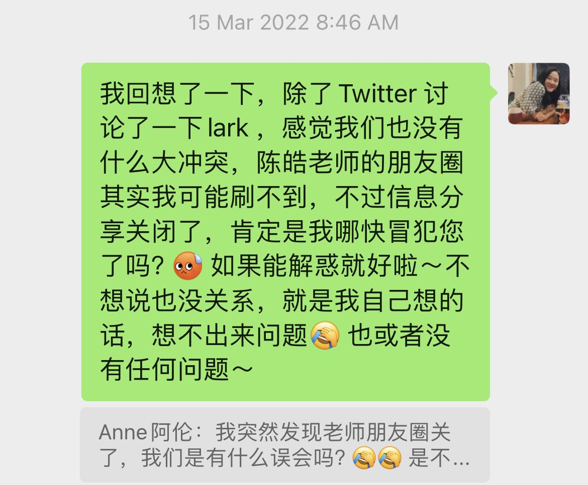
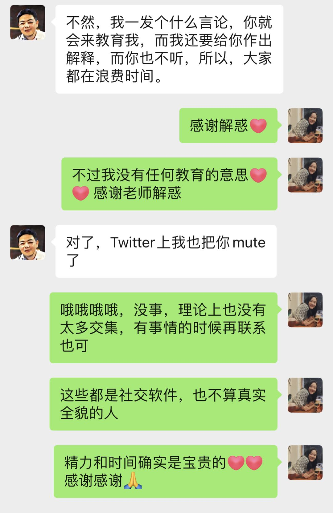
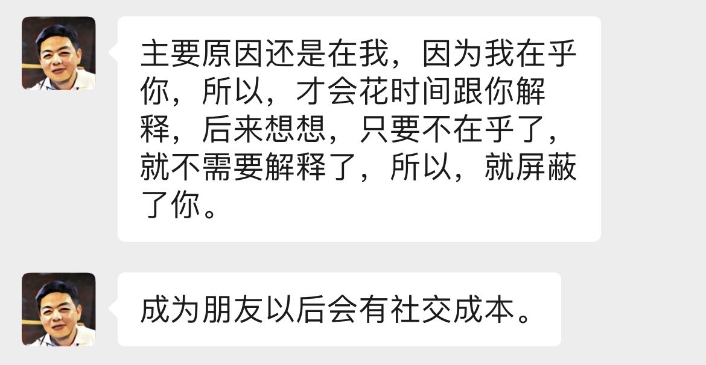
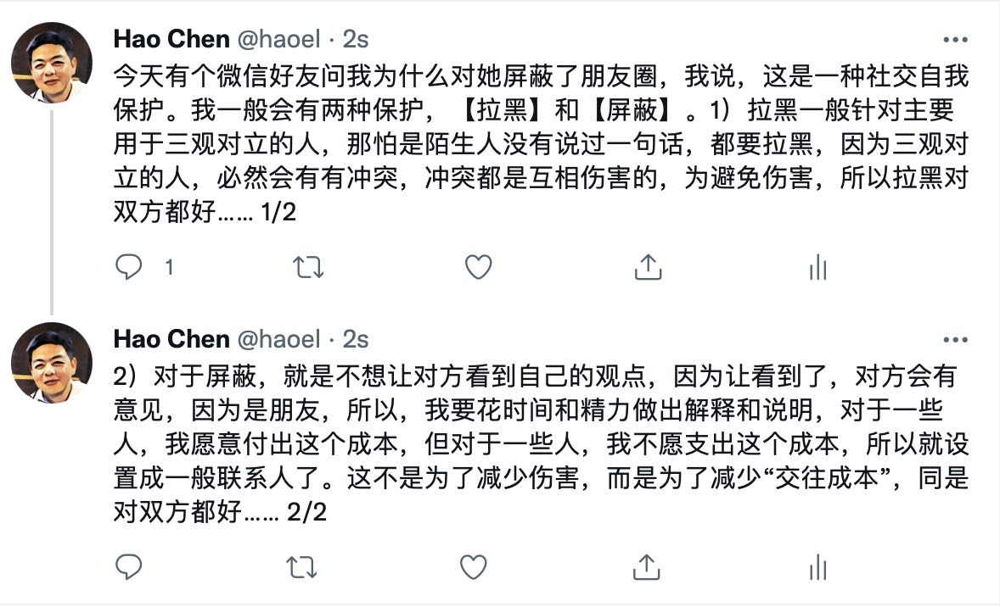

# 纪念 左耳朵耗子 - 与 陈皓 老师的故事

非常抱歉这么晚才写这篇文章，在 5 月份的时候就有微信好友分享我这个 repo。5 月 15 号的时候我在国内休假，当时是有很复杂的情绪，因为我在家里很开心，但是看到这个新闻又很难过。8 月的时候后反劲，想到最早一批的互联网人，跟同事聊陈皓老师，非常难过，不明白怎么还年轻人就没了。奇怪的是，那天以后，我就很少有抑郁情绪，有一种冥冥之中被陈皓老师保佑的感觉。我最近时常感叹自己对时间的感知变得有些迟钝，8月份到今天写这个文章，又一个半月过去了。

## 语音电话，社区的打造

之前在 justyy 的群里加到了陈皓老师的微信，20 年的五六月份的时候，陈皓老师跟我打了一个电话，问我社区建设的事情。因为当时做 Vue Beijing 有一年多，2019 年 3 月开始，每个月一次线下活动，疫情后转成线上。大家还挺活跃的。当时陈皓老师想问问我怎么做的，可能想看看对 MegaEase 有没有参考性。对于我来说，我感觉这次沟通是一个非常破次元的事情。

因为陈皓老师是一名从业二十多年的老程序员，彼时我刚刚工作三四年。整个聊天感觉没有代购，非常意外。我本能的以为自己跟长辈聊天会比较有压力，结果是陈皓老师非常谦逊，进行了平等的对话，我的担心实属多余。现在还能回想起那天午饭时间的记忆片段。

## 飞书是不是国际化的

第二次比较密集的交集就是我在Twitter上回复陈皓老师的一个推。他当时说喜欢用谷歌套件，slack 办公，然后举例子说飞书不是国际化的。我很难翻找到以前的讨论内容了，主要我可能还是年轻，且当时自己因为公司原因一直在用飞书，感觉挺好用的。就说了很多自己的观点，这个事情还有后续，大家可以一下聊天截图。起因是我问陈皓老师的公司在没在招人，我有个朋友当时在找工作，我发现看不到对方朋友圈了。然后就发生了以下对话：

我后来有给一两个朋友看过我们两个的微信聊天记录，两个人的第一反应都是人与人相处好难。可能跟人相处就是难的吧，难在每个人都是那么的独一无二，总有看法不同的时候。我们两个是两个非常直接的人，感谢双方的坦诚直接。

## 内推 & 加群

另外的交集就是我推荐朋友去陈皓老师公司这个事情，在推特起冲突之后。朋友的简历通过了，他要面试。还有就是刚开始接触的时候，把陈皓老师拉到了很多我的群。所以如果你在这些群的话，群成员还是可以搜到他。

## 后记

当时听到陈皓老师去世，我真的非常震惊。这个跟你听到一个你不太认识的人去世的心情是完全不一样的。我是一个很情绪化，性格相对敏感的人。8月份的时候聊到这个事情还是忍不住很难过，控制不住情绪。就像 Randy 发的推，如果在人活着的时候，也收到这么多赞美就好了。

我感觉疫情之后，大家的心态都发生了非常多的变化。希望我的每一个认识的人都能够关注自己的身心健康，不要太焦虑于抽象的生活的意义，去关注自己具象的每一天的滚烫的生活。希望我们都能够兼容不同的观点，爱具体的人。

希望陈皓老师在天堂不再劳累，不再有很多争吵，如果有 next life, 希望他的 next life 平安顺遂。

