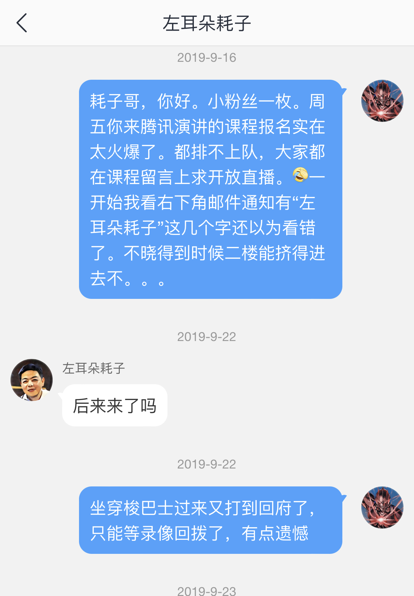
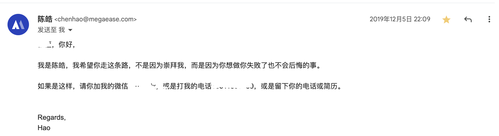
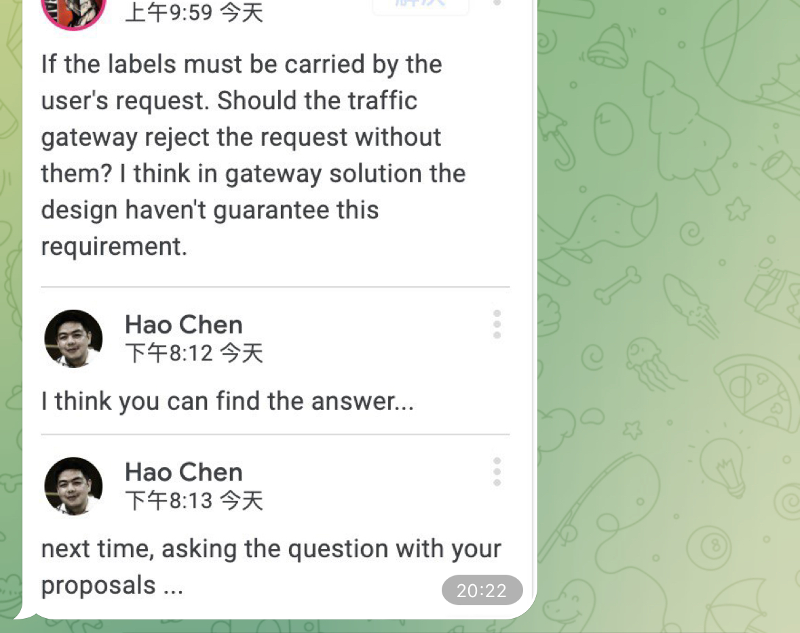
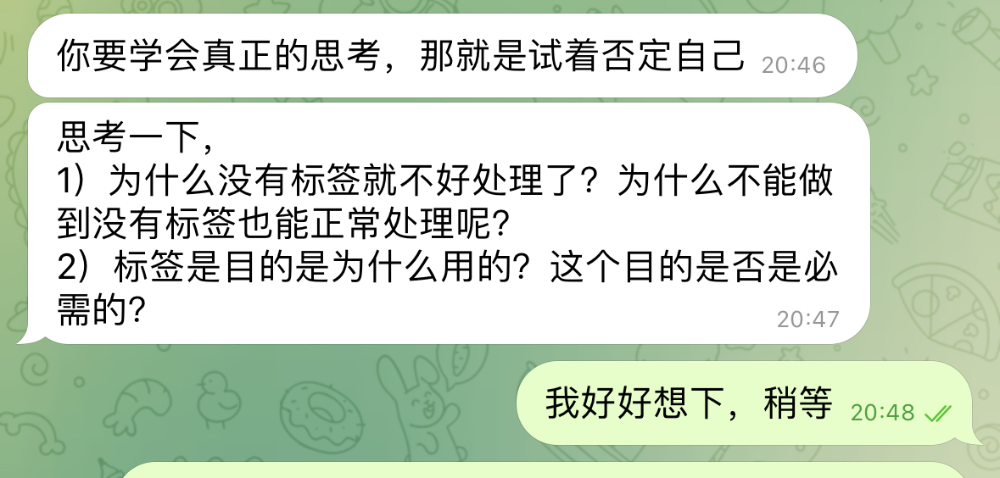
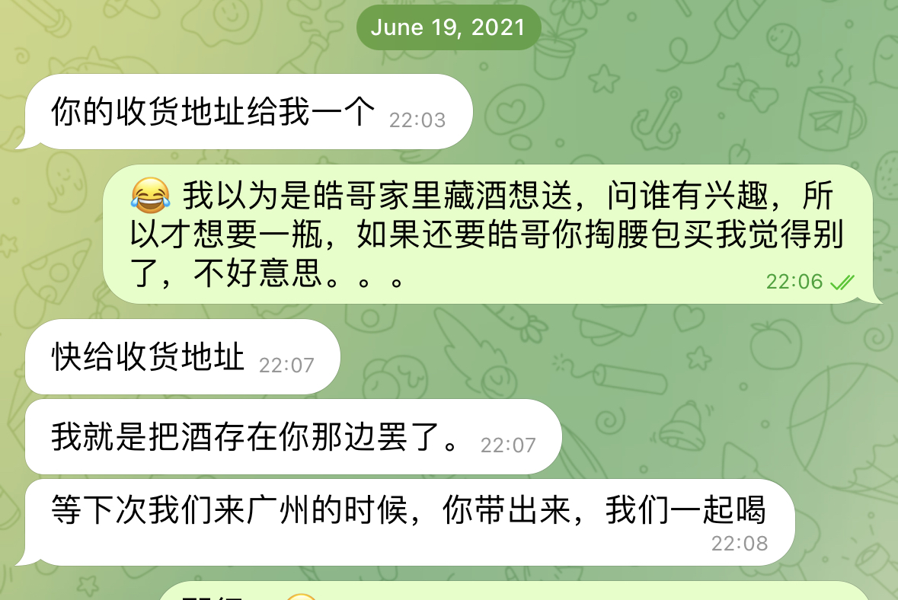

# 纪念 左耳朵耗子 

我是MegaEase前员工，有幸能跟随皓哥，和MegaEase的大神们共事奋斗，心怀感激。至今不愿相信皓哥已经不在了，正如锟哥他们在readme 里所说，皓哥是一位出色且令人尊敬的前辈，写下来是为了更好记住。

## 偶像 

缘起于我的偶像，陈皓先生来前公司演讲，讲云原生，听到热血澎湃，觉得自己是井底之蛙，而且陈皓先生的coolshell 
的那篇《别让自己“墙”了自己》更让我觉着时不我待。

在weibo 私信了陈皓先生后，又找到megaease的官方邮件，忐忑地发了一份面试申请。

记得是一个周六，陪完家人在商场，突然接到陈皓先生的微信信息。

聊了有一个小时，陈皓先生分享了不少他自己的感悟和理念，作为一个小粉丝，内心实际上无比激动。很有意思的是，陈皓先生实际上一直在“劝退”，毕竟创业不是过家家。

没有丝毫犹豫，我决定追随自己的偶像。

## 追随

加入公司后，我改口叫偶像为皓哥。

皓哥天生自带气场，而且独立思考问题的模式，对高标准的追求，让我一开始在远程的工作中一直处在深深的自我怀疑中，每天担心自己无法跟上这些牛人的步伐。

印象非常深，一个产品设计文档， 用google doc 编写。

皓哥知道了直接在线跟我共同编辑，看着他三下五除二就把我思路换乱，支离破碎的文档用干练的格式，清晰的脉络重新梳理了一遍，内心压力巨大同时又深感佩服。

相同的事情（震撼）太多，如何做一个产品，如何独立思考，讨论问题的方式，每周mini sharing 的框架等等等。

各种原因，我没有继续跟随这么geek/cool 的MegaEase 一起成长。

去年还和皓哥，suchen 吃了餐饭，见到皓哥我还是会莫名紧张，他在我心中永远是严厉，出色，又有点”调皮“的偶像/前辈/老板。

## 致哀

有一次，皓哥在群里问我们要不要酒

皓哥，酒我还放着，没开。早过了5k个点赞了，我也没勇气直播女装大佬写代码。但是为什么你会这么突然就走了？

希望在天堂，皓哥好好休息，不要那么劳累了。