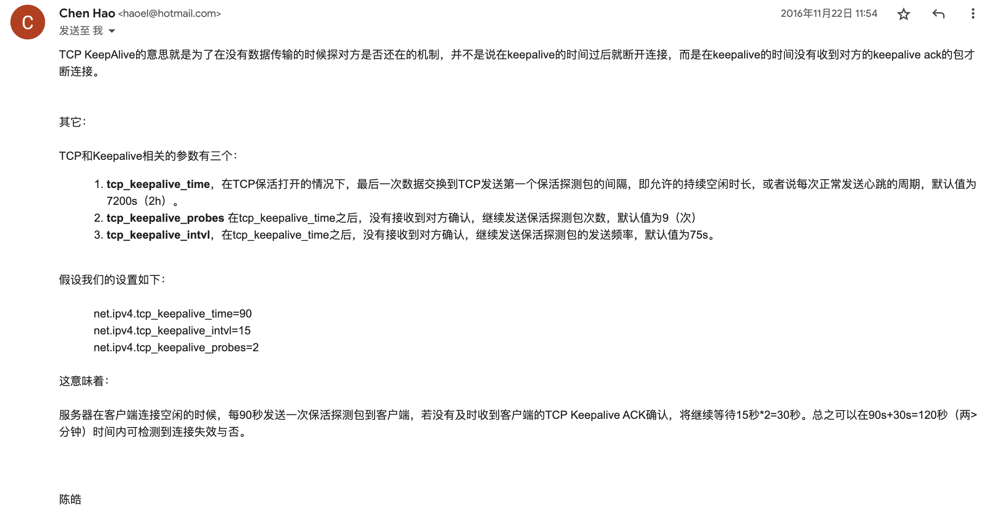

# 纪念 皓哥
毫不客气的说，走到IT这条道路来，就是通过CoolShell上面的文章，看到浩哥分享的技术文章太赞、太有吸引力；感觉普通人都可以做这么多神奇的事情，实在是太爽了，太帅了。

之后我便开启了在IT这条大道上学习和成长之路，浩哥的每次分享，我都会第一时间看，每一次都会感受到浩哥独特、深入、直入本质的观点，我都受益非浅。

他在极客时间上开设的专栏，我第一时间就购买了，像是如获至宝般的开始学习，学习他对技术的执著和信仰，对人生的感悟。

他是我人生中重要的指路明灯，让我知道普通人的人生可以很精彩，至少对自己、对身边的人不悔。

之后也自己带过团队，也把从浩哥哪里学到的知识、领悟带到团队中。

16年，由于我们线上WebScoket服务连接数一直处在ESTABLISHED状态，无法释放<原谅我技术菜>，一时没有找到方法解决，就想起了浩哥，抱着试试态度<毕竟他是大佬>，试着给他发了一封Gmail邮件，简单描述了一下我们的问题。

没想到，第二天就回复了我，还更正了我描述错误的地方，也提供了解决方法，很详细，从哪时我知道，他是那么的乐意助人、那么认真、负责.

千言万语，也说不完对浩哥的尊敬，也只好就此打住。

谢谢浩哥