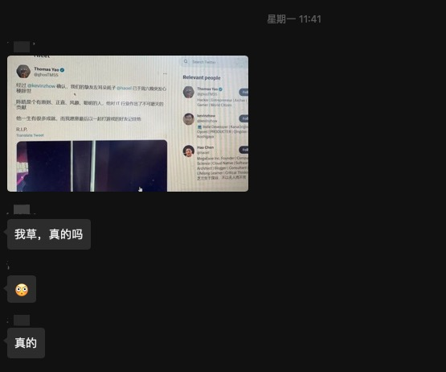

# 怀念 左耳朵皓哥

皓哥不认识我，但皓哥是我最敬仰的程序员！

## 初识

第一次 `认识` 皓哥不知道是什么时候了，三年前？五年前？可能更早～ 第一次看到 [酷壳](https://coolshell.cn/) 收录至今，不一定经常看但是每隔一段时间都会把最近更新都看一遍。每次看酷壳感觉都是一种激励一次洗礼！

每次聊到 TCP/IP 我都会把皓哥的 [TCP 的那些事](https://coolshell.cn/articles/11564.html) 这篇文章分享给大家；像这种例子还有很多～
还记得四年前自学 Golang ，当时看过很多文章写过很多 demo ，看到皓哥 12 年就写过 [Go 语言简介](https://coolshell.cn/articles/8460.html)，原来一个语言可以通过这么精简的方式完成基本全面的介绍～ 

## 激励

做软件研发8年+，纯 `野生程序员` 一枚，记得在开发第三年左右也就是 2018 年附近，感觉每天的 CRUD 的生活一眼望到了尽头，翻到皓哥写的 [技术人员的发展之路](https://coolshell.cn/articles/17583.html) 对我启发特别大，从那时开始就专注产品的角度去看待需求，提升自己全面的能力，莫名的一股动力坚持到了现在，虽然写代码这么多年依然热爱

## 左耳听风

皓哥的专栏课是最完整学习的一门课程，如果让我说真正能够对工作改变多少我不知道，但是莫名的是一种支撑和认知的进步提升！

## 怀念

5月15日中午在食堂吃饭看到群里消息第一反应这又是造谣！然后自己赶紧去看是真的～ 当时自己真的也是不愿相信，始终感觉有一天能够见到皓哥当面请教～ 没想到这是以后的以后才能实现了！
周一的一下午都在翻看酷壳和左耳听风的文章，一直到下班的地铁上都在翻看皓哥的 twitter～

软件研发这些年认识了好多大牛，也关注过 N 个大牛的博客或者公众号，但是像皓哥这样原则、认真、专注的大佬个人认为就皓哥一人。

Great minds discuss ideas
Average minds discuss events
Small minds discuss people

希望自己也可以按照皓哥的座右铭一样专注学习、工作和生活！

芝兰生于深谷，不以无人而不芳
君子修身养德，不以穷困而改志

R.I.P
