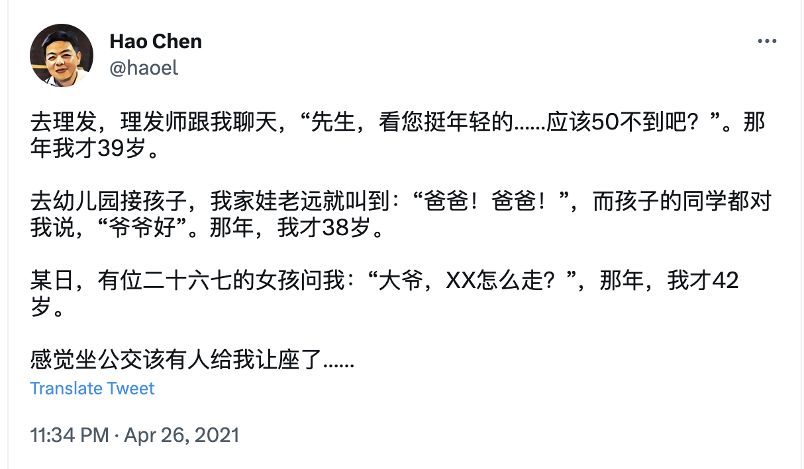
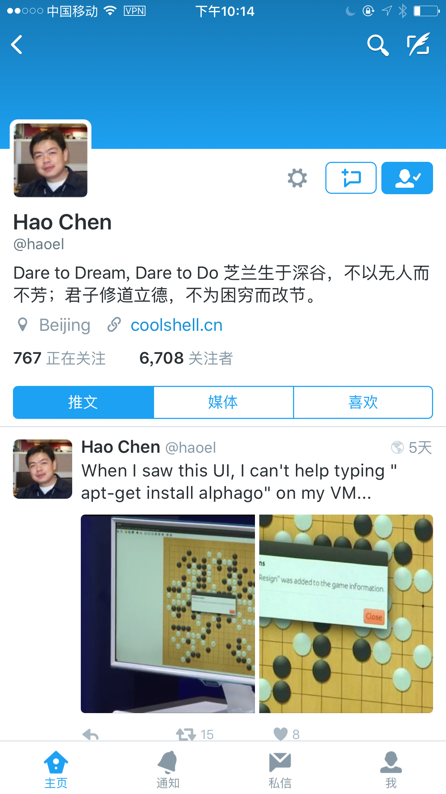
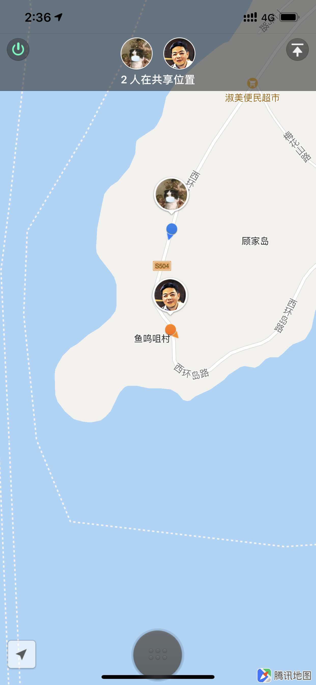
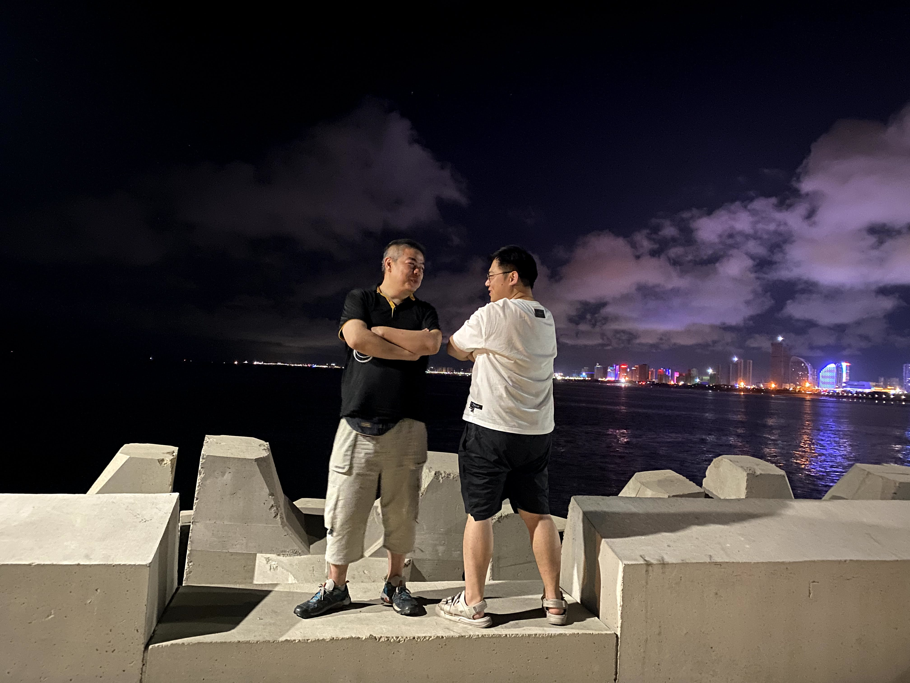
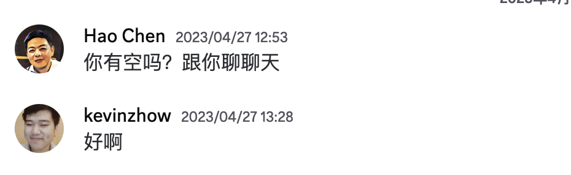

# 纪念左耳朵耗子

刚刚从半睡半醒中醒来，梦境的最后一刻是陈皓成为了 AI，而我刚想和“他”说说话。

我相信那一天终究会到来，但此刻看着 Discord 里甚至还没显示为离线的他，我也知道再也得不到回应。

## 在北京相识

我一直称他为皓哥，因此现在也还是皓哥吧，但这个名称其实让我纠结过，毕竟他那么显老，甚至让我一度也想过叫皓叔。但，为了不让陈皓同志觉得和我有年龄代沟，最终还是用哥这个辈分了，感觉他挺喜欢的 ：）

2015 年底的时候我因为公司被收购来到了北京，当时负责筹划名叫「字里行间」的写作产品，2016 年 3 月的时候，正值组建团队之际，公司有阿里背景的 HR 大姐说，有个技术大神从阿里出来了，约了吃个饭，问我能不能一起去。

我拿过来一看——陈皓，接着大姐说 “在 Amazon 干过，还有个技术博客非常有名，叫 Coolshell” 。

我当即就去网上 "人肉" 了一番，找到了他的博客，微博，Twitter，从那时候开始，我从皓哥的个人介绍里就总能看到这句 “芝兰生于深谷，不以无人而不芳” 。其实这个和我潜意识的技术人是有点不搭的，也太“老土”了吧，哈哈，但说真的，我是很喜欢这句话的。

皓哥是真的把座右铭当成信条来执行，使得这句话也就不再像是一句用来装饰自己的空话。

这张 Twitter 截图应该是见面前一天晚截下来的，为第二天的见面做准备。

第二天中午，我在北京朝阳大悦城的望湘园见到了他，皓哥这个人很真实，他如果一开始觉得对公司没兴趣，就会略显疲态，言语间带着攻击性，上来先劈头盖脸的批判了一番我们金主的业务内容，直到上菜了，才让我得以在他嚼饭的空隙做一些自我介绍。

“这个是我之前的产品，Yep”

“Yep 是你做的？”

“是啊”

“这个我知道啊，太酷了，第一次见在国内这么玩开源的”

Yep 是我之前做的一款面向程序员和设计师的社交产品，当时走了客户端全开源的模式，因为这款产品，本来将要不欢而散的饭局，产生了 180 度的反转，皓哥说可以聊聊，然后特别的说 “我主要是对 Kevin 感兴趣”。

我没有想到他会这样想。

在尝试拉他入伙的时候，他反复追问当时的老板是 “相信技术，还是相信管理” ，而老板的太极回答没能让他满意。

再后来，他便成为了当时公司的技术顾问，而我们的友谊也是从那时开始的。

## 亦师亦友

我当时住在朝阳区的青年汇佳园，而皓哥在朝阳的远洋天地，地缘上的因素使得我们就像是邻居一样，经常能碰个面，吃个饭。

聊天时，皓哥的输出是非常持久的，通常开启一个话题后，我基本只剩下负责吃的份，而他都是一个小时起步，跟我讲很多他的经历，价值观，他喜欢对比 Amazon 和 阿里 的企业文化，一个是工程师文化的代表，一个是销售驱动的代表，一个相信技术，一个相信管理，以此为引子，就是那晚的下饭菜。

有一次我跟他吐槽说，公司昨天有人没关窗户，结果现在开始安排值日关窗了。

他说：“你看，这个就是相信管理，如果要是相信技术的公司，就会安装一个自动闭门器，相信什么是刻在公司基因里的。”

有一次我问他，Amazon 那么好，你为啥还愿意去阿里。

他说：“本来是没什么兴趣的，但他们的 HR 的诚意打动了我，我想去看看到底是什么样的企业文化能有这样的 HR”

皓哥就一直是这样较真的一个人，如果感兴趣，就一定会去试试，他从来不会只停留在想的阶段，我也从没有见过他纠结的样子，总是会坚定的随着自己的价值观，行动，验证。

也正是他，逐渐影响了我价值观塑造的时期，做自己相信的事情，再把相信的事情做对。

2017 年底的时候，我决定离开当时的公司，谈完离职之后，我给皓哥发了信息，一起在管氏翅吧撸串。

那天，我一直在跟他倾诉，说着那些在公司里无法实现的抱负，说着自己后悔没有坚持下来的那些事情，以及最后我哭着说 “我只是想做自己想做的产品”

现在回想那些瞬间，我才意识到自己失去一个挚友所代表的是什么。

## 青岛

2018 年的时候我决定离开北京，在青岛以独立开发者的形式，去弥补那些自己过去的遗憾。

临走前，皓哥非要约我一起爬山，于是我带着老婆，他带着女儿，四个人一起去爬了怀柔的红螺寺，那天我被折磨的很惨，一路累的哭爹喊娘，第二天腿酸的厕所都上不了。

他说：“我就是故意搞你的，我要做点什么事情，让你记住我”。

说这句话的时候，他带着一种老男人的风情。

离别前，他说：“我以前有朋友从北京回到昆明后，失去了理想变得世俗了，但我不担心你，因为你知道自己想要什么。”

我觉得他还有点担心的，但所幸，我并没有改变。

因为皓哥在青岛也有亲人的原因，在随后 2019 - 2021 的那段时期，皓哥每年暑期都会带着家人来青岛和我聚一聚，带着一点点视察的性质。

他说，他很喜欢海的辽阔，在海边会觉得一切事情都会被包容。

而我却再也没去过一次北京，也没能赴约昆明。

记忆中，那天青岛下着小雨，他带着女儿坐在我家客厅的地垫上，电视播放着一个在日本旅行走路的 Youtube 频道，4K.

他说，感觉真的太放松了，我们一定要一起去一次日本。

## 一起做点什么事情

皓哥一直说 “总觉得我们会在一起搞点事情”，但很多年来都没真的走在一起做点什么。

所幸，这件事没有成为遗憾。

2022 年的时候我开始给自己的产品加入服务器，公有云的服务太贵了，而皓哥的 MegaEase 正好可以解决这个问题，我成为了潜在用户。

那天他说想去海外推广这款产品，但是产品设计他不满意，他说： “这是我自己设计的，也是我能力范围内能做的到的极限了”。

我说： “要不我给你搞搞吧，反正我也想用这个系统，这样我用的可以更爽一些”。

于是我得以有机会，在那之后的 3 个月，利用每天一些闲暇的时间，给 MEGAEASE 做一些品牌和产品的设计，其实很多地方我也许可以做的更好，但再也没有如果。

2023 年的 4 月 27 号，是他最后一次跟我打电话

那天他跟我聊了会 MegaEase，以及接下来想做的 AI 产品，说 “这可能是我最后一次能赶上的技术风口，再往后可能我也不懂了” 。

希望我能以合伙人的形式，跟他一起搞这款产品。

其实在此之前，皓哥都将我视作未来的合伙人。但我因为自己的产品还没有完成计划，不想再一次留下遗憾，也深知在兼顾的情况下，我无法符合一个合伙人所代表的期望，因此我总是有些抗拒的。

这一天我依旧有些抗拒，但和皓哥一起做点事总是我心底也期望的，在听他讲了 1 个小时后，我把心里关于不想留下产品遗憾的事情又提了一次，说 “我觉得这方向没有问题的，等到时候可以搞搞看，反正我也会用到”。

留下了一张空头支票。

## 最后一次对话

2023 年的 5 月 2 号的凌晨 3 点左右，我在睡觉前发现 Discord 好像上线了语音消息的功能，于是就给皓哥发了句语音 “测试一下 Discord 的语音功能”，第二天，他 7 点多回了句语音 “你晚上不睡觉啊”。

然后我也没有回复，这种没头没尾的对话，我们已经习以为常。

也从来未曾想到，如此稀松平常的对话，会是最后一次。

5 月 15 号凌晨，朋友给我个信息说，皓哥走了。

我一时错愕，问 “走了是啥意思，润了吗”

我没有能走入那个时间线。

直到现在，我都觉得非常不真实。

因为我可以轻易的想起他说话的音调，想像出他对一件事会有怎样的态度，会如何回应我的信息。

那些一起和朋友们玩 FIFA 的瞬间，和家人们在海边散步影像，以及我俩在烧烤店撸串时的对话，都能那么轻易的被回忆起来。

怎么，这些就都不再有后续了呢？

这个有时候爱称自己的是老家伙，知道我也听 AC/DC 后就兴奋的给我分享歌单的人

怎么能就没了呢？

## 没有遗忘，就没有离去

我一直以为，自己是一个可以看淡生死的人，甚至从初中开始，我就一直会以这种方式思考自己的人生：

“假如今天我已经 80 岁了，即将死去，我回想自己的一生，是否会觉得自己是个傻逼”

毫无疑问，皓哥的一生是值得他骄傲的。

每当想起他的时候，我总是能得到勇气把自己相信的事情坚持下去，让做和不做的事情都一样骄傲。

我希望自己能传承一点他的骄傲，继续创造，分享，更勇敢的面对未来，他已经留下了答卷，而我仍需要继续作答我的人生。

我想，只要我没有忘记他留给我的那些精神，他也就未曾离我而去。

愿他在另一个世界，依旧玩的开心。

以此纪念我的挚友，陈皓。
