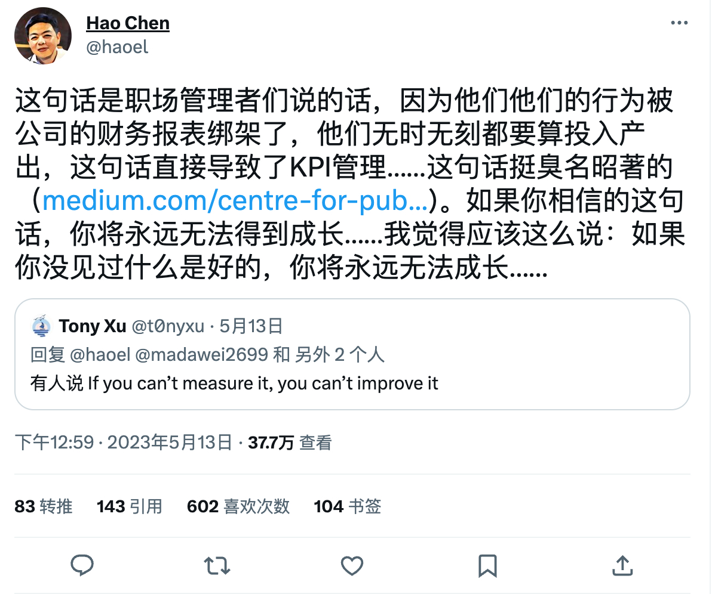
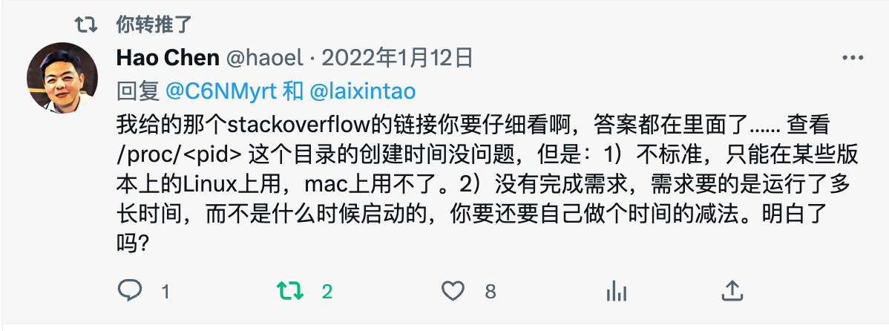
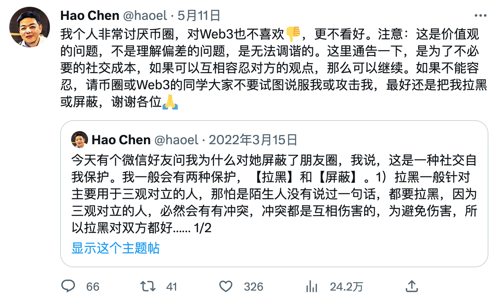

## 缅怀陈皓

今天听闻陈皓去世了，心情久久不能平静。周末的时候我还在看他在 Twitter 分享的一个
观点，居然这一条就成了他最后发送的推文。

陈皓对我的帮助非常大，我的书签，博客引用，和笔记里面，都有很多对 coolshell.cn 的
链接。可以说，他是我在很多领域的启蒙老师。

一些教程只是教会你用某一个工具，但是陈皓写的文章，是想教会你这个东西设计的逻辑，
使用的核心思想是什么，举一反三，和其他优秀的设计有什么相通之处。

由于国内特殊的工作环境，在技术方面做到他这个级别的前辈很少了，又几十年如一日在网
络上耐心地分享自己的知识的人就更少了。陈皓就像一盏明灯，不知道照亮了多少人的路。

像陈皓这样光在网络上就有十几万的粉丝的“网红”，却很少见到有负面评价，今天在网络上
大家都是清一色的表达自己的悲痛和思念，是因为他帮助过的人实在太多了，即使网络上跟
别人有争论，也都是有理有据，讲逻辑，很有耐心。

我和他有过短暂的交流，沟通的过程非常舒服，他是一个很谦逊的人，即使对于我这样的后
辈，也称可以“学到东西”。

由衷地感谢这位素未谋面的老师，愿在天堂安息。

让我们永远记住这位伟大的人。
