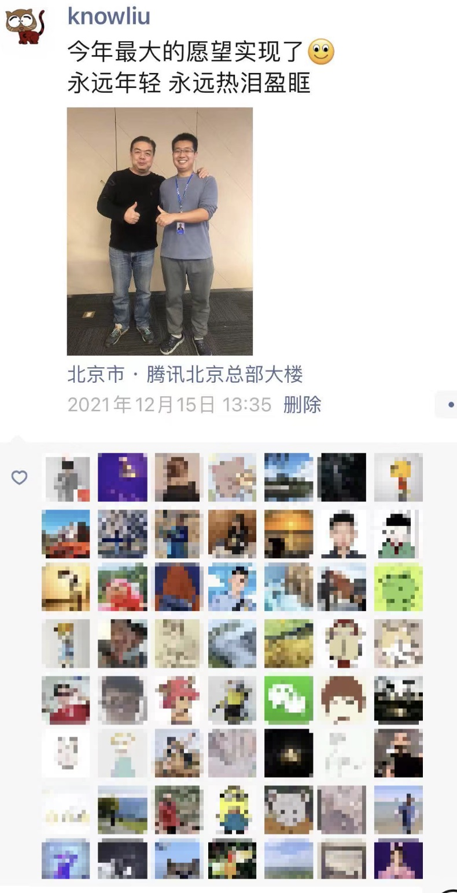

## 初识皓哥

作为一个技术人员，相信很多人都听过左耳朵耗子。我是大约在2013年通过某篇技术博客知道的皓哥，后来进一步通过CoolShell、知乎、极客等渠道进一步的了解皓哥。
虽然我们之间几乎没有真正的见面交流，但我依旧被他的那种geek精神感染，这也许就是皓哥的人格魅力吧，相信很多技术人都和我有一样经历。

## 第一次见面
2021年12月15日，皓哥来我们公司做一场关于云原生的技术交流，这是我第一次，也是唯一一次见到皓哥本人。在得知此消息时万分激动，还记得那天我提前很早就来到了会场，和皓哥要了合影，加了皓哥的vx，表达了对他的崇拜。他本人是如此的和蔼，在那次交流会上，皓哥分享了很多技术之外的内容，这些都让我至今受益匪浅。会议结束后，我兴奋的发了朋友圈：

## 纪念皓哥
虽然我和皓哥只有一面之缘，但是榜样的力量是无穷的。皓哥的人品、对技术追求的精神会一直影响我们这一批做技术的人。