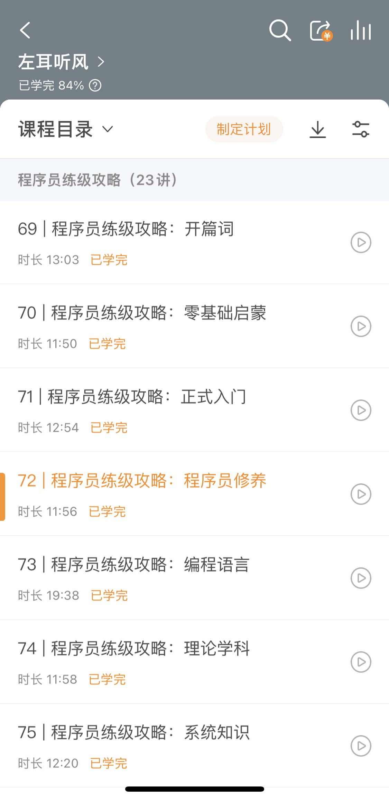
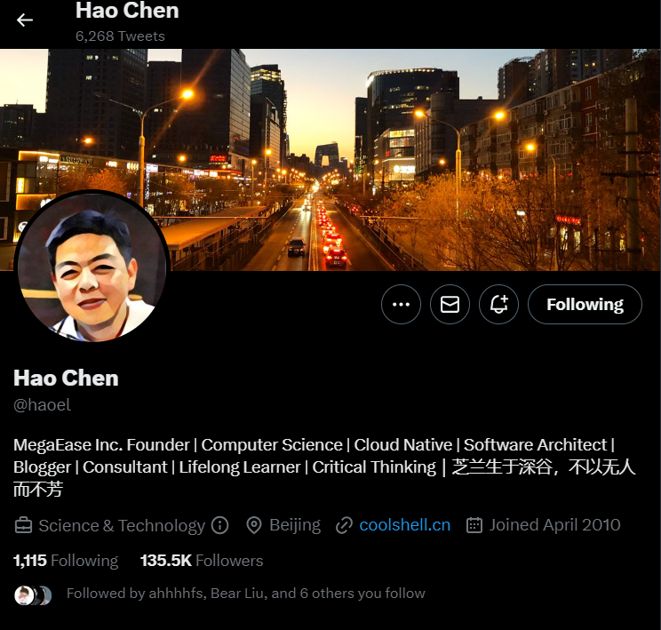

## 纪念左耳朵耗子

### 初次相遇

初次相遇是在极客时间app上的技术专栏《左耳听风》；时间回到2019年，当时在一家软件外包公司工作了2年，感觉技术上也再难得到提升，所以萌生了换工作的想法，在极客时间专栏排行榜里看到了耗子哥的《左耳听风》，文案上描述是一位资深技术专家写的，当时想着能听听行业内的前辈分享些过来人的经验，也就订了这个专栏。

### 断断续续

在接下来的工作中断断续续地学习了专栏内容，但并不系统，在一次公司内部晋升过程中，评审团问了些技术问题，当时回答的并不太好最终晋升也没通过，后续自己做晋升复盘总结下来是自己的知识体系没有建立起来，学的东西浮于表面，回过头来又把耗子哥专栏里<程序员练级攻略>重新系统的学习了一遍，按照攻略逐步提高自己，后续也顺利通过了晋升，同时也明确了自己未来的职业发展方向。

### COOLSHELL之旅

在技术专栏里的学习过程中也看到有些内容在耗子哥的博客上有更详细的阐述，在闲暇时间就关注起CoolShell来，随着越来越多的阅读，发现耗子哥输出的文章都是观点鲜明，干货满满，我印象最深的就是那句话 “希望给未来的自己看看，要么被未来的自己打脸，要么打未来自己的脸。”

### 密切关注

在CoolShell上看到了耗子哥的Twitter，并开始在上面关注起来，他分享了很多生活上技术上的点滴，包括疫情里的生活，也看到他玩着最近大火的ChatGPT，就像身边技术人一样，后续上Twitter主要就是想看下耗子哥有什么动态，直到一个周一的早上，依旧打开了Twitter，看到推送的消息说耗子哥离去，起初我也是不太相信，毕竟几乎每天都能看到他的动态，后来在其他平台也推送了相关的新闻，突然间感觉特别失落，一个行业的前辈和楷模离开了我们。

## 致敬

最后向耗子哥致敬

> 芝兰生于深谷，不以无人而不芳，君子修身养德，不以穷困而改志
