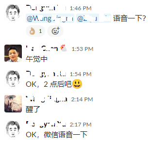
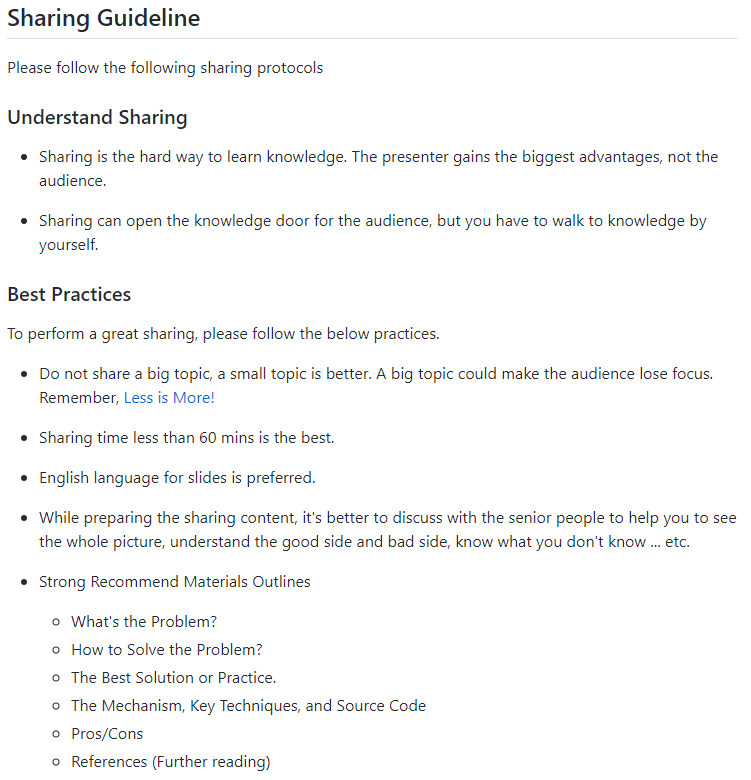

# 在你身边工作，已是最好的回报

半年多以前，我写了一篇《在 MegaEase 工作是一种怎样的体验》，发到了自己的博客，皓哥转发到了[推特](https://twitter.com/haoel/status/1565163398530158592)上，一时间，我那个平时基本无人问津的博客的流量增长了上千倍。

文章写的是 MegaEase 这个公司，但作为初创型公司，公司文化与创始人有着莫大的关联，甚至可以说，是皓哥将自己的基因注入了 MegaEase，所以，写公司实际上也是在写人。

我和皓哥是在路透认识的，当时他就是我的老板，所以，我想对那篇文章做一个补充，再多记录那时的两件小事。

在进路透之前，我在一家国内的公司工作了很长时间，虽然也是相关行业的领军企业，但像很多的国内公司一样，不是很重视邮件。而到了外企，邮件则是最重要的沟通工具。所以，进入路透之后，怎么写邮件实际上是我首先要学习的一项技能。

记得我第一次发一封比较重要的邮件前，皓哥帮我仔细的检查了一遍，然后，他坐到我的座位上，拿过键盘，开始逐字逐句的修改，边改边告诉我，之前有什么样的问题，以及为什么要改成现在的样子。

这事一件很小的事，邮件的内容我已经完全没印象了，但这件事却让我记忆深刻。因为，面对同样的情况，很多老板可能只会说“写的不行，再去改改”，或者好一点也只是指出具体问题，但皓哥却是手把手的教。

另一件让我印象深刻的事，是有次聊天时，皓哥对团队说，你们没事要多出去面试，看看外面需要哪些技能，自己应该在哪些方面提高。当时大家都很惊讶，居然老板会让手下的员工多出去面试，难道不怕成了之后辞职吗？！

这两件事，虽然发生在十几年前，但细究之下，却与今天的 MegaEase 有着紧密的关联，那就是，除了完成工作，皓哥也一直在关心着所有人的成长，他与大家，既是老板和员工，也是朋友、师生。我有时觉得，这种复合的关系甚至是 MegaEase 可以维持一个高效的远程团队的根本。

我也以合伙人的身份折腾过创业，过程中，我实践了一下从皓哥身上学到的东西，形式不完全一样，但本质是相同的，就是帮助员工成长。除了手把手的指导以外，我在技术团队开展过一个“每周烧脑”的活动，就是每周留一道算法题，大家先做，然后再一起分析、讲解。虽然现在看来，那个公司做的很滥，纯属瞎折腾，没有任何成功的可能，但整个技术团队的离职率却很低。而且，公司解散之后，有两位同事还专门发微信感谢我，说“学到了不少东西”。他们不知道，我也有要感谢的人。

加入 MegaEase 后，由于住的比较远，我大约一个月才会去一次公司，主要是长期在家办公心理上会有些孤独，去公司的目的也更多的是找皓哥聊聊天，散散心。因为去的少，每次我过去，皓哥都会开玩笑说“老板又来检查工作了”。我本来计划2023年5月15日去公司和他聊天的，但之前突然接到的一个电话，却让这次见面变成了送别...

转发我的文章时，皓哥说，“让我有点高兴也有点惭愧，高兴的（是）获得些认同；惭愧是，大家应该值得更好的回报…”，今天，我想说，“在你身边工作，已是最好的回报”。

---

**附**：《在 MegaEase 工作是一种怎样的体验》的原文

没人邀，所以目前还在飞机上，也只能发到自己的博客里……

时光飞逝，转瞬之间在 MegaEase 已经工作一年多了，作为一名老龄程序员，之前也算经历过一些不同类型的公司，但 MegaEase 的这一年多确实给了我很多新的体验。借此文和大家分享下。

### 1. 远程

可能不少读者已经读过《[MegaEase的远程工作文化](https://coolshell.cn/articles/20765.html)》这篇文章，对 MegaEase 的远程工作方式有所了解。

我对这一点的体会是从加入的第一天开始的。我在北京，因为公司总部也在北京（就是老板在北京的意思），所以过去办了入职手续。手续刚办完，老板对我说了句“你明天不用过来了”，我心里“咯噔”一下，想“这就人生第一次被开了，我应该还没来得及犯错误吧”，好在很快听到了后半句“跟你合作的都在外地，你来办公室也是和他们网上交流”。自此，我正式开始了远程工作生涯。

目前，MegaEase 是一个小团队，20来人，却分布在北京、上海、广州、杭州、重庆、郑州、武汉、昆明等十来个城市，大家完全通过网络组成了一个研发团队。这一年多，我平均一个多月才会去一次办公室，并且大多数时候是因为在家待闷了想出去散散心。

这两年因为疫情，很多人体验过远程办公这种工作方式。我的第一次远程工作经历也是在疫情初期，但后来因为工作效率下降太多，疫情有些缓和后，当时的公司就要求大家恢复集中办公了。相信大多数公司的远程办公也是这种情形。所以，在坚持远程的前提下保持正常工作效率，确是 MegaEase 的独到之处。

《MegaEase的远程工作文化》这篇文章中提到的首要问题是“人”，这可能是很多团队无法坚持远程办公的原因，但并非所有的团队都如此。首先，在我经历的公司中，疫情初期的那家在“人”这方面绝对是高配，和 MegaEase 比起来，无论是职业经历还是学历背景，都高多了；其次，无论是在那家公司，还是在 MegaEase，我都是同一个人，但我能很明显的感受到自己前后工作效率的差别。

我想，这里的区别在于公司的文化，“远程”是写在MegaEase 的基因里的，所以它在各个层面对“远程”进行了优化。这些在《MegaEase的远程工作文化》里已经写的很详细，我不再赘述，只想借“通讯工具”这一个点，说下自己的体会。

大家知道 MegaEase 是以 Slack 作为主要通讯工具的，而国内用的多工具则是微信（包括企业微信）、钉钉和飞书。在使用过所有这四种工具之后，我发现虽然它们都是用来“聊天”的，但 Slack 明显不同于其他三个。

首先，我认为这里面只有 Slack 是沟通工具，其他三个都是管理工具。Slack 关注的是信息的组织和传递，并在这方面远远胜出。因为 Slack 是以信息为中心，信息可以聚合在一个主题下面，而其他三个则是以拉群和老板为中心，一个群里穿插着合种主题，非常混乱，它们有一大堆诸如“已读/未读”之类的领导喜欢的功能，但在一个远程团队中，这些功能除了能让领导产生“一切尽在掌握”的幻觉之外，并没有太多实际价值。

第二个区别是 Slack 针对技术团队做了功能优化，讨论技术问题比其他工具方便的多。而国内的这些通讯工具都面向全行业，谁都能用，谁也用不太舒服。

### 2. 加班

没人喜欢加班，我尤其如此。一是身体素质不算好，不想让自己挂掉；二是生物钟使然，晚 8 点开始，我思路的清晰度就开始直线下降。所以，加班多少是我选择工作时的重要考量因素。

我待过的公司中，有一家有加班文化，入职前我仔细谈了加班问题，最后妥协为周六加班，但晚上最多到 7 点。但即便如此，那仍是我加班最多的一段时间，最后身心俱疲。所以我真的难以想象一份 996 的工作会是什么样子。

而 MegaEase 则是业界少有的从老板开始反对加班的公司，除非确有必要，公司从不会要求加班。甚至有同事连续几天搞得有点晚后，被老板提醒要“注意休息”。

崇尚加班的公司，往往都认为可以通过加班提高团队的产出，但至少从我自己的情况来看，事实并非如此。我在那家有加班文化的公司和 MegaEase 各有一个完整年度，而这两年的主要工作也正好都在 Github 上，我简单的对比过自己这两个年度的代码量，在少 1/4 工作时间的情况下，我在 MegaEase 写的代码反而要稍微多一些。

当然，代码量不是足够准确的指标，对比代码量，只是因为它最容易量化。而在难以量化的代码质量上，我也认为 MegaEase 这边要更好（请参考后面“软件工程”一节），再考虑到我在 MegaEase 承担的任务更杂一些，应该就足以反映一些问题了。

### 3. 考勤

作为一家远程办公的公司，大家肯定可以想到我们不需要上下班打卡。但 MegaEase 实际上是一家没有考勤的公司，既没有人统计你迟到早退了多少次，也没有人统计你请了多少天假（也就不会因为考勤被扣工资）。这里唯一的要求，是正常工作时间内，如果不在线，需要在 Slack 里提前说一下，不需要任何人的审批，就像下图这样：

MegaEase 基本没有审批系统和流程，但是需要把信息透明出来。这两种都是防“作恶”的手段，一种是通过审查方式，一种是通过信息透明的方式，哪一种更受欢迎是显而易见的。

另外，即使在办公室，也不用担心中午小憩被老板（大家能看出来谁是老板吧）看到记到小本本上，比如：

大多数国内的公司都会要求上下班打卡，甚至我听说疫情期间必须远程办公的时候，有公司要求员工必须视频在线。所以，很多人应该难以想象这种完全不要考勤的做法。

但亲身经历后，我反而觉得这个问题非常简单——大家都是成年人，心里都很清楚“界限”在哪里，不要考勤是公司对员工的信任，所以作为员工，就要让自己值得这份信任。反过来，在那些对员工严防死守的公司里，代打卡、虚拟位置打卡之类的事情并不罕见，比如这则新闻：[国内首次！干扰钉钉“打卡”，判刑五年六个月！](https://new.qq.com/omn/20211016/20211016A0701T00.html)。

其实类似的情况不仅出现在 MegaEase，外企应该是国内最早不要求打卡的公司，加上工作压力小，员工确实会自由散漫一些，但我工作过的公司中，上千名员工中，真正过分的案例我只听说过一两个。

### 4. 软件工程

稍有规模的公司就会强调软件工程和过程管理，但强调不等于能做好。在我的经历中，最重视软件工程的那家公司，也是我认为在这方面做的最差的。这家公司有专门的“技术管理部”，可惜里面的绝大多数人缺乏最基本的一线经验，形成了外行管理内行的局面。不是说外行不能领导和管理内行，现实中不乏做得好的外行管理者；但作为外行，乱提各种教条化、形式化的要求就不对了，这不仅会降低工作效率，也会挤压优秀员工的生存空间，所以实际效果还不如那些什么也不管的公司。

而 MegaEase 是把软件工程做到了实处的公司。由于软件工程是一个太大的话题，所以我只通过几个细节说下自己的体会。

**首先是“文档驱动”**。程序员大多不爱写文档，我也不例外。但另一方面，我又主动写过一些几千上万字的文章（包括本文），甚至还挣过点的稿费（不包括本文）。所以，我觉得自己能写点东西，只是不爱写那种纯为满足形式要求而写的文档——当评审只看章节是否齐全，不关心实质内容，自己又不想完全“胡说八道”时，肯定没有写的动力。

在MegaEase，文档没有形式化的要求，写文档的目的是为了深度思考问题，把重要信息结构化，并分享出来让别人看懂。我们认为，写不出简单清晰的文档说明作者没有把问题想清楚，在这种情况下动手开发，肯定会出问题。

应该说，每家公司都想把文档工作做成上面的样子，但过程中慢慢退化为走形式的公司也不在少数，这是相关管理者缺乏经验和执行力的体现。

**第二是“Code Review”** 。我一直认为，Code Review 应该是开发流程中发现 Bug 最多的阶段，因为只有人脑可以在有限的时间内实现路径覆盖，这是任何工具和测试手段都达不到的。所以，Code Review 做的好不好，很大程度上可以反映产品的质量好不好。

这方面，MegaEase 也是我工作过的公司中做的最好的，因为部分产品已经开源，大家可以关注下 Pull Request 下的修改意见来实际看一下。

**第三是“以正合”**。这个词出自《孙子兵法》，但我觉得也可以用在软件领域。“以正合”是指用业界已有的、成熟的、标准的方案来解决问题，不取巧。因为这些标准的方法已经经过了实践的检验，会考虑到各种我们自己无法预见的边边角角。

当然，“以正合”并不是拒绝创新，软件是智力型行业，重复性的工作都会被自动化和模块化，所以，创新无处不在。而且，在《孙子兵法》的原文里，“以正合”的后面就是“以奇胜”。我们只是认为，最终的方案必须经过详尽的论证，而业界的标准可以提供最权威的论据，能够避免我们搞出很多看似巧妙实为天坑的创新。

实际上，之前一家公司在技术上的一个主要问题就是其开发过程中用了太多“技巧”，这些技巧在局部来看是技巧，但放到全局，就成了混乱之源，导致各种问题层出不穷。甚至，今天的很多公司也是这样，开高薪、招牛人，然后加班改永远也改不完的 Bug，把本应该是智力密集型的软件行业变成了劳动密集型，实在是太过可惜。

**第四是“关注X问题”**。公司的内部讨论中，经常会问的就是“这个问题的X问题是什么”，也就是根本问题是什么。经常和用户打交道的读者应该对此有所体会，用户很可能会说“我要一口锅”，但真把锅给了他，接下来就会要水、要面、要油盐酱醋，而实际上，一个包子就可以完美解决他的X问题——饿。

类似情况在技术人员中也时有发生，所以我们会通过问“X问题是什么”深挖下去，以找到最佳的解决方案。但这一点，实际上也是 MegaEase 工作文化的一个体现：追求本质，从根本上解决问题。

### 5. 招聘和面试

工作这些年，面试别人和被别人面试都经历过很多，这些经历中，我一直想的一个问题是“如何降低面试过程中的偶然性”。

我认为并发和多线程是我在技术上的一个强点（之前写的[这篇博客](https://blog.localvar.cn/archives/lock-free)或许可以算作一个证明），但在我的面试经历中，却因为“不懂多线程”被鄙视过两次。

另一方面，技术面试的时候基本都会问算法题。但算法题非常像脑筋急转弯，也许灵光一现，就答上来了，也许一时卡壳，就答不上来，难以准确反映应聘者的真实能力。而且，在 LeetCode 已经广为人知的情况下，应聘者是否刚刷过这道题也很可能导致截然不同的结果。

所以，作为招聘方，这里的偶然性是指因为面试过程中问的问题不合适导致错过合格的应聘者，或录用不合格的应聘者。

我不知道 MegaEase 的面试方法是不是最佳，但我认为它确实在很大程度上避免了偶然性。

首先，我们很少直接就某个技术问题提问，而是在应聘者介绍项目经历的过程中，不断深入其核心工作。这时，优秀的应聘者一般能逻辑清晰的讲出很多细节，包括遇到了哪些具体问题，如何解决的等等；反之则往往会回答“时间太长，有点记不清了”。，

另外，我们没有算法题面试，只有编程题，一开始的题目会非常简单，只要水平不是太差，都可以轻松完成，相当于热身，让应聘者进入状态，后面慢慢不断增加复杂的需求，让逻辑越来越复杂，直到卡住为止。这就是软件开发的实际过程，都是从一个简单的需求开始，然后不断地加需求，软件或是代码就是这样一点一点变烂的，而这个增加需求的过程，则由面试官临场应变，所以应聘者不可能提前准备。主要看应聘者是怎么思考问题的，怎么重构代码，考虑问题是否周全，和怎么应对变化的需求和复杂的逻辑的。

而且，MegaEase 看的也不只是代码最终的执行结果，还包括整个写代码的过程，比如：是否经常出现语法错误（我们不限制语言，所以应聘者一般都是用自己最熟悉的语言，不应该出现太多基本语法问题）、代码风格（逻辑是否清晰、命名是否合理、排版是否整洁等），甚至代码录入速度（优秀程序员肯定会提高手速以适应脑速），这些反映的都是应聘者的基本素养，不会发挥失常，也不可能提前准备。

### 6. 分享

MegaEase 每周都有技术分享，大多限于公司内部，少数对外公开了。其实很多公司内部都有技术分享，但直到加入 MegaEase 后，我才意识到技术分享的目的到底是什么。

大家可能会问，“分享”不就是为了让更多的人学习到新知识或技术吗？还能有什么其它目的？这样理解“分享”并没有错，但会导致为了分享而分享，失去应有的效果。大家不妨回忆下自己参与过的分享，数一数其中让自己有所提高的比例。

事实上，分享最重要的目的，是提高“讲师”的能力，而不是提高“学员”的能力。教然后知困，一开始，讲师或许对要分享的主题信心十足，但大多很快会发现，自己之前的理解居然是如此的肤浅，根本拿不出手。可是，牛已经吹出去了，只好硬着头皮去查资料、思考、做试验来准备。而这个准备的过程，就是讲师提高自身能力的过程，作为学员，没有亲身经历，受益显然要小得多。

另外，懂得多和讲得好也是两码事，如何让学员爱听、听得懂也有很多技巧，这也只有进行分享的讲师才能亲身体会到。

所以，把“提高讲师的能力”作为分享的主要目的，会让讲师变被动为主动，而在讲师想方设法提高分享水平后，学员的收获也自然会更多，所谓教学相长。

以上也正是 MegaEase 进行技术分享的核心原则，在我们的内部分享页面上，原文是这样写的：

* 分享是学习知识的硬核方式，分享者比听众获益更大。
* 对听众来说，分享可以打开知识之门，但你必须自己走进去。

实际操作上，MegaEase 为了每个人都获得提高的机会，大家会轮流当讲师。而在分享结束前，有时还会有一个“批判”环节，过程中的各种不足会被直言不讳的指出来，我有幸经历过两次，虽然不是面对面，但那场面也是相当的尴尬啊。

最后，虽然本文提及了我之前工作过的一些公司，但我无意也并非是在用这些公司来反衬 MegaEase 有多好。运营一家公司要比注册一家公司难得多，所以活着的公司都必然有其优势和生存之道，并且，文中提及的公司都可以算活得不错，MegaEase 也有自己的困难和问题。本文是从一个喜欢技术工作的程序员的视角写的，我更多的是想向大家介绍下，一家技术公司可以是什么样子的。

最后的最后，简单说一下我们做什么东西，MegaEase 主要做云原生微服务架构的基础组件，包括用于流量调度的 API 网关，用于服务治理的服务网格，全栈监控平台，关键中间件的高可用运维管理平台，等等。我们主要是想把这些技术做得透明和低门槛，其中的一些组件，已经开源了，欢迎大家关注这些开源项目，如果觉得不错，帮忙加颗星，如果觉得有问题，也欢迎提 issue 和 pull request：

* [https://github.com/megaease/easegress](https://github.com/megaease/easegress)
* [https://github.com/megaease/easemesh](https://github.com/megaease/easemesh)
* [https://github.com/megaease/easeprobe](https://github.com/megaease/easeprobe)
* [https://github.com/megaease/easeagent](https://github.com/megaease/easeagent)
