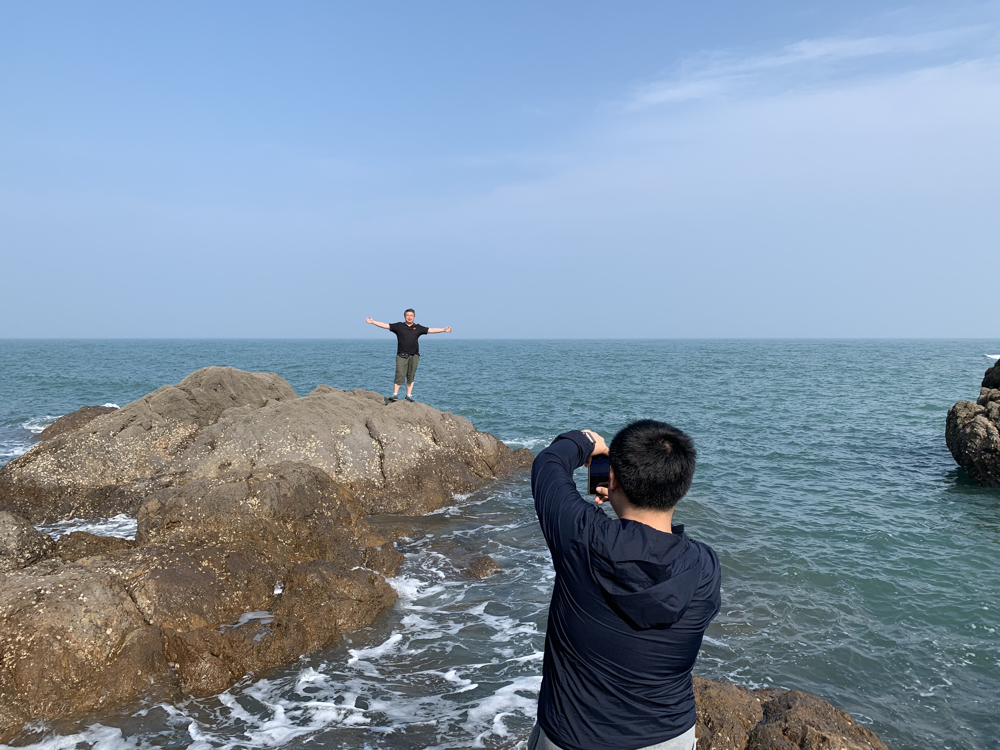
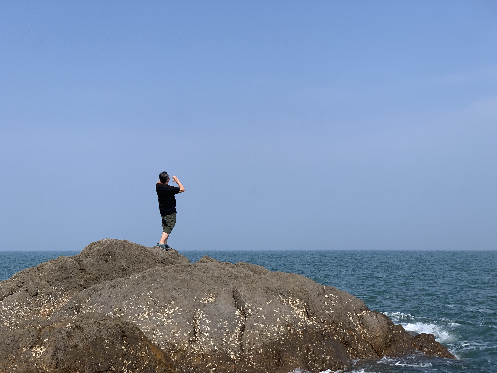

# 与左耳朵耗子的一面之缘

2019年6月，我约了去见 Kevin Zhow。
“刚好我有个朋友来了，一起见见”
“好啊”

就是这么机缘巧合的我见到了陈皓，然而当时我对他一无所知。
对于皓哥（跟着 Kevin 这么叫了）的了解是在那之后通过 Twitter 和 CoolShell 慢慢探索的。
然而对话却只有那短短的一个下午，但也足够影响我至今或是未来。

互相简短的认识之后，心想可以见到这么厉害的程序员多亏了 Kevin。
后面提到了我正在学编程，其实这是我第三次尝试。
“现在开始写，写个十年就很可以了”
至今很清楚的记得皓哥如此说道，
然后问我多大，
“31”
“嗯，写十年到40岁一样没问题，”
“不要担心什么35岁不能写了，好公司大龄程序有不少...“
后面的这些话就没有记得那么清楚了。

只是“...写十年...“那句我至今依稀记得，轻松但又不失认真的语气，
我想也只有真的喜欢写程序的人会这么说，在意的是积累而不是年纪。

## 现在
15号凌晨收到 Kevin 发我消息 “陈皓走了，心梗”。
前些天还看到皓哥在 Twitter 上谈论关于 AI 的话题，
一时间也不知道怎么安慰 Kevin， 只能简单的说出 “节哀”。

虽然我与皓哥只有那一面之缘，但依然觉得惋惜，也心怀感激。
就像 David Bowie will never die 一样，陈皓也是。

