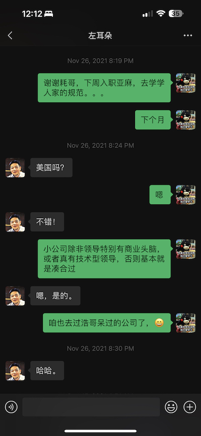

# 耗子

感谢兄弟们创建了这么一个Repo来让大家表达对耗子的思念。也希望耗子的家人，孩子通过这些来更多的了解耗子，在接下来的日子里勇敢前行。希望你们了解，虽然你们最爱的人走了，但是因为他生前的为人，他的影响。今后你们有需要，联系我们当中的任何一个人，我们都会竭尽所能的帮助你们。

说实话，我现在依然无法消化这个事实。当我在群里看到有人说这个消息时，我非常确信是有人在造谣，因为我知道耗子有时候会在微博或者twitter跟人争论，所以有人刻意中伤也不奇怪。然后我就微信耗子，telegram他，希望他出来辟个谣。当我知道这是真的地时候，我头皮发麻，觉得难以相信。

我没有见过耗子，但是一直follow他的文章，他放在网上的视频，他教的课，他的朋友圈。有事的时候会直接找他，但是也知道他忙，所以没事也不会打扰他。我已经不记得什么时候第一次看耗子的文章，觉得应该是很久很久之前了。见字如面，从他的行文中你就能很直接地了解他是一个什么样的人，他性格怎样，他喜欢什么，讨厌什么。我被他的文章吸引，进而想了解更多，然后越看越有意思。我感觉那个时候我不会编程，但是依然觉得他做的事，他这个人很有意思。如今我已经是美国AWS的一名软件工程师，我在入职亚麻的时候还给耗子发过消息，很自豪地告诉他，咱也进了当初耗子待过的公司。

我曾经是一名果粉，所以当得知乔布斯逝世的时候我很伤心，还哭了。我觉得一个这么热爱自己所做的事情的人，不应该这么早就离去。但是不管怎么说，乔布斯并不认识咱。几年前因为工作，需要找编程界的KOL，靠这个机会跟耗子取得了联系，也算跟自己崇拜的人有了接触。耗子对我来说就是启明星一样的人物，我最大的梦想就是能到他开的公司工作，把他知道的东西都学到手；或者参与它的项目，能够有所贡献。也希望他能够把项目带到美国来，越做越好。

只可惜，目前为止还没有为他的开源项目尽一份力，唯一的一个[commit](https://github.com/haoel/haoel.github.io/pull/8/commits/8d225f252ff88af41eb45e3de5d46163c397a77d)贡献在耗子的[科学上网](https://github.com/haoel/haoel.github.io)文章里。能够在他生前合并一次我的代码，我已经很知足和自豪了。

耗子的去世让我想了很多。生活是充满未知的。无论你信不信神，生活中总有时候你是需要负重前行的。但是人不可能永远生活在痛苦之中，所以我们总是需要信仰和支撑，帮我们度过苦难的时期。耗子的一生当然也充满挑战，但是总的来说他是快乐的。因为他很早就找到了自己热爱的事情，并且持续在做。

从耗子身上学到了什么？耗子一直有分享他的人生观和做事的方法论，你从他的经历中能够知道，他之所以成为他，并且没有人做成第二个他，就是因为他觉得这个东西好玩，所以他不断地花时间在这上面，并且乐于分享出来。这同时也成就了他豁达的性格，他说过，赚钱这个东西并不难。他坚信他做的东西一定会成功。这种自信也让他能够不为生活中琐碎的事情分心，集中精力做他认为有意义的事情。

我能不能成为耗子呢？简单来说不能。当这个消息确认的时候，我看到群里的人都在发RIP。我觉得这没什么意义。我理解，能加进耗子群里的，说明理念是相近的。但是当这件事情过了之后，绝大多数的人还是继续当前的生活，没有一丝丝改变。是的，改变是很难的。人不会因为许愿，发誓而改变习惯。随着年龄的增大，即使是外界刺激，也很难让人做出持续性地改变。惰性让大多数人随遇而安。

生命之中大多数事情我们是无法掌控的，就像我们喜欢谁，崇拜谁，这个是外界无法强迫的。当然我们也会有期望，有朝一日自己能成为自己崇拜的偶像。但大多数人都是一时冲动，要行动的时候往往会觉得遥不可及，也就逐渐放弃了。

人人都有梦想，现实中能够为之坚持努力的人其实少之又少，而最终实现梦想的人，那真是老天爷的眷顾。我觉得耗子在天有灵，看到他其实影响了这么多的人，他一定笑地乐开了花。人最大的意义是家人，我希望耗子能够欣慰。有这么多的人，一辈子都不会忘记耗子。

如果我有困难，有疑问，我觉得耗子能够帮我，我一定想方设法找到他。我希望耗子的家人，特别是孩子，也能做同样的事情。能够做你爸爸朋友的人，都是可以依靠，值得信赖的人，不管生活中有没有困难或者疑问，多跟他们交流一定会有所收获。耗子很推崇美国人或者西方人的做事方式，中国人比较含蓄，一般不轻易麻烦别人。我希望你们不要有所顾忌，因为耗子的朋友，耗子真正影响到的人，是他留给你们真正的财富。

相信我，所有在这个repo里面留言的人，都是值得信赖和依靠的，因为他们都是深深的受你父亲影响的人。

黄强

2023年5月17日, Redmond, WA