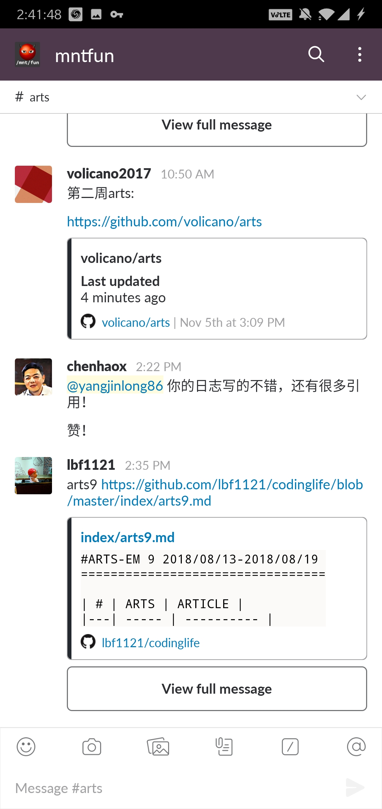
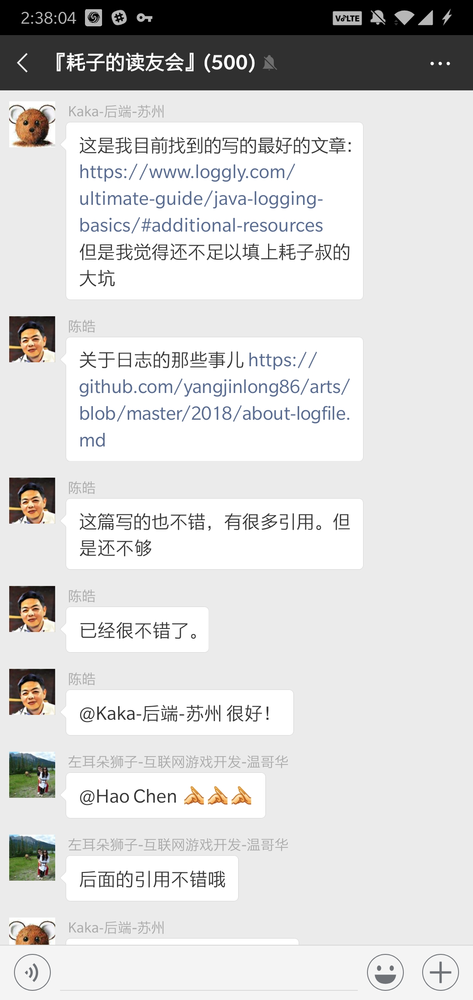

皓哥是我技术方面的偶像。

2012年，我看到一篇文章[程序员技术练级攻略](https://coolshell.cn/articles/4990.html)，中肯的建议、清晰的升级路线，对刚入行不久的我帮助甚大，从此就被皓哥圈粉，关注他的微博、twitter，学习coolshell的文章已经变成了日常。

> - 不要乱买书，不要乱追新技术新名词，基础的东西经过很长时间积累而且还会在未来至少10年通用。
> - 回顾一下历史，看看历史上时间线上技术的发展，你才能明白明天会是什么样。
> - 一定要动手，例子不管多么简单，建议至少自己手敲一遍看看是否理解了里头的细枝末节。
> - 一定要学会思考，思考为什么要这样，而不是那样。还要举一反三地思考。

2018年，订阅了左耳听风专栏，和群里的兄弟们一起坚持`ARTS`能力训练活动，我坚持了43周[ARTS](https://github.com/nocdr/arts)，虽然产出的质量不高，但是过程中的收获非常大，也让我养成了阅读英文文档的习惯，并且发掘了很多高质量的技术网站，还很费劲的刷了一些leetcode题。在读友会群里，有一次完成皓哥布置的命题作文《关于日志的那些事儿》，还得到了皓哥的表扬鼓励，当时非常激动的截了图。

>Hao Chen [Yesterday at 2:22 PM]
>@大龙 你的日志写的不错，还有很多引用！
> Hao Chen [18 hours ago]
> 但是还不够，还要再多找找. wikipedia上可以找找相关的词条。 (edited)
> Hao Chen [17 hours ago]
> 日志的格式分两种，一种是access log（像nginx/apache这样的），这是有标准规范的，另一种是runtime log，这是运行时的程序的行为日志，就是需要有log level的，也有输出的格式要求。
> Hao Chen [17 hours ago]
> 然后，日志归档写的还不够，没有细节。

通过读友会群加了他的微信，通过之后我很兴奋，居然加了偶像的微信，我跟他说，我以为您会不同意加好友，他说不会的。后来是2022年有段时间我在工作上有一些变更和挑战，面临着未知的压力，那段时间特别焦躁，每天看书学习到深夜。有一天我鼓起勇气在微信上给皓哥发消息求指导，皓哥不耐烦的问着我的工作情况，让我非常感动。现在看来，那个时候他的任何一句鼓励都是我最强大的精神支柱。

皓哥走了，但他留下的东西，依然指引着我们前进。