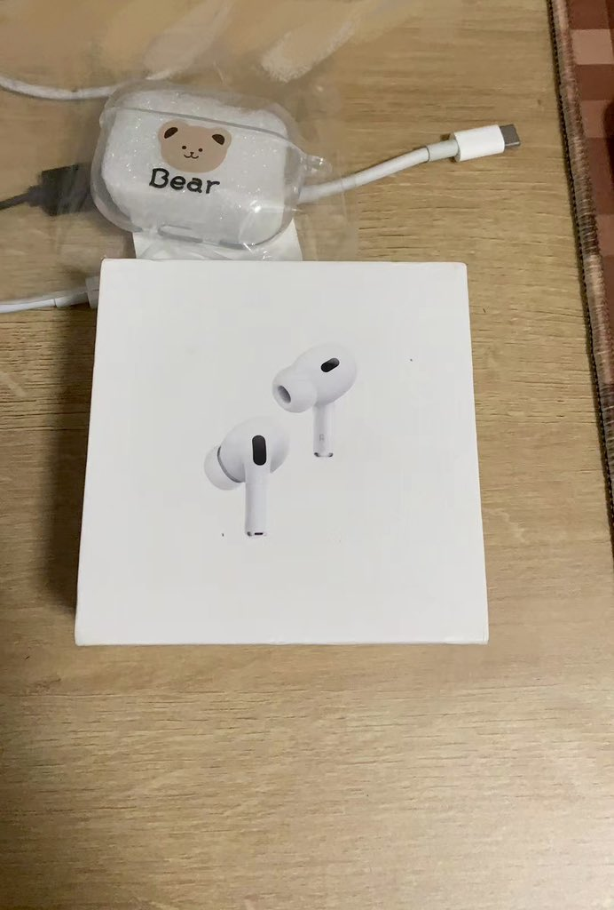
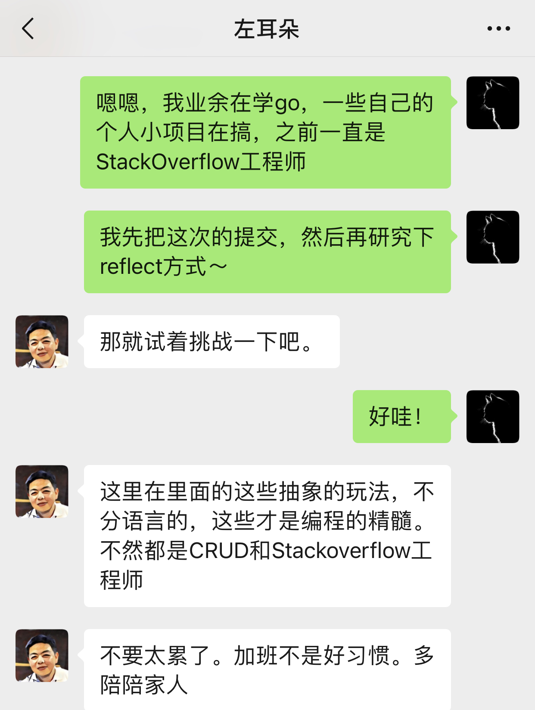
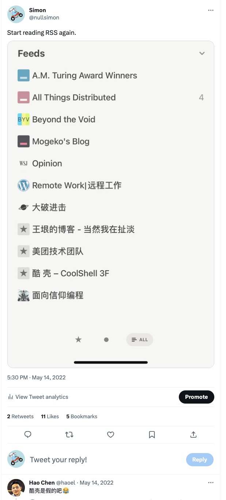

# R.I.P 左耳朵耗子

挺希望这是一个玩笑的，由开始的不敢相信，到后来的伤心难过。

自己一直是看着耗子叔的博客慢慢成为一个技术人的。

他对技术的热爱，让我觉得很纯粹，我见过太多只是拿技术谋生的人，所以我一直觉得这是一个志同道合的人，很难得。

有幸去年参与他的开源项目而结识，一起微信语音沟通需求，问题，解决方案。后续还因为我的PR给我送了一个AirPods。

他知道我是半路出家，还指导我如何进一步学习一些技术要点，引导我去刷leetcode，同时还聊到一些技术的弊端，坑。

当时聊天后知道我在阿里，还跟我说年轻人不要加班，早点休息，要多陪陪家人。

翻看twitter还发现一个真假李逵的小插曲，当时我错误订阅了一个假的coolshell的RSS订阅。

希望耗子叔一路走好, R.I.P
