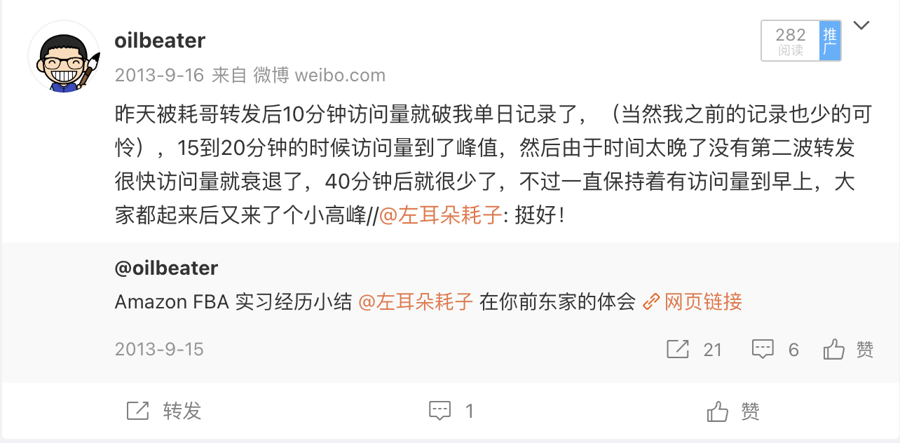

# 我和耗子叔的回忆

## 初始酷壳

和很多人一样，第一次接触耗子叔是通过 coolshell.cn 博客。

当时印象最深，对我之后影响最大的应该是 [分享：我的READER订阅](https://coolshell.cn/articles/2105.html) 。当年尽管我已经是大三的计算机专业的学生，但是课本外的专业知识还是相当差劲，也不知道哪里才能获得一手的信息和资料。让我一个象牙塔里的学生，接触到工业界最先进的技术就是从这个列表开始的。这个 RSS 的列表陪伴我度过了很多年，很长时间我的计算机技术相关的信息都是依赖这个列表。

## 亚马逊的擦肩而过

几年后在我实习的时候，碰巧去了亚马逊中国耗子叔在的那个部门，不过当时耗子叔已经去阿里了，没能在亚马逊碰到。实习结束后我专门写了篇博客记录当时在亚马逊实习的经历，抱着蹭流量的心态我在微博发博客的时候 @ 了一下耗子叔。本来是抱着蹭到就算赚的心态，没想到耗子叔很快就转发了，当时博客流量就上来了，我还拿出去和同学们炫耀了一段。开始写博客的初衷也是受耗子叔博客的影响，这个博客几乎是我早些年工作没啥成就时，唯一能拿得出手的东西了。

## 从阿里到 Docker

第一份工作去了阿里，总算是和耗子叔到了一个公司，但是部门差的太远，没有什么业务的交叉，起初也就没什么交流。当时 Docker 开始崭露头角了，阿里内部各个部门都有一拨人都看到了这个技术的突破性，想在阿里内部推广这个技术，几个不同部门的人组了个群聊这些事，我和耗子叔凑巧也在这个群里。当时我还是个应届生，肯定掀不起什么风浪，但其他高级别的人也都碰到了不少阻碍，所以不断有人跳出去单干，我们也戏称这个群变成了前橙会群。

在当时阿里内部大领导已经拍板不会推进 Docker 了，耗子叔在这个过程中也遇到了不少风波，里面涉及到很多复杂的人和事这里就不多说了。内部做不了，我当时其实也有了去找个创业公司做 Docker 的想法。

作为社恐的我那天还是鼓足勇气和耗子叔私聊了这件事，耗子叔还是出乎我意料的快速的就恢复我了。在谈到容器在阿里的时候耗子叔情绪还是挺激动的，觉得阿里做事不地道，在阿里搞 Docker 已经不可能了，说了很多的气话。然后我再提及了想去外面的创业公司做 Docker 的事情，本以为情绪都烘到这个地步了，应该会和我再吐槽几句阿里是垃圾，让我赶快去外面吧。结果耗子叔话头一转，开始劝我在阿里先稳住，有一定积累再去看外面的机会。

我在那一刻突然意识到，耗子叔是那种我之前很少没见过的，并不是以公司立场甚至不是以个人的立场去考虑问题，而是真的完全出于为你好的立场去考虑问题。而我当时其实只是想找个大牛去肯定我的一个决策。

之后我还是去了那个创业公司，一直到现在，今天回过来看，如果从经济的角度那我当年还是应该听话的。鬼知道阿里转身就是 All in 云原生。

## 多年后的合作

之后很长一段时间和耗子叔都没什么联系，最近几年我开始做开源项目，一直不瘟不火，不知道该怎么去推广。这时候耗子叔也开始创业了，并且把公司内部的技术分享放到网上，我就又萌生了去蹭流量的想法。说来惭愧，这么多年都没帮过什么忙，每次一有事情还都想着去蹭。另一方面耗子叔创业也在云原生领域，所谓同行是冤家，了解这个圈子的应该知道这个圈子友商之间交情都挺差的，见面不打架就算客气了，我这还想明目张胆的去蹭流量。

本着蹭到就算赚我还是发了微信，想在他们的分享会上分享一下我们最近的技术进展。耗子叔依然出乎我意料快速的就答应了我，让然后就张罗起来了。

{:height 789, :width 776}

尽管很多年都没联系，但耗子叔像老朋友一样就要和我语音聊聊，一聊就聊了一个半小时。从云原生这个领域来说，我们俩几乎是同时进入的，要说正儿八经当职业来做我还更早一些，我本来以为自己还算老兵了，尤其在网络这个领域我也还算可以，但耗子叔的很多观点还是让我觉得自己狭隘了。

我们聊到当时为了让 kube-ovn 这个项目能被更多人使用，我做了很多在云原生领域并不推荐的功能，让更多非云原生最佳实践也能跑起来，这个成为了我们早期吸引用户的最大卖点。耗子叔很直接的指出我的做法过于功利了，快速的获取用户变成了我最优先的目标，为了完成这个目标我其实在鼓励用户使用并不符合最佳实践的做法。虽然我的做法能吸引用户，但是并没有让用户发挥出云原生最大的价值，这种形式上的云原生最终并不会产生业务上的收益。如果是他的话，他会劝说用户尽可能使用最佳实践，而他所有产品功能也都是依托最佳实践基础来做的，尽管初期改造后会很痛苦，但是改造后能够确定性的有大幅度的改善，而不是为了云原生而云原生。

说实话，在之前我一直觉得云原生领域已经挺无聊的了，东西就是那些，每天都是各种和现实磨合，甚至都忘了当初是为啥要加入这个领域。大概是理想多次被现实扭曲，所以才变得这么功利吧。

耗子叔之后介绍了当时 MegaEase 的愿景，当时在外面能看到的还只有一个网关，但背后其实有个更大的梦想。耗子叔希望透过流量入口和云原生的技术把复杂的多云管理变的简单，通过云原生可以做一个跨公有云的系统，符合这个最佳实践的应用，存储、网络、计算都可以在多个云间快速的迁移。这样可以把多个公有云变成自己的资源池，把价格给打下来，给用户提供更优质低价的云服务。

当时听完后我是有点懵的，技术上我是听懂了的，但是还是被里面的一些有想象力的做法惊住了。耗子叔看气氛差不多了就问我，你们公司现在做的产品我看过了，挺没意思的，也不咋地，你要不要过来和我干这个？我内心 os 了一句你知道做这个不咋地的东西我有多努力嘛？嘴上说那等我把这个公司做黄了再去你们那吧。耗子叔听完哈哈一笑，说这倒也不至于，不至于。

那时候我们都还以为会有合作的机会，没想到之后再也不会有机会了。

## 回想

回想这些年来和耗子叔的交往，每次都是我有求于他，每次我多觉得这是不是太占用他宝贵的资源了。但是每次都会得到他毫不迟疑的，全情投入的帮助。他对技术理想的执着，对有着技术热情人的支持，只需要只言片语就深深的感染了我，让我在现实的阴霾中又看到了理想的光辉。如果我们每个人做事的时候想想耗子叔哲哲情况会怎么做，遇到有人需要帮助时想想如果是耗子叔会怎样帮我，那我想耗子叔不只有数字分身，也会在我们每个人的精神世界中有个分身。我想说他是个高尚的人，纯粹的人，在搜这句话出处是发现出自《纪念白求恩》，里面的一些话似乎正是再说耗子叔，就让这段引文作为这个纪念的结尾吧。

> 从前线回来的人说到白求恩，没有一个不佩服，没有一个不为他的精神所感动。晋察冀边区的军民，凡亲身受过白求恩医生的治疗和亲眼看过白求恩医生的工作的，无不为之感动。每一个共产党员，一定要学习白求恩同志的这种真正共产主义者的精神。  
> 白求恩同志是个医生，他以医疗为职业，对技术精益求精；在整个八路军医务系统中，他的医术是很高明的。这对于一班见异思迁的人，对于一班鄙薄技术工作以为不足道、以为无出路的人，也是一个极好的教训。  
> 我和白求恩同志只见过一面。后来他给我来过许多信。可是因为忙，仅回过他一封信，还不知他收到没有。对于他的死，我是很悲痛的。现在大家纪念他，可见他的精神感人之深。我们大家要学习他毫无自私自利之心的精神。从这点出发，就可以变为大有利于人民的人。一个人能力有大小，但只要有这点精神，就是一个高尚的人，一个纯粹的人，一个有道德的人，一个脱离了低级趣味的人，一个有益于人民的人。  
