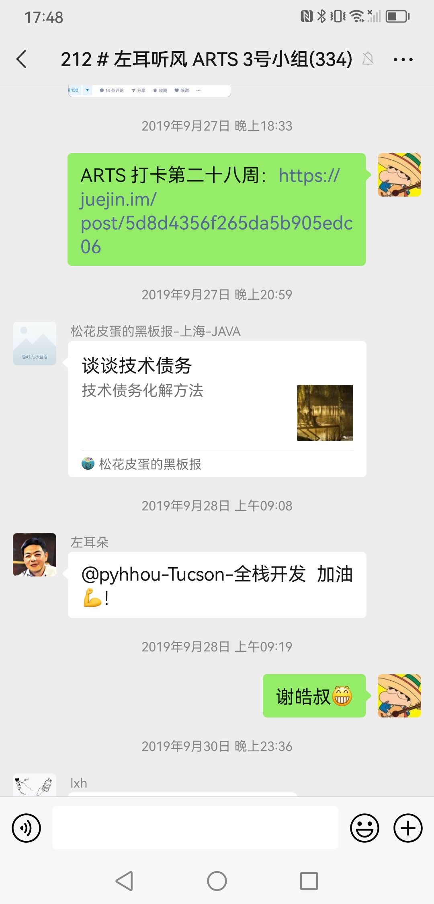

# 以此怀念左耳朵耗子

## 皓叔教会我的

最初我是从极客专栏认识皓叔的。如果没记错的话，应该是在 2019 年年初，那个时候我毕业工作不足 1 年，还是在一家小公司，做的东西很杂，对整个互联网行业没有一个基本的认知，可以说那时的自己就像一只无头苍蝇一样，一会学学这个框架，一会又学学那个服务，很难说自己真的掌握了些什么。很是有幸能读到皓叔写的专栏，继而通过专栏又知道了 coolshell。

皓叔的每一篇文章，每一句劝导对那时的我来说都是及时雨，他的很多观念给当时焦虑的我吃下了定心丸。下面的列出来的理念都是我从他那学到的

- 计算机知识的学习没有速成，只有十年如一日地不断更新自己才是正解
- 计算机这个行业并不存在年龄的限制，只要你有兴趣，有热情，任何时候都不晚
- 基础很重要，只有掌握了基础知识，你才能在技术这条路走的更远，或在某个技术领域扎得更深
- 学习是为了找方法，而不是找答案
- 要从知识的源头学起，这样才能事半功倍，这也是为什么我们需要去读很多的西方的著作，因为计算机起源于西方
- 要懂得对那些浪费你时间的事情说不，任何时候都要留一些时间来读书学习以提升自己
- 远离碎片、远离八卦、远离百度，远离那些一心只为了流量和利益的人或事
- 。。。

皓叔让我在这个嘈杂的世界沉静了下来，让我在日新月异的计算机领域明确了方向，让我更加珍惜自己的时间，把时间花在真正有价值的事情上

皓叔在极客时间上写的 **程序员练级攻略** 我来来回回读了不下 20 遍，把里面推荐的书籍和文章都仔仔细细记录了下了，并制定了计划去努力啃完它们，已经完成了一部分，直到现在我还是在坚持去反复学习专栏里面提到的那些专业基础知识，希望有朝一日我能像皓叔一样，对这里面列的东西融会贯通，信手拈来

## ARTS

ARTS 是皓叔在极客时间发起的一项挑战，目的是让更多的人开始坚持技术的积累。在皓叔的倡导下，[我坚持写 ARTS 快 2 年](https://github.com/peteryuhang/arts)。之所以提起这个，是因为通过写 ARTS，我开始技术写作，开始阅读英文文章，开始对一些社会现象发表自己的见解，开始关注一些社区。虽说现在我已经不再写 ARTS，但是我时不时还是会通过写作来记录自己的所见所想，通过写作来进行技术输出。在写 ARTS 的过程中，我养成了技术积累以及技术输出的习惯。也是通过写 ARTS，皓叔在他文章中提出的那些理念在我心中也变得更加清晰明朗起来。那些理念不再是别人嘴上说的貌似有理的道理，而是我工作学习的指导原则。我也梦想着像皓叔一样，有朝一日能够通过写文章来帮助其他处在迷茫和困顿当中的人。

我时常被问起，为什么可以坚持周周写 ARTS，而且坚持这么久。我想其中一个原因便是我对皓叔的价值观深信不疑，虽然没有线下见过皓叔，但我觉得皓叔很多事并不仅仅是嘴上说说，分享的书籍、文章、方法，都是自己看过觉得好的，才会告知于我们。他将自己几十年来的经验教训反反复复通过各种各样的形式告诫我们，话语中肯却句句中的。想必他告诉我们去实践的东西也一定能帮助到我们。现在回过头来看自己，能在刚踏入社会时啥也不懂的时候接触到皓叔，我很是欣慰。这时，我又想起了他不厌其烦地提醒我们，鼓励我们要坚持去啃那些硬核的专业知识。告诉我们慢慢来，比较快

## 最后的话

他在这个人人都不情愿说真话的年代，义无反顾选择了说真话。就如他所说 “做正确的事情，等着被开除”

他在这个流量与利益驱动的社会，努力去做一些和流量利益无关但却能帮助他人的事情

他像是这物质横流的世界上的一方净土，尝试着告诉旁人，技术并不仅仅只是赚钱的工具，技术和生活一样，也可以五光十色，多姿多彩

他告诫我们选择比努力更重要，并且很多时候还亲力亲为地帮助我们做选择

他努力开导我们，让我们不再对当下焦虑，不再对未来害怕

。。。

我曾幻想着等自己积累了足够的专业知识，有了足够的经验，我可以和皓叔一起工作，一起学习，一起谈技术，谈人生。只可惜自己没那个福分了。。。

谢谢你，皓叔！感谢你的谆谆教诲，字字句句吾将铭记于心

愿天堂没有 bug

R.I.P.
