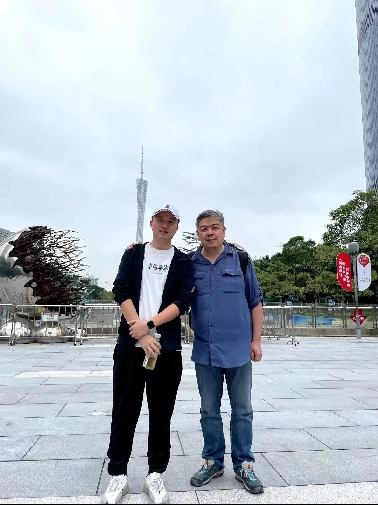

早在学习编程的时候，https://coolshell.cn/ 酷壳就是我常去的网站，这个博客的技术文章观点鲜明，充满了技术人的理想主义和人文色彩。字里行间颇有王小波的影子。

我被这种独特的文字吸引，以至于每篇文章我都会反复地阅读，畅快淋漓，coolshell 所倡导的技术理念，以至于对我今后的技术道理产生了蛮大的影响。

后面大概是 20-21 年的时候，皓叔在极客时间开设《左耳听风》的专栏，我也因此成为了极客时间的读者，由于有 coolshell 信用背书，我当时毫不犹豫就购买了该专栏。并且学完了的专栏的全部课程：

后面因为践行皓叔发起的 ARTS 活动（每周完成一道 Algorithm 算法题，阅读 Review 一篇英文文章，每周总结一个工作中的技术 Tip 技巧，Share 一个传递价值观的东西）。在技术群里结识了皓叔。虽然现在的技术群已经解散，但那段时候高强度的训练，让我的算法、代码、技术和影响力的都得到很大的提升，群里面优秀的小伙伴的分享，也让我见识了人外有人，天外有天。更加懂得虚怀若谷，保持谦卑。

后面结识皓叔是因为一个名为 highlight 的项目，你因为太忙想要找人帮忙，我那时候刚好有空，也觉得这是一次难得学习和锻炼的机会，也就主动参加了。虽然说是帮忙，但是从数据库设计到系统设计，你手把手在指导，虽然项目最后黄了，但在你的指导下，学到了很多知识，也收获了一群很有趣的和志同道合的小伙伴。度过了一段有趣的时光。

后面由于 highlight 项目的关系，后面慢慢的有了你的联系方式，第一次皓叔给我打电话的时候，我记得是晚上 10 点（之前都是微信聊），那天也聊了很晚，我那时候也正处于迷茫期，不知道何去何从，但皓叔和我聊了很多，聊技术，聊职业规范，聊未来发展等等，告诉我要相信技术，要用技术去创造价值。。我还记得我那天晚上开心的睡不着，我没有想到一个技术圈的知名人物居然会花时间去指导和帮助一个默默无闻平平无奇的小子。这也激发了我对技术的热爱和要走技术道路的理念。

后面不久，你出差就来广州，作为创业者和技术圈的知名人物，你当时还在百忙之中抽空见了我一面，在花城广场饭后散步，你和我分享了很多自己的生活，经历，创业感悟等等。。作为技术圈的名人，初次见面却感觉非常的亲切，不仅是老师，也就像一个多年未见的朋友，这可能也是因为你的发自内心的善良和对他人发的关心。

明明此情此景，犹如昨日，但在 5.15 日收到你的讣告，顿时觉得难以置信。记忆太过鲜活。明明前几天你活跃在朋友圈分享，你写的文章，玩游戏还有你的教育理念，这几天心情一直很沉重，脑子里不断的在回想怎么可能这么好一个人，突然间就走就走了呢。。

司马迁曾说：人固有一死，或重于泰山，或轻于鸿毛，你精彩而短暂的一生，为这个世界增添一抹色彩，你的离开，也让这个世界少了一个热爱分享，观点鲜明独特，不功利，充满理想主义的人。

斯人已逝，生者如斯，以下是你的座右铭：

芝兰生于深谷，不以无人而不芳
君子修身养德，不以穷困而改志

你生前所推崇的理念和价值观，也将永远是我学习的方向。

愿在天堂安好。R.I.P.