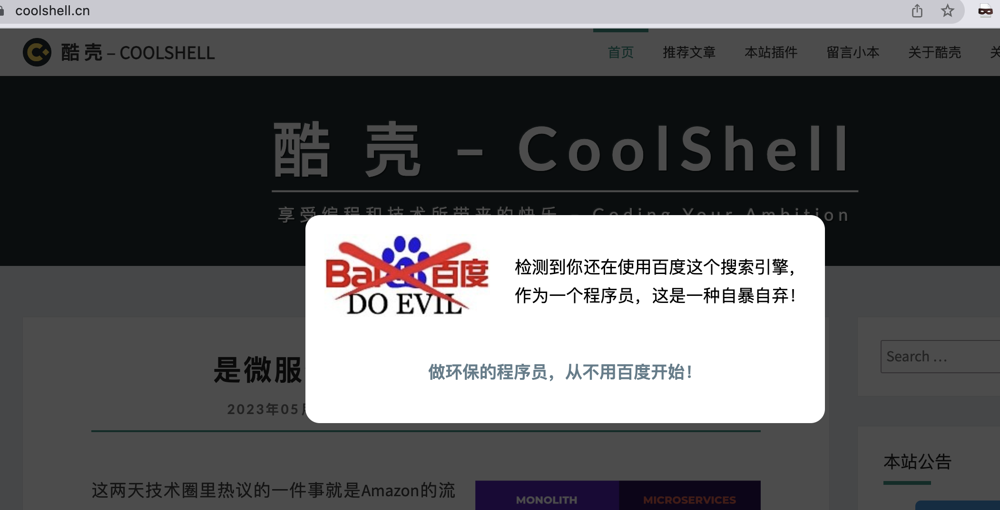
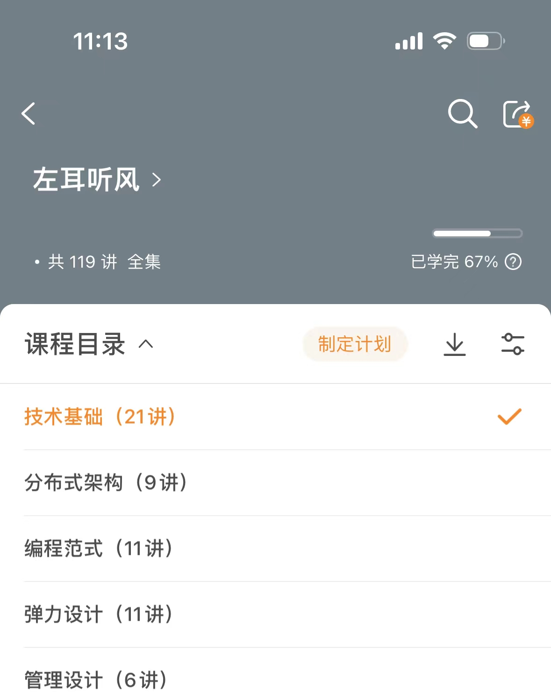
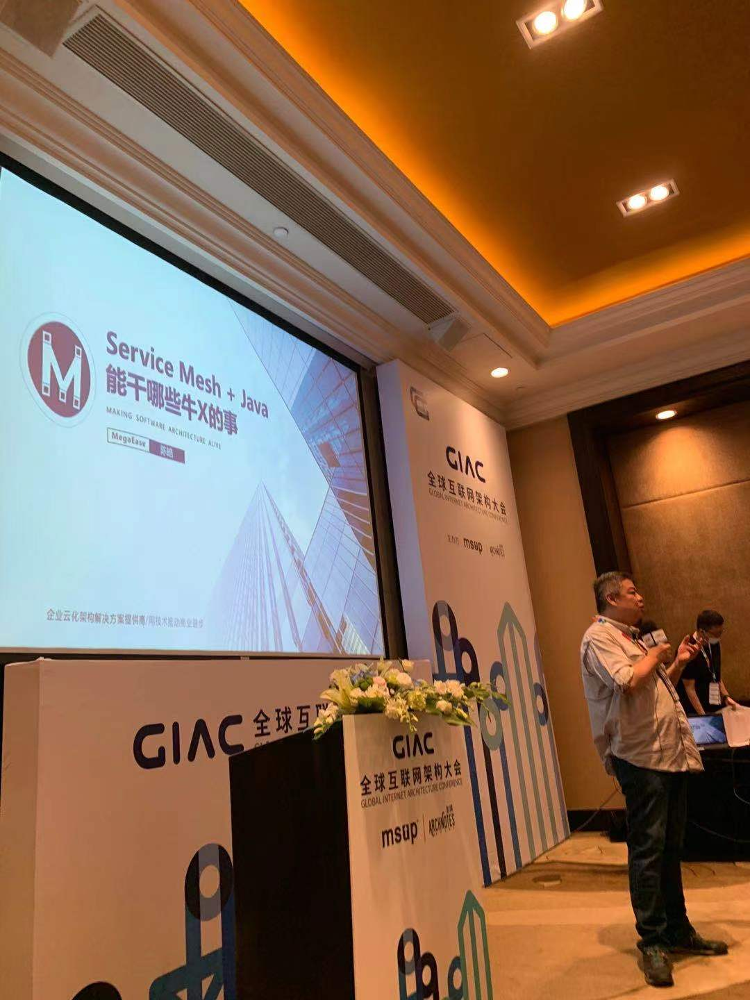
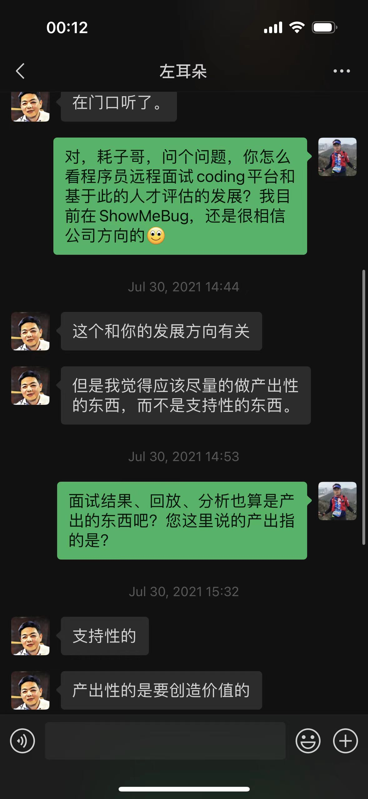
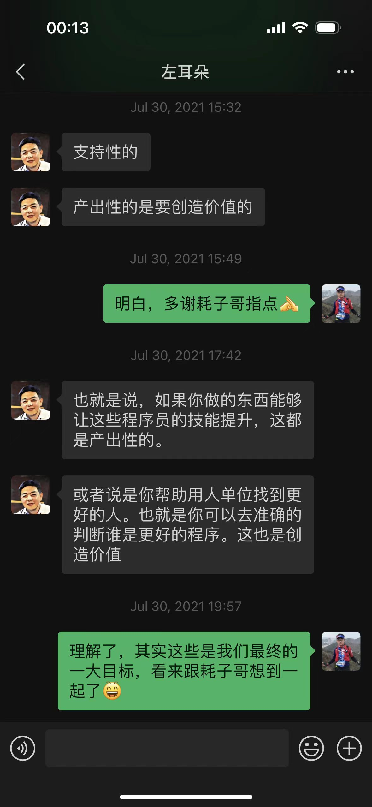

# 我与耗子哥的故事

## 立场鲜明
第一次见识到耗子哥的个性，是多年前偶然从百度跳转到[酷壳网](https://coolshell.cn/)时，首页的弹框。

  
    

点击弹窗的链接会进入一篇博客[“作环保的程序员，从不用百度开始”](https://coolshell.cn/articles/9308.html)。里面详细介绍了耗子哥与百度的来来回回，读着这样的文字，脑中浮现一副“程序员侠客”的形象，国外黑客中有不少这样很有正义感的程序员，很高兴国内终于有一位可以归为此类的人。

## 左耳听风

2018.1.21 我买了耗子哥在极客时间的专栏《左耳听风》，当时第一次感受到大佬的水平，每一篇都是他深度思考的结果，收益匪浅，里面讲到技术人应该追求路线，我觉得我到现在还没有做到。

今年准备再深入读一遍。

  
    

## 沟通技巧

2020.10.23 耗子哥在极客做了个直播，讲沟通的技巧。我找到当时的几张截图整理下内容：

- 沟通障碍
    - 信息不准确 ⇒ 要简单准确、强调重点、慢点回答
    - 信息太多 ⇒ 要直接了当，不绕弯、不铺垫和解释太多
    - 没有交互 ⇒ 问开放性问题、鼓励表达真实想法、培养参与感
    - 表达方式 ⇒ 表达方式要积极、不在细节上争论
- 沟通技巧
    - 引起对方兴趣：事前做足功课、找到对方的 KPI
    - 真实主题，强化观点：过滤无用信息、消除模糊歧义的信息、明确笼统的事情
    - 基于数据和事实：少说“可能”，列举证据参考，给出数据

耗子哥还讲了程序员要想成功，得做好这三个方面

- 时间管理
- 沟通：其实包括对老板、平级、下属的沟通
- 学习能力

耗子哥说**程序员有两种**，他很希望大家都往工程师方向努力。

- 操作员（操作代码的程序员）
- 工程师（有解决工程问题的能力）

最后他还推荐了几本书：《Code Complete》《重构》《GoF》《数据密集型应用系统设计》

记得中间耗子哥最后还讲了厚黑学中的 PUA 术，当时有点小震撼，但录屏找不到了，这块如果有小伙伴保存的话，可以分享下。

## 五米之内

2021.7.30 [全球互联网架构大会 GIAC](http://giac-history.msup.com.cn/) 在深圳南山区的华侨酒店，我第一次见到了耗子哥，他的演讲现场挤满了人，我在前面第一排站着，跟他相隔不到 5 米，听完了全程。

演讲主题是“Service Mesh + Java 能干哪些牛叉的事”，但演讲的具体内容我忘得差不多了。耗子哥比我想象的胖了不少，声音很浑厚，看得出对程序员群体很愿意交流和分享。

  
    

## 言传身教

当天互联网大会结束后，耗子哥在大屏幕留下了自己微信的二维码，我马上加上了，会后私下问了一些问题，耗子哥一一作了回答（如下图）

  
    
    

耗子哥一个观点是要“**尽量做有产出性的东西，而不是支持性的东西**”，也就是能产生价值的或者帮助别人产生价值的东西。

直到今天我依然感激他这么对待一个萍水相逢的程序员，他不在了，但这些聊天记录仍能唤起记忆。

谢谢你，耗子哥，很欣慰中国有你这样立场鲜明、有正义感、乐于分享的程序员！

最后附上几个耗子哥推荐过的国外程序员博客

- Jeff Atwood：[https://blog.codinghorror.com](https://blog.codinghorror.com/)
- Joel：[https://www.joelonsoftware.com/](https://www.joelonsoftware.com/)
- [http://blog.cleancoder.com](http://blog.cleancoder.com/)
- Paul：[http://www.paulgraham.com/articles.html](http://www.paulgraham.com/articles.html)