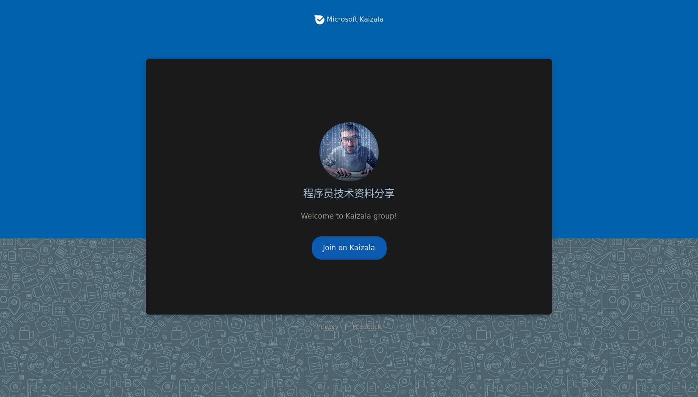

# In memory of Haoel

本来早已，至少是去年疫情依然严重（上海封城）的这个时候，当时正在做职业生涯里第二重要的抉择，已经决定不再跟过多人联系（再进一步向二冬学习，当然也可以是只学了皮毛），博客也荒废了很多年，我觉得还是要写点东西，为了纪念虽未谋面，但却比我遇到的其他人更多影响我的灵魂，以及证明我也曾活过。

最开始是上大学时读他的《跟我一起写Makefile》，这也是让我对计算机世界真正产生浓厚兴趣的开始。但是在这旅程的起点，他写在CSDN个人信息上的那句“不以无人而不香，不以穷困而改节”更是刻入我的脑海，我心里也说要作这样纯粹的人，虽然在高中就有朋友和老师因我的鲜明的个性而建议我要去“适应环境”。

然后就是酷壳，基本每篇文章都会去读，虽然不一定都懂。这里印象最深刻当属《程序员技术练级攻略》和《作环保的程序员，从不用百度开始》，前者自然不用说，是程序员难得一见的职业指南和寻宝地图，后者跟他起诉出版社侵权一样，让我觉得这就是程序员的自我修养吧，不作恶（在魏则西事件显现更为突出）。而我也基本只用谷歌（当然这同样存在类似vendor lock-in的风险），软件也尽量使用开源软件（除了信仰，至少这样方便Hack/Debug）。
为了看他的消息（当然是技术贴），我也会偶尔登录微博，后来他微博用得少，我就只用关注推特。从　微软 Kaizala 的程序员技术资料分享到 Telegram 的程序员资源分享社区，我也一直想关注业界的技术风向标，虽然后来tg群无关技术讨论太多，我也只订阅了他的tg程序员资源分享频道，推特上讨论我一直在围观，包括最近的aws通过rtt限流的讨论我后来也发给研究网络的朋友（他不上推特）。

自我从业十余来年，能有如此技术深度和丰富经验，能如此热情分享和帮助身边的人，算我孤陋寡闻，我只碰到这么一位。做到前者的人很多，而能那么关心身边的每个人，包括回复陌生人的邮件，倾听别人的声音，那么平易近人，不计名利，我觉得能认识这样的人是无比幸运。2020年初跟一位同事一起吃晚饭聊天时，他说他的前同事在跟耗子一起做事，我开玩笑说等我哪天厌倦了我也去免费打工（虽然可能人家看不上我）。上一家我觉得想加入的公司是豆瓣，直到我的豆瓣广播被系统’仅自己可见‘。

第一眼看到那条消息，我不敢相信，但是再三确认，的确是他的好友确认后再发出来的，我感觉心一下子空了，像一位多年好友未辞而别，他对我的影响是要比其他任何人（包括亲人）都要深。看着一篇篇纪念文章，一遍一遍地刷新，一个和蔼可亲的形象跃然纸上。看到有人提到他“常关心自己的孩子，所以我安排了我的儿子与他们的孩子进行英语交流，＂，我同样作为一个父亲，希望也能同他一样，能让孩子在长大后为曾有这样一位父亲感到骄傲。作为一个小插曲，当时跟一个朋友发消息时，“天妒英才” ibus-pinyin 竟然打不出来，虽然我虽然刚从Mac迁移到Ubuntu上，但是这个让我非常惊讶。当然一番研究后，发现是词库问题，以及未开启Cloud Input。

我记得上高中时的一篇英文文章，大致内容是，就是有个（战乱地区的？）小孩紧急需要输血，找了一圈，这个小孩的一个朋友同意了，等输完血后这个朋友问医生自己会什么时候死，当时只是当作一篇英文课文，而随着时间流逝，发现这样的友谊如此真诚，什么都可以分享，甚至生命。让我以耗子的这个邀请截图做个结尾吧，分享就是那么一个朴素而美好的想法，Stay hungry, stay foolish：

