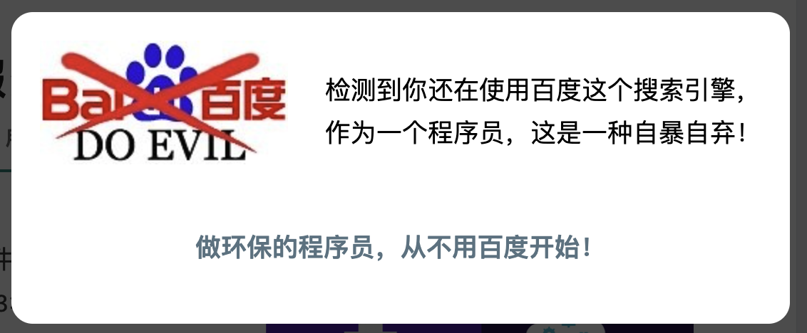

## coolshell
我已经记不清到底是接触coolshell还是开启我的it职业生涯谁在先谁在后了，但是coolshell的文章对我的思想冲击我永远不会忘记。

记得刚接触Linux那会酷爱one-liner，很多日常的文本处理和数据分析都用命令行处理，感觉很酷。看到coolshell中介绍三剑客的文章，觉得太酷了这，然后看到coolshell中分享了[the-art-of-command-line][1]这个项目，简直了，就像mind-blowing，从中学到了太多太多，第一次真实体会到geek精神，以及什么是`Just for fun`.

## 痛恨手册
> 痛恨各种不从研发团队出发，不从团队和项目出发的流程、方法论、咨询师、SQA、流程部门。
>
> 痛恨那些为所欲为的，为了自己商业目标牺牲用户利益的中国IT企业。
> 
> 痛恨中国的C2C式的那种简单的抄袭和复制。
>
> 痛恨互联网上的那个墙，还有那些烦得不能再烦的审查机制。（我能拥有.cn域名真是一种壮举）
>
> 痛恨中国的某些编辑和某些作者乱出书，出烂书。

刚工作没多久看到痛恨手册时有点不太理解，当时觉得博主可能确实很牛，但是似乎不太符合以和为贵的中华文化，如今看来耗叔还是过来人太懂了，后来也认识到这是耗叔直言不讳性格的体现。

## 做一个环保的程序员

我不会忘记我当时从百度点击进到coolshell看到这个弹窗时对我的震动，大概是具象的看到了我与博主的巨大思想鸿沟，当时我还不会科学上网。后来刻意对比了一下当时的bing和百度的搜索结果，百度是不是环保我不太清楚，反正我转bing了。另外自此之后我也形成了个习惯，当留意到同事经常用百度搜索技术问题时，我就让他顺带搜一下coolshell，然后点进去让他看那个个性鲜明的提示，感受下当年对我的震动。:-)

最近几年一直关注着[haoel.github.io][2]，根据耗叔的推荐买了`AC68U`，后来搬家又升级买了`AX86U`，后面又买了软路由，知道了`CN2`、`GIA`线路，买了`bandwagonhost`，ChatGPT出来之后又套了`cloudflare`和`WARP`。总之工具有问题了就到这个汇总页面上尝试新的解决办法。同时也理解了耗叔为什么把`互联网上的那个墙`写进了痛恨手册。

## 左耳朵耗子
耗叔在极客时间开了《左耳听风》专栏后，有了更近的接触。记得有一次在群里面他和另外一个人，应该是某本书的作者有了言语上的冲突，气得他退群然后微博拉黑了耗叔，后来又看到了他们后来的合影，那时我一点都不意外，就是这样一个直言不讳的耗叔，有着属于他自己的臭脾气。

后面耗叔分享过一篇文章[《别让自己“墙”了自己》][3]，我读完后感触很大，主要是我本人也有相似经历（虽然目前可能远不及文中列举的几位取得的成就）。于是我给耗叔写了封邮件分享了我的一些感触和自己的一些个人经历，这算是我第一次主动和耗叔交流，他第二天回复我并且鼓励我，让我加他的微信。得到耗叔的肯定对我是一种巨大的鼓励，好像那段时间一直都很开心。

## 耗叔
耗叔有一次在群里面提到觉得有人叫他耗叔显老，叫他耗子就行，但考虑到耗叔在我心中的分量以及确实存在的年龄差距，就一直称呼为耗叔了。我想，像我这样称呼的应当不在少数。

每次开车路过东三环我都会想到耗叔大概就住在附近，要是哪天可以约耗叔吃上一顿饭，痛快聊几个小时是一件多么荣幸和快乐的事情。昨天梦到耗叔来我们公司做技术分享，他还问了我一些技术细节问题，谢谢耗叔您帮我完成这个愿望。

我真的特别感谢您。。。如果没有coolshell我可能不知道世界有现在这么大，甚至我可能成为什么样的人。失去您我感觉很无助，前方可能再无人引路。我虽说不清失去了什么，但仿佛失去了所有。

[1]: https://github.com/jlevy/the-art-of-command-line
[2]: https://haoel.github.io
[3]: https://coolshell.cn/articles/20276.html
