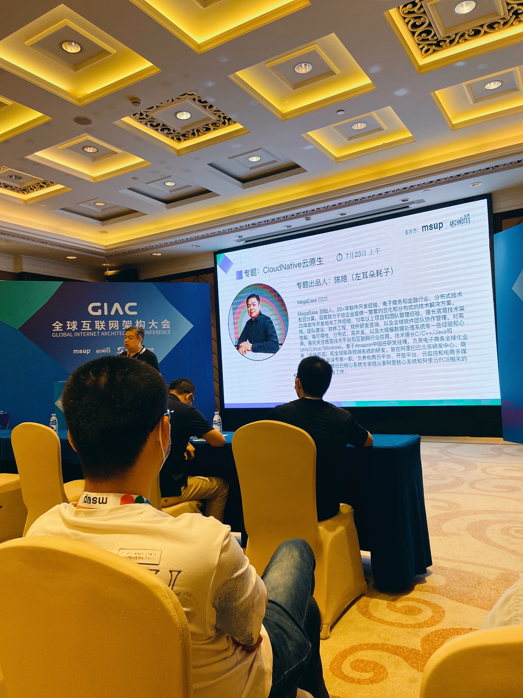

# 缅怀左耳朵耗子

## 芝兰生于深谷，不以无人而不芳

## 君子修身养德，不以穷困而改志
 

这几天看了各网友的memory，乐于助人、敢于反抗和批判的精神留给了我栩栩如生的印象。 互联网大牛很多，但是平易近人，真心愿意鼓励帮助他人成长的凤毛麟角，只有一个颗❤️的心灵才有如此胸怀。

我也是从[coolshell](https://coolshell.cn/) 了解到的您， 文章写得有深度广度，有独到的见解，给人启迪和帮助，和国内其他技术文章相比给人独特耳目一新感觉。后来也订阅了极客的左耳听风，加入了您的微信群。

19年年初我从一家小公司离职， 一直都在中小企业同一个领域干了快5年，年龄也快30， 当时感觉人生迷茫。 于是加了您的微信，您很快通过了， 我用word 文档说明了我的工作履历以及当前的状态， 当晚您就微信语音我，和我聊了一个多小时。给我做了一个面试，涉及c++、网络、高并发相关知识， 面试后给了一个很高的评价，觉得我基础知识掌握的很好，应该去大公司经历，也给我介绍了您的公司即将招人，可以考虑。 聊完后又在微信群里，让群友给我介绍工作。给了我极大的信心和鼓励，素未谋面的大佬如此真诚的帮助真是让我触动，后来4月我就来了鹅厂，感谢您。

后来我们没有了太多交集，想来甚是遗憾。

愿您在天堂安息  🙏 🙏🙏

 

2023/5/21
