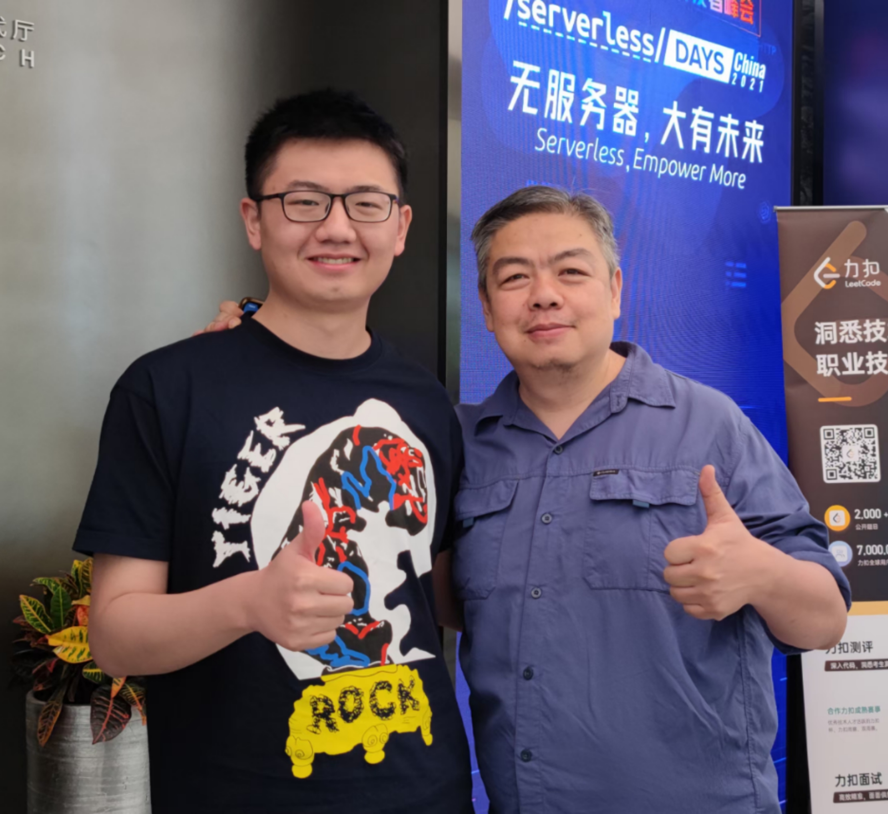

# 纪念左耳朵耗子

## 初次交集

我是一位95后程序员，最早认识耗子叔，并不是通过他的博客酷壳，而是通过他在极客时间的课程《左耳听风》。

当时我在一家创业公司，因为一些公司的需求，从原本的后端开发转成前端开发。代码是越写越迷茫，非常的焦虑。而且受限于公司是重业务轻技术的那种类型，感觉自己地位很low，技术也根本不重要，一直有一种挫败感。

后来是买了课学习了一下，不但能学到许多技能，更重要的是，还能收获不少的思想与观点，算是很值了。

然后才逐渐开始，追叔的博客和推特，这时常能激励我维持编程的热情。

## 相遇

后来我转成全栈开发了，当时也接触了很多云原生的技术，很多耗子哥的技术文章终于能看懂了(⁎˃ᴗ˂⁎)，我也逐渐开始做自己的技术分享。

当时做了些 `serverless` 技术相关的布道与直播，也很感谢腾讯云赞助我去北京参加 `serverless day`。

正是在这个活动上，我和耗子叔相遇了，这是我第一次见到真人。

我们就 `serverless` 技术的应用展开了深入的探讨，探究了更多的技术场景。

后来也时常通过微信，进行技术上的交流。耗子叔也很耐心，从来没有因为我提问的水平之低劣而草草应付我。

记得一件聊天时候的趣事，有一次我们在聊 `SAE`，结果我们的印象完全不同，我在说 `Serverless App Engine`，他在聊 `Sina App Engine`，闹了些笑话，所以技术聊天对齐很重要。

可惜的是，今年我的手机主板坏了，所有微信本地的聊天记录全部丢失，如果哪位知道如何恢复，我恢复成功之后，附上一些技术交流的记录。

## 尾言

他是我的偶像，我现在做的很多事情，其实也是对他的一种模仿，我是一名追随者。

最后，附上2021年，我和叔的合影。

芝兰生于深谷，不以无人而不芳；

君子修身养德，不以穷困而改志。

**Heroes never die!**
