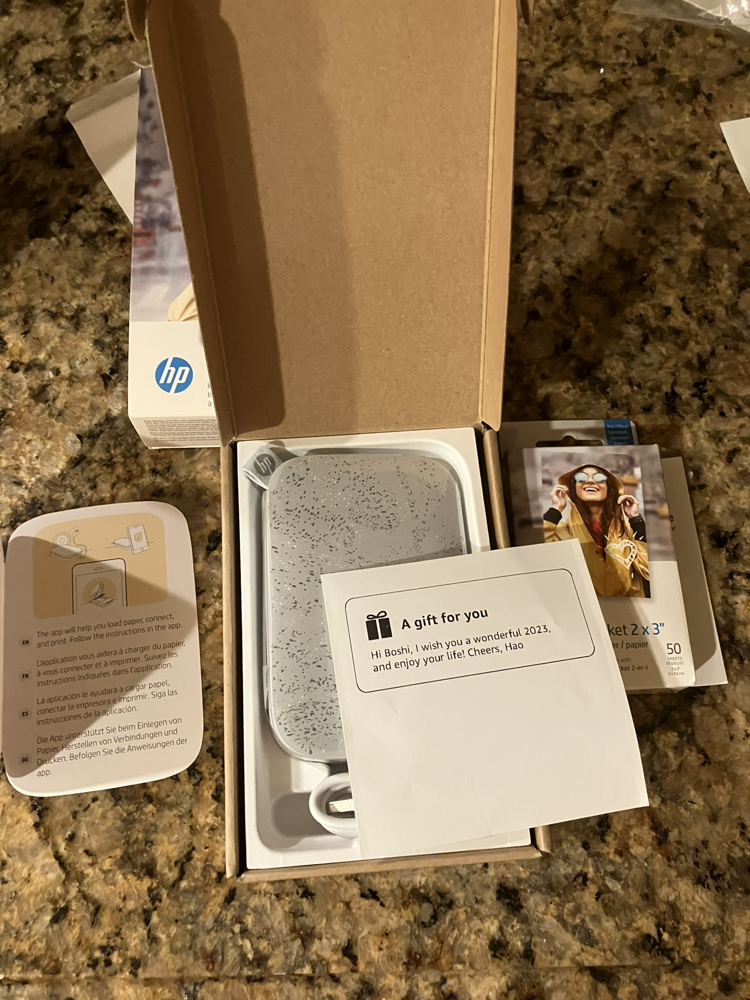

# 纪念 左耳朵耗子 

我是  左耳朵耗子  在阿里的下属，他对我帮助很大，改变了我的人生轨迹。
回忆下我和 左耳朵耗子 的故事，以纪念。

## 成为我的上司
2012年陈皓加入了淘宝北京新业务，那时候他并不是我的上司，不过我非常想跟他一起工作，因为我感觉能从他那里学到东西。
我当时混的还比较滋润，刚刚晋升到P7，团队氛围也非常的好，每天上班都非常快乐，我也不想离开。
当时北京研发中心的 VP 钱振宇 介绍我给 左耳朵耗子 ，让我们可以一起做点东西，因为我总是弄些乱七八糟的技术。
第一次聊天我对 左耳朵耗子 很失望，并不是聊天内容，是因为他吸烟，我非常讨厌吸烟的人，我呼吸困难，一闻到烟味就会咳嗽。

第二年，北京研发中心拥抱变化，我所在的项目被划给支付宝，我们团队被划给云OS。
我是一个愣头青，到云OS第一件事情就是跟当时的开发总监研究云OS是不是android。所以我很不开心。
这时候  左耳朵耗子 又伸来橄榄枝，我立即就跑路去他那里了。其实我还是很怀念我之前的团队的。不过这个不是重点。

## 在 聚石塔 刷 leetcode
左耳朵耗子 当时的团队是商家业务部开放平台，所以我也跟他一起来到了商家业务部（天猫）。
虽然叫开放平台，但是根本不开放，我们的工作是把阿里云的机器换个名字，聚石塔，然后卖给ISV。
这和开放平台有什么关系呢？因为不买聚石塔是不可以调用开放平台API的。

这个时期 左耳朵耗子 对阿里云提出很多想法。比如当时阿里云的所有机器都是互通的，就是在一个局域网里。
我们有个工作就是给机器设置 安全组，大概就是路由器上的iptables，这样就可以隔离机器了。
这样问题特别多，特别麻烦，一不小心就有漏网之鱼，大概是SDN这样的概念那时候还不成熟吧。
左耳朵耗子 就提出了山寨AWS VPC的想法，不过我那时候连VPC是什么都不知道。

左耳朵耗子 在平时经常给我们些amzn的面试题做，用 左耳朵耗子 的话，我是一个野路子，完全是自己发明的解决方案。
他叫我学一些 TCP/IP 什么的，我觉得没啥用，我就是一个野路子，我不需要这些东西。而且我觉得我已经很厉害了。
很偶然的机会 我收到一封 Facebook 的招聘邮件，我就把邮件给 左耳朵耗子 看，他说你去试试吧，我觉得面试你得学点东西。
其实就是leetcode那种编程题，我在阿里是P7可是我连easy做出来都吃力。
后来很显然，我被 facebook 给打击了。就这样左耳朵耗子 开始教我刷leetcode。

做leetcode 对我提升非常大，就算写一遍那么多题，对编程技巧提升也是很大的。当时leetcode 有149道题，我刷满了。
leetcode 的创始人后来 还来过北京，还和 左耳朵耗子 一起讨论过合作，我有幸也参加了下，他告诉我当时刷满的人 不过 10 来个。

这段时间相当于 左耳朵耗子 给我一个比较系统的训练，让我从一个野路子变成一个合格的程序员。

## 改变阿里云？
左耳朵耗子 和 我经常在西溪园区遛弯，有时候扯淡，有时候讨论问题。
我记得是很冷的冬天，他问我你愿意跟我去改变阿里云吗？我说好啊，2014年我就跟着左耳朵耗子 来到了阿里云。
左耳朵耗子 和 阿里云 有很多故事，大家喜欢的话可以去知乎上看看。
虽然我当时是跟 左耳朵耗子 到阿里云唯一的人，不过我阴差阳错的避开了 阿里云 VPC 项目，那些事情我就不在这里提了。
我说几个对我影响比较大的事情。

### https://fun.coolshell.cn/
我当时在运营一个叫 commandlinefu 的微博，就是分享一些命令行的技巧。而且还是从 twitter 上翻译来的。
我希望弄一些粉丝，就打算印几个马克杯抽奖。
左耳朵耗子 告诉我你抽奖都有什么意思，我们来开发一个谜题系统，然后说你赞助的奖品。
这就是 https://fun.coolshell.cn/ 的由来，估计好多 左耳朵耗子 的老粉丝都玩过。

这个给我触动很大，这已经超越程序设计了。

### 阿里星 byvoid
我和 byvoid 私下有过交流，当年他是阿里星，正好在杭州就约来和 左耳朵耗子 一起吃饭。
后来 byvoid 的面试记录泄露了，我和 左耳朵耗子 都被调查了。

被调查是很耻辱的，这件事情让我对系统安全有了更深的认识。
左耳朵耗子 经常提醒安全设计，我之前是不太在意的。

### 工作居住证的一些细节
这个故事大家在知乎上都看过了，我就不重复了。
不过我说一些大家不知道的细节。

当时公司给 左耳朵耗子 的答复是 衙门办事慢。
左耳朵耗子 没有听信，居然跑到有关部门 上访。衙门处理的很认真，给了一个盖章的答复。他还给我看了纸质版本。
后来我也改签合同了。

这是 左耳朵耗子 教给我的较真的品质。这件事直接改变了我的做事态度，或者说大大减少 得过且过 的次数。

### 阿里云的软文
左耳朵耗子 和 公司闹得很不愉快的还有这个软文事件。
当时公司让各路大 V 转发一个 12306 为什么不挂的 知乎问题。
左耳朵耗子 给传达指示的小姑娘批评了，说你不知道阿里的六脉神剑有一条是诚信吗？
他还给我们看当时的往来邮件。

这件事情让我对 左耳朵耗子 刮目相看，他是一个有原则的人。

这个章节的标题叫 `改变阿里云？`不过我一次都没提阿里云，因为我觉得 左耳朵耗子 并没有改变阿里云。
阿里云有很多很多问题，左耳朵耗子 也提出了很多很多想法，不过可能是他比较能 `喷`，所以他的peer并不喜欢他。
当然我是 左耳朵耗子 的直接下属，我如果评价这些就显得不客观。
不过他终究没有实现他在西溪园区遛弯时候对我的承诺，改变阿里云。

## 离开
2015年4月份的时候 左耳朵耗子 离开了阿里。当时他爸爸在北京做手术。
左耳朵耗子 的团队不算他只有 3 个人，我们凑钱给他买了一个XBOX。算作礼物。
表达对我们对他在成长道路上的帮助的感谢。
虽然他的peer并不喜欢他，他对我们还是很好的。

我离开阿里的时候，左耳朵耗子 继续给我了很多帮助和建议。
我从未感到他的离开。

他创业了，我由于一些原因没有跟他一起创业，不过我们一直保持联系，经常在通话。
我有技术问题也会和他讨论。
今年年初他还给我寄来一个照片打印机，感谢我对他公司开源项目的贡献。

没想到这个照片打印机居然成了我和他最后的纪念品。

愿 左耳朵耗子 在天堂安息。

Boshi 05/15/2023 