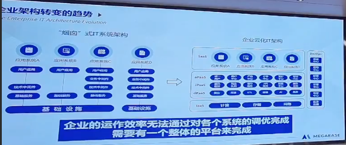

# R.I.P 左耳朵耗子

我是一名大四的学生，和皓哥有过一面之缘。

## 初闻

大四这一年，我离开了学校，参加了实习。

第一次听说“左耳朵耗子”，是在实习公司的团队文档中。文档的代码规范部分，引用了皓哥的[“如何写出无法维护的代码”][1]这篇文章。

当时看完这篇文章，我整个人都要笑疯了，怎么会有这么有趣的文章！有趣归有趣，但是这篇文章真的是一针见血，当时我写的代码除了能跑，貌似满足这篇文章提到的所有诟病。

读完后，我下意识地看了下文章的作者“左耳朵耗子”，只是感觉名字和文章一样有趣，没有深入去了解这个人。

## 遇见

由于公司的产品和马栏山有合作，2023年02月23日我被项目经理指派去参加马栏山的技术讲座，当时讲座的主讲人便是皓哥。

咦？这不是那个那个“左耳朵耗子”吗？听讲座前，我怀揣着好奇特意去了解了皓哥。

我第一次搜索到了[CoolShell][2]，拜读了皓哥的几篇技术方面的文章，感觉皓哥的文章写得很好，和我以前在CSDN上看的烂水文不一样，皓哥的文章能够抓住重点而且深入浅出。

接着，我又了解了皓哥20多年的程序员经历，对皓哥产生了一种莫名的崇拜：这个人简直是整个中国互联网的前辈啊。

在讲座上，皓哥分享了对很多东西的看法：云原生、分布式、ChatGPT。真的能感受到皓哥的人生是在不断地思考中度过的，皓哥不但提到了目前云原生生态的不足之处，还为企业的转型之路提出了自己的见解，可以说是一次毫无保留的分享了。皓哥还谈到了自己创业建立的MegaEase，完全开源中立，希望去提供更方便的企业级的云原生服务。

以前在课上听几分钟就开始玩手机的我，竟然也能这么认真地听完一场讲座。

我不禁赞叹皓哥真的活出了我想要的样子，我也不知道多少次幻想过，能够像皓哥一样在年轻时于互联网大厂中沉淀自己，等到积攒了一定经验后大胆创业，做出自己的事业。

## 印象

听说到皓哥离世的消息，是在一个互联网圈的大群中，当时我找多方求证，始终不愿意接受这个消息，最终在微博上看到了CSDN的官宣，才明白了：皓哥走了。

皓哥给我最大的印象，也是我一生都学不来的东西，就是**对技术的纯粹**。我能够感受到，我遇见过的一些在职场打拼过几年的程序员变得更加油腻，对技术的热情也逐渐消退，做事更加看领导眼色。但是在皓哥发的微博、推特中能感觉到，皓哥虽然进入中年，对技术的热爱却像是一个刚接触计算机的大一的学生。我真的很敬佩这样纯粹的生活态度。

很遗憾没能主动加皓哥微信，但是平时看皓哥在群里的互动，能够感受到皓哥是一个很平易近人的人，皓哥会在群中热心地解答大家的疑惑，大方分享自己对技术的理解。

天妒英才！我感觉真的很可惜，今天上午看到了MegaEase的页面变成了灰色，我也不知道该说什么，希望天堂有代码，皓哥不会寂寞。

[1]: https://coolshell.cn/articles/4758.html
[2]: https://coolshell.cn/