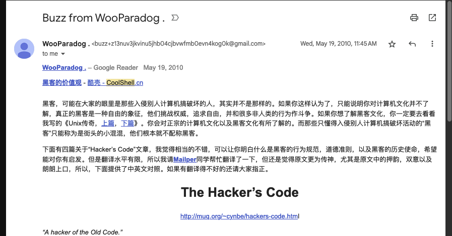
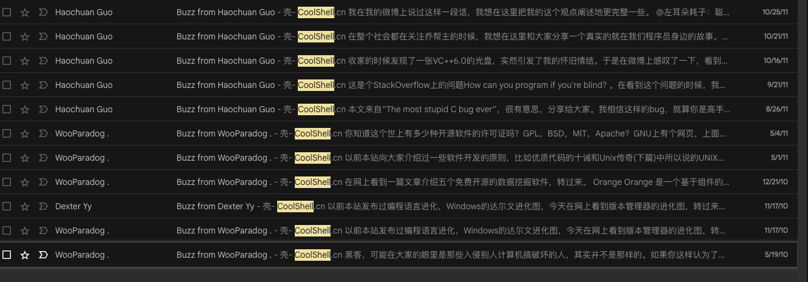
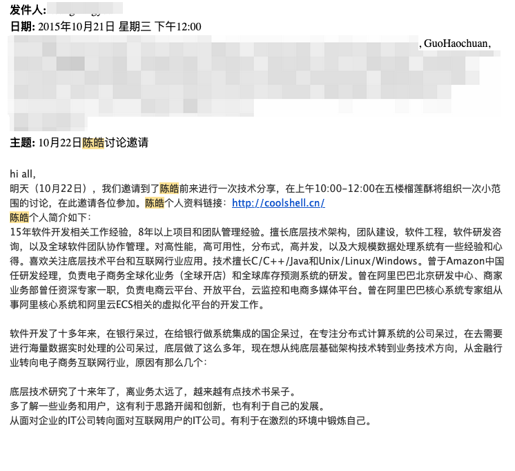
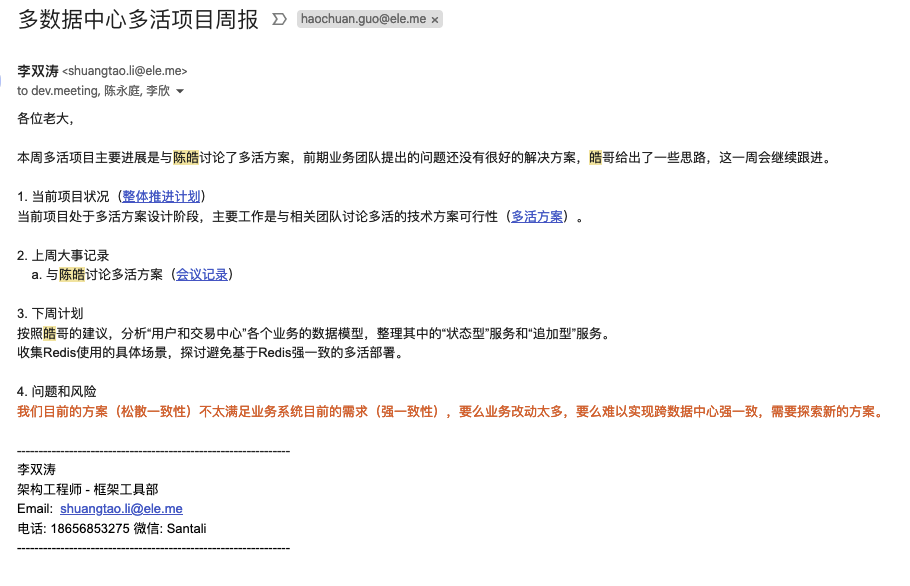
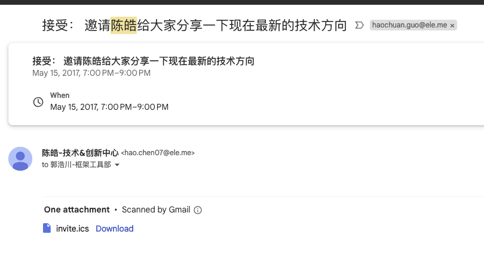

# 缅怀左耳朵耗子
## 初遇篇章

我第一次知道皓哥，还是在十多年前的博客黄金时代。当时我在 Google Reader 上翻阅别人分享的 CoolShell 文章，
从此这个博客成了我“必读”订阅列表的一部分。被他博客内容深深吸引，它不仅富有理想，充满科普性质，深度骇人，
而且读起来非常有趣。我几乎没有漏过任何一篇文章，喜欢的甚至会分享到 Google Plus/Buzz，因此在我 Gmail
历史记录中依然可以找到这些分享。

自那时起，皓哥成为我所敬仰的众多技术巨头中的一位。这十几年我一直在追寻他的脚步，但始终感觉自己难以企及。

最早的分享：

早期喜爱的文章:

## 饿了么篇章

我真正认识皓哥是在饿了么的时期。那段时间，我正被各种容量和稳定性问题困扰，状态并不是很好。然而，在2015年，
公司邀请皓哥进行技术分享，那是我第一次见到他的真容。虽然我已经记不清他分享的具体内容，但整个过程非常实用、技术性强，
让我深深共鸣。他给我留下的印象非常亲切，没有架子，没有套路，直接讲述技术，非常开心。那一刻成为我那段困苦时期的一个亮点。

后来饿了么开始了多活项目，与皓哥的交流也逐渐增多。双涛承诺会分享他在项目中的贡献，我这里就不过多赘述。但是，我可以肯定，
如果没有皓哥，这个项目肯定无法顺利完成。

对我来说，皓哥在那段时间的最重要贡献是他的各种分享和交流。从技术方案到管理方法，他的影响力从单纯的技术逐步转变为方法论，
甚至影响到我的生活原则和理想。我至今仍在使用他分享的许多方法，他留下的文档我也珍藏至今。

有趣的是，有一次他给我们分享面试方法论的时候，我发现里面竟然有我当时进入豆瓣的面试题。他告诉我，那是他当年分享给耿老的。
原来在很早之前，他不仅通过博客影响了我，而且从我开始工作的时候就已经开始影响我了。

他给我们团队的技术分享邀请：

## 之后篇章

自从我离开饿了么以来，我和皓哥还有过几次交谈。那时候，他正处于创业初期，我们讨论了如16进制员工编号、全国远程工作，
以及成为中国的37signals等诸多话题... 然而，因为各种原因，我最终没有加入。

最近一次与他的交集发生在这个月。由于与我们当前项目的关联，我了解到他最近正在筹备一个为AI打造的底层基础设施项目。
原本我以为我们还有机会再次合作，但万万没想到晴天霹雳, 夺走了这么有理想的前辈。

感谢皓哥
