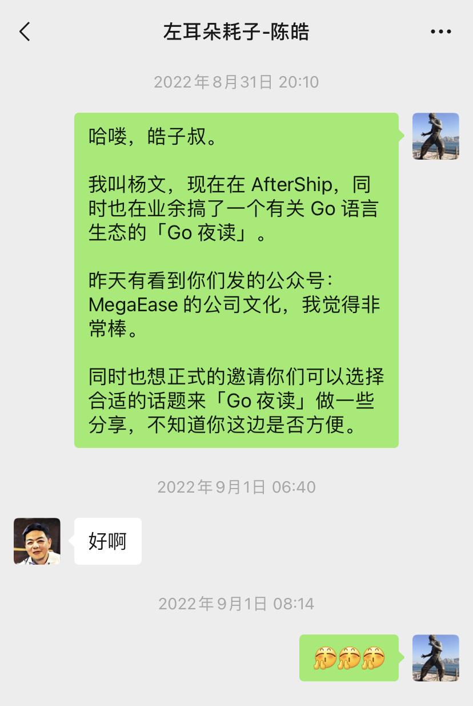
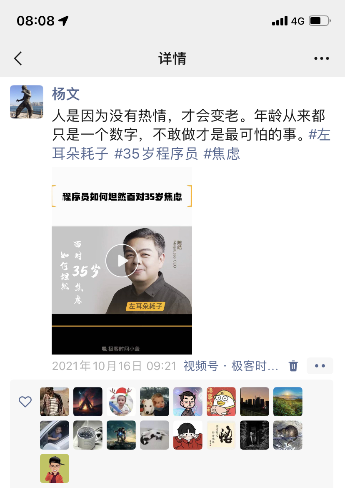
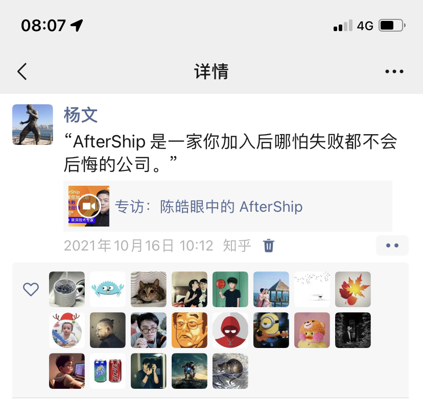

## 缅怀左耳朵耗子 - 陈皓

听闻陈皓去世，第一反应是假消息，但是我的心情已经开始难过，随即去多方求证，发现信息是由 MegaEase 公司的同事发布其确认消息，但是我依然很难以接受这一事实。当时的心情已跌入谷底，不知道能做点什么，心情久久不能平复。不由得感叹道：人生无常！生命是何其的宝贵，每个人都要保重身体，都要为了健康而不遗余力才行啊。

昨天，我看到了 MegaEase 公司同事组织的这个缅怀活动，我觉得我也很有必要将我与陈皓老师，我称其为“耗子叔”的一点故事记录下来。

>哈喽，皓子叔。

>我叫杨文，现在在 AfterShip，同时也在业余搞了一个有关 Go 语言生态的「Go 夜读」。

>昨天有看到你们发的公众号：[MegaEase 的公司文化](https://mp.weixin.qq.com/s/We2sVz5wr0DJxzVRCoIJAg)，我觉得非常棒。

>同时也想正式的邀请你们可以选择合适的话题来「Go 夜读」做一些分享，不知道你这边是否方便。

耗子叔，二话不说就答应了。

>好啊

后面，我也看到多个有关耗子叔的分享，其中一个是：

「程序员如何坦然面对 35 岁焦虑」
>人是因为没有热情，才会变老。年龄从来都只是一个数字，不敢做才是最可怕的事。

另外一个是早些年陈皓与 Teddy 对谈的影像资料：[「专访：陈皓眼中的 AfterShip」](https://www.bilibili.com/video/BV1YK4y137W3/)

他对于我们公司以及 Teddy 正在做的事情是非常认可的，并且也给了我们很多启发。

由衷地感谢你，我的耗子叔，谢谢你的博文，谢谢你的影像资料的那些话语，谢谢你对技术人的指引，愿你在天堂安息。

让我们永远记住你这位对我们做出卓越贡献的人，一位伟大的人。
