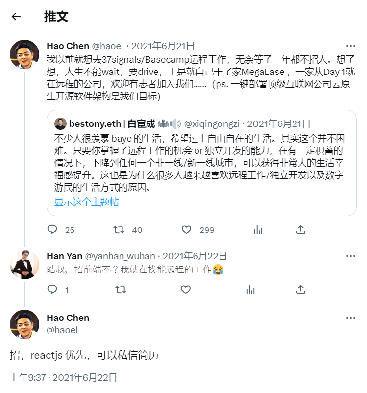
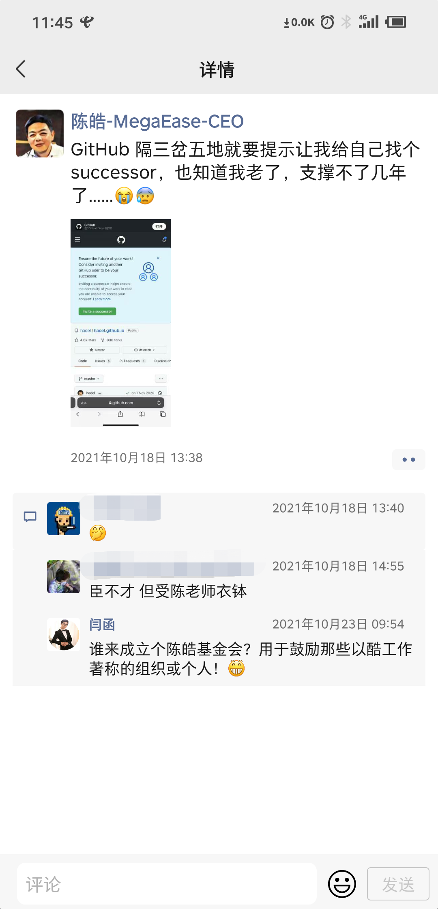

2023年05月15日，上午9点55分，再过几分钟就要开周会了。

我怀着忐忑不安的心情盯着电脑屏幕，心想：今天皓哥会怼我吗？应该不会吧，我上周的工作效率还可以的：完成了订单详情页面的开发以及项目中大量细节问题的处理，忙到头昏眼花。虽然不太亮眼，但是肯定不差，算是尽到了本分。虽然上周三早上我的电脑出了硬件故障拿去维修折腾了一整天，但是丝毫没有影响到锟哥给客户的演示（因为头天晚上我就加班把那个需求做完了，而且跟宇富一起核对了好多遍，把该注意的不该注意的细节全都折腾了几遍，确保不会出现明显的问题）……不会这样还要怼人吧？

突然，英杰在slack公共频道给我发了一条网关模块的bug信息。完了完了，这下凶多吉少了，现在改这个bug也来不及了。再次怀着极度忐忑不安的心情，我打开了周会的腾讯会议……

刚进会议，就看到锟哥打开了视频的摄像头，还让我们都把摄像头打开。嗯？什么情况？以前开会除了新员工入职基本不开摄像头的（只是由英杰率先共享在线的任务分配表格），还有锟哥不是在昆明吗？怎么跑到北京去了？旁边的应该是博民？皓哥人呢？还有几个不认识的是投资人吗？这太反常了！看到这些情况我的第一反应是：完了完了，公司要凉凉了。估计是投资人觉得公司项目进度太慢，然后现在市场情况又不好。我有种不祥的预感：哎，我又要失业了……

等所有人都把摄像头打开了，锟哥开始脸色凝重的说：各位同事，告诉大家一个不好的消息，我们的挚友和同事，我的同学，公司的CEO陈皓先生于前天晚上突发心梗去世了……

啊？！皓哥就这样走了？隔着摄像头，我看到好几位同事都像我一样身体震动了一下，然后脸色也开始凝重起来。

锟哥继续说：大家放心，公司会继续运营，项目继续做，我们要继续实现皓哥未竟的理想……

这次极不寻常的周会瞬间勾起了我对皓哥的种种回忆。皓哥发出的回调函数（前端术语，指下完指令后未执行完的代码）尚未执行完毕，不应该就这样结束。在公司之外的人看到的皓哥只有一面（技术大牛、受人崇拜），而作为公司内部员工的我由于经常打交道，看到的是更真实的一面，再加上本人敏感的性格和爱琢磨文字的特质，足以让我能写出这篇复杂而深刻的纪念文章。

# 入职MegaEase

我入职皓哥的公司是在2021年的夏天，有意避开了“建党100周年”那天，当时正值疫情期间。

面试是在一周前，伟哥面的我（当时他还在，后来离职了），当时一开始跟伟哥聊的特别开心。我给他讲我之前工作中的成果，碰到问题以及解决方案，如何协调各方人员推进项目等等情况，也让伟哥觉得我是一名靠谱的开发者。不过最后一下的统计句子中有多少个单词的题目没答上来（要考虑标点符号等等，伟哥说这个需求会不断往上加，直到问到人崩溃，最后正确答案是要用到状态机）。伟哥面完了让我等消息，当时我已经不抱什么希望了：连唯一的一道面试题都没答上来还能有戏吗？

结果没想到晚上皓哥给我打电话了，这是我第一次直接跟皓哥交流，之前只在网上听过tinyfool对他的采访，依然是那种中气十足、自信满满、不卑不亢的男中音，当时我感觉他已经50多岁了。第一次打电话皓哥跟我说了不少：要不断地学习，不断地思考，思考怎么样把项目做的更好。不要把创业公司当成避风港，要有主人翁心态，要努力培养自身的领导力，我只跟信任的人打交道，当我不信任你的时候，你再强又如何等等等等。他还说公司马上也要入职一个芬兰的小伙子，他准备加入中国籍，但是他的签证遇到一些问题被卡住了，所以准备拜托百度的副总裁陆奇找中国的大使馆想想办法……聊了没多久，他就说今天有新浪微博的架构师来公司做分享，我晚点再打给你吧。

挂了电话，我被惊到了，一会儿“百度副总裁”，一会儿“大使馆”，一会儿“新浪架构师”，这也太牛了，这些词我以前想都不敢想。在我以前的公司，最大的天花板就是负责管我们的略强一点点的技术经理，负责协调资源的项目经理，还有啥也不懂的领导。之前我只知道皓哥一个人牛，看来他的朋友也都是大佬，这是一家不平凡的公司。

我以为他说的晚点再打给我是随口说说，说不定到时候就忘了，我不明白还要说啥呢？但即便我这样想，也没有关电脑去睡觉，而是一边在看他前不久推荐的书一边等他。等到快十一点的时候他果然又打过来了，后面聊了一些与工作无关的事情。

即使全部聊完了，我还是没有反应过来，我到底有没有面试成功？因为聊的过程中完全没有说过“恭喜你，你已通过我司的面试，几天后过来上班吧”这样的话。但是转念一想：如果没有成功，为什么要聊这么多呢？看来已经成功了！于是欣喜若狂的通知了老婆。

现在回过头来看，其实我跟皓哥的交流是极其稀少的，打交道的场景也跟很多人不一样：一般人是以朋友的身份跟皓哥交流，或者是IT大佬给菜鸟做人生指导这样的形式，我跟皓哥几乎从一开始就是雇主与雇员的形式。下图是我在互联网上与皓哥唯一的一次交流：



# 在MegaEase的蜜月期

一开始我也是叫皓叔，毕竟他看起来那么老成，而我看起来又那么晚熟。说他是我老爹估计都没人会怀疑。刚入职不久叫皓哥还不太适应，不过听到同事们都叫皓哥之后我也开始改口，这种行为很像女人嫁到婆家开始改口叫男方的母亲一声“妈”。

正如皓哥在上面的推文所说，我们公司也支持远程办公。我是非常喜欢远程的，最主要的原因还是敏感：受够了现场办公的那些乱七八糟的干扰，也受够了一般的管理者为了改善办公体验的杯水车薪的努力，更受够了头天晚上加班到深夜第二天还要顶着晕乎乎的脑袋跋山涉水去通勤的烦恼……远程办公能一步到位，解决上面所有的问题，能让我更专注、更高效的处理高强度快节奏的工作任务。

这里的会议非常少。只在每周一早上10点开个全员的周例会，每周一晚上8点开个技术分享会，其它的与项目有关的就让各个负责人私下自由地去拉人组织会议就行了。开会全部都是务实的，几乎没有务虚的。比较有意思的是技术分享会，一般是内部人员轮流来分享与技术相关的内容，有时皓哥也会动用他的影响力去外面找人来分享。内部人员分享比较好玩的是宇富同学：他说话不太利索，分享时磕磕绊绊的，听得人急死了，每次都把我笑的够呛。还有其它人的分享皓哥也能从中挑出不少毛病来，然后说补充几句，结果一补充就能说个把小时，思路极其清晰，视野极其开阔，让我们觉得分享者分享的内容不重要，皓哥的补充反而收获更大。皓哥的口头禅：烂得一塌糊涂、糟糕得一塌糊涂、漂亮得一塌糊涂……呵呵，有意思，连夸奖都能用上“一塌糊涂”这个词。

这里的管理非常松。不会有项目经理时时刻刻盯着你，只要你能按时完成任务就行。完成功能以周为单位，上班时间完不成就得自己加班，否则到下周一周会还没完成就会被说。

能远程，会议少，管理松，而且还有顶级技术大佬的悉心指导，请问还有比这更完美的工作吗？没有！记得面试那天我跟皓哥说过MegaEase是国内最好的互联网公司，那时皓哥也会不好意思的说：哈哈，没有没有，你太夸张了……

# 在MegaEase的阵痛期

快乐总是短暂的。在MegaEase度过了短暂的幸福时光后，终于迎来了阵痛期。

据我观察，在公司内部，在公司的明规则上，还有一套与皓哥高度绑定的潜规则：声誉系统。皓哥对人的信任和不信任都是基于这个系统。这个系统如何运转？全凭皓哥对大家做的事情判断。

一开始，皓哥就帮我们建立好了岗位鄙视链：顶级架构师看不起经验不够的普通架构师，普通架构师看不起只会写代码却设计能力欠缺的后端，后端看不起没有设计能力的前端，前端看不起不会写代码的UI设计师，设计师看不起完全不懂技术的商务，商务看不起只会算钱的财务……不管多么愚钝的人，进公司就能明显感受到这些。无论什么会议，从皓哥的话里行间都能体会到：前端只是后端的附庸，UI设计师只配给前端打杂，而商务？一般只会在项目上线后找完全不懂代码的小白用户时才用得到……这可能就是很多阿里前员工形容阿里领导的那种“爹味儿”——啥都给人安排好，连喜好都能安排。

如果我们给皓哥的声誉系统一个货币（誉元）来衡量的话，每个岗位的初始誉元数量就不同，就导致了我们的初始受信任程度就不同：最近博民和黄地的表现不错，誉元加加，给他们加更多更好的任务。英杰虽然也很努力，但还差点儿意思，誉元减减，也给加点任务。至于德刚，本来就没有到及格线，压根儿不用理他……

皓哥会从多方面考查员工的表现。做得好就夸，做不好就骂。但是像软件开发这种复杂行为，是不太好衡量的。记得做中间件的时候，团队遇到了一些难题，进度较慢，皓哥发火了，重新安排了任务，还把几个人送走了，当时把我们都吓坏了。以前还有些廉价的鼓励和夸奖，后来只剩下怼人了。见人就怼，甚至连锟哥都怼。怼天怼地怼空气！用JavaScript代码表示就是像下面这种样子：

```jsx
function survivalInMegaease(yourPerformance){
	switch (yourPerformance) {
		case '你做项目太快导致一些细节问题':
			console.log('你将会受到皓哥的严厉批评');
			break;
		case '你忙不过来导致项目进度变慢':
			console.log('你将会受到皓哥的严厉批评');
			break;
		case '你碰到难题需要帮助':
			console.log('你将会受到皓哥的严厉批评');
			break;
		case '你做错了':
			console.log('你将会受到皓哥的严厉批评');
			break;
		case '你做对了':
			console.log('你将会受到皓哥的严厉批评');
			break;
		case '你沉迷于工作，累到进ICU':
			console.log('你将会得到皓哥的欣赏');
			break;
		default:
			console.log('你将会受到皓哥的严厉批评');
			break;
	}
}
```

渐渐地，公司的气氛也变得沉闷压抑起来，大家都不敢说话，大气也不敢出，隔着网线我都能感受到皓哥那强大的压迫感。这时也显现出远程办公的优势：即使公司氛围压抑到极点，不用去现场就不用面对那些可怕的情绪，继续冷静的安心的做自己的事情。以致于我在公司碰到了第一件离奇的事情：有一天实习生找我聊天，说呆不下去 了，公司气氛特别闷，不喜欢远程办公的这种方式。我感到很诧异：竟然有人连这么爽的工作方式都不喜欢？！难道你想去现场被老板“生吞活剥？

有时我也搞不清楚我能进MegaEase到底是幸运的还是不幸的？幸运的是这里可以远程办公，不用通勤，有很多厉害的同事能进行高质量的交流，还能实现摸鱼自由……不幸的是一旦皓哥开始不信任，就要每天承受巨大的精神压力，各种PUA、各种语言暴力，出现PTSD（创伤后应激障碍）的频率比先前高很多，还有丧失了先前那种对大佬无限崇拜的感觉。

不过皓哥的这种只有惩罚、没有奖励的高压管理也带来了意外效果：就是底下的员工非常团结，都兢兢业业，相互帮助，完全没有别的公司那种勾心斗角、抢功甩锅的现象，大家的关系非常简单、舒心，这真的非常神奇！在这种情况下，MegaEase不仅仅是企业组织，更像是某种心理学实验。

# 皓哥死因推测及反思

## 被忽视的情绪价值和被丢掉的平常心

说实话，皓哥的去世让我感到有点意外，但是没有像外部人员一样那么意外，因为不好的迹象在平时就已经反映了出来，工作中偶尔会看到皓哥请假：“痛风犯了，下午在家上班”或者“痛气发作，明天去一下医院”。

项目出现bug难以避免，但是高标准又难以容忍bug的出现。类似于牛顿第三定律：给别人的压力，自己也会感受到同样的压力，丢掉了平常心，干啥都要按照最高标准来，不光是代码，还有思考问题的方式，项目功能，还有文档，甚至打游戏，做饭等等等等，都要按照最高标准来。在这种语境下，情绪常常会变得僵持，容易出现认知失调。然而，魔鬼就隐藏在细节中，这种僵持并不是没有代价的。代价就是负能量快速大量的聚集。为了排解负能量，一般人可能会选择出去走走，透透气，或者洗个澡睡一学，过几天又慢慢缓过来了。而皓哥排解负能量的方式，很可能是继续宅在家里，看更多牛逼的技术书籍。看完书又带来另一个副作用：更加觉得周围的人浅薄无知，尤其是对公司的员工，很难达到他的预期。交流时比以前更有攻击性，又会导致更多尴尬，负能量更多聚集……于是形成了恶性循环，最终变成了压垮骆驼的最后一根稻草。

好死不如赖活着，活着，就有希望。如果无法容忍一些小的错误，那么极有可能要面临更大的错误。太大的压力与致命性疾病肯定也有一定的相关性。情绪和生命能量同银行里的存款一样，一味支取却没有存入，总有一天会破产。

我不可能在皓哥说“如果今天做不完，你明天就去把离职手续办一下”的时候对皓哥说：皓哥，您别这样，您这样会导致我们双方的心理压力都增大，进而导致您的血压升高，进而加剧您的致命性疾病……

不可能！绝对不可能！

一个在烈日之下即将被行刑的“犯人”能对“刽子手”提什么建设性意见呢？如果我这样说了，可能会被认为是精神有问题，被更坚决地“砍下头颅”，其它的什么也改变不了。所以在强大的路径依赖下，我们只能眼睁睁的看着大佬一步步滑向深渊，付出无穷大的代价。

## 综上所述，可以归结为：只执著于技术，而忽略了身心健康

# 古今多少事，都付笑谈中

其实皓哥所做的一切，只是正常的像样的民主国家应该做的，是正常水平，但即使这样正常的表现都显得很稀缺，说明我们的社会早已不正常。比起皓哥那老黄牛一般的努力，改善整个社会的“土壤”显然是更重要的，这肯定也是皓哥的理想。

如果我有选票的话，我会选他当科技部长。

皓哥的离去让我有些许如释重负的感觉（没人希望天天被枪顶着脑门儿上班）。但是很快又让我陷入了新的忧虑：少了这样一位业界极其优秀的头脑的指点，我们的云原生之路会走歪吗？

如果网友们有心，可以为皓哥做以下这些事情：

- 利用皓哥生前的文字，语音，图像，视频等资料训练的【陈皓AI】：继续体验皓哥那犀利的交流风格。
- 编写《陈皓传》：就像《乔布斯传》一样，谁不想青史留名？皓哥为了中国IT业的发展鞠躬尽瘁，赋予了MegaEase灵魂，我们更应该成全他。另外：皓哥生前最讨厌别人出烂书，所以这本书也要达到卓越的程度。
- 成立【陈皓基金会】：用于鼓励那些以酷工作著称的组织或个人！



在皓哥先前已有的称号之外，我还想加入以下几个称号：IT界的人生导师，国内远程办公的先驱，云原生的布道者，软件技术的理想主义者，优秀的世界公民……

皓哥的溘然长逝让我想起了诸葛亮的《出师表》：先帝创业未半而中道崩殂……

有的人活着，他已经死了，而有的人死了，他还活着。

平庸的人渺小如尘埃，昙花一现的人能像流星一样划过夜空，而皓哥无疑是最熠熠生辉的那颗星！

皓首穷经，皓月当空……

R.I.P 皓哥，愿天堂好得一塌糊涂