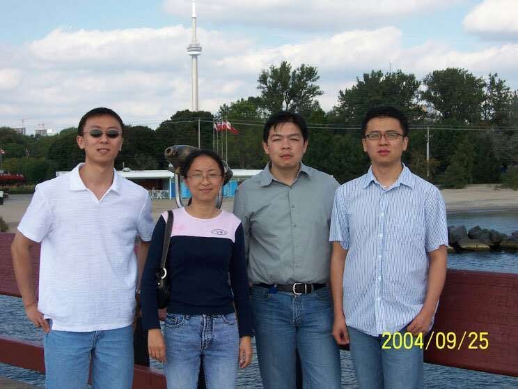
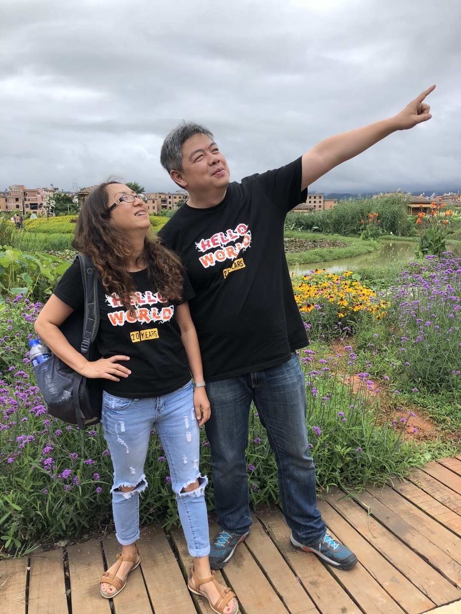
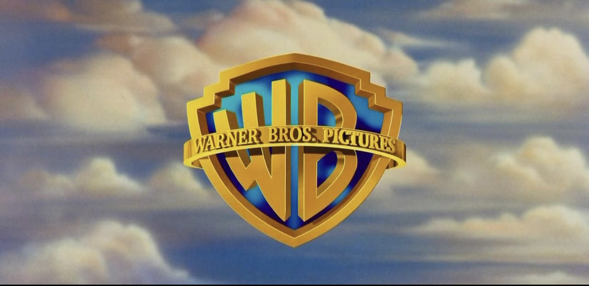

# 介绍

这个文档记录了来自大学同学对于陈皓的追思， 因为大学同学很多都不是从事IT技术类相关的工作，因此一些只言片语的记录都会汇集到我这里来进行汇总，当然也有一些同学的是独立成文的会按照一个个小Section的形式记录。

## 怀念陈皓同学 （来自同学MHC）

今天，陈皓永远的离开了，我们都感到无比悲伤。然而，回顾他的一生，我们为他感到欣慰，因为他一直按照自己的方式活着，他活成了他想要的样子。用他的话来说，他没有辜负这个时代，也没有辜负自己。当我们回顾他的一生，他有爱着他的父母，爱着他的妻子和女儿，还有那么多爱他的同学和朋友，还有成千上万受到过他帮助和支持的网友。我们应该为他感到骄傲，他始终坚守自己的原则和信念。就像他的座右铭所说：“芝兰生于深谷，不以无人而不芳；君子修身养德，不以穷困而改变志向。” 尽管他的一生短暂，但他为这个时代带来了一束光明，他的文章和行动改变了无数人的命运。我们应该为他的一生喝彩鼓掌。

1994年，我认识了陈皓，我们是大学的同学。当时，我们观点相左，因此我们经常因为一些简单的事情而激烈争吵。从那时起，我就知道陈皓是一个个性鲜明的人。

在大学期间，我就发现陈皓的文笔非常优秀，特别幽默。他观察事物也非常仔细。他写了许多诗，其中有一些描述我们的同学，非常巧妙风趣。我至今仍记得其中一首，是关于我们班上最聪明的男生的，他写道：“骨瘦如柴一米八，坑坑洼洼似蛤蟆。三天不洗油头发，纷纷扬扬似雪花。”同学们读后都哈哈大笑，知道他在写谁。他的文字把那个同学描绘得惟妙惟肖。尽管已经过去了20多年，我仍然记得他所写的每一个字。陈皓说话非常幽默，但内心却非常腼腆。上大学时，他大部分时间都花在电脑前。我记得他总是坐在那台UNIX终端前，无论女生如何跟他说话，他似乎都没有反应。他是一个非常注重学术的人。我经常取笑他说：“打五笔打得那么快有什么用？”但他总是轻蔑地看着我说：“哎，你不懂。”他代表了电脑刚刚进入我们生活那个时代，那种单纯质朴的程序员形象。

大学毕业后，陈皓进了工商银行。我们曾有过几次接触，他非常喜欢观察每个人的行为，并给我们描述。我至今记得他讲过许多关于工商银行的笑话。现在，无论我身在何处，只要我把他当年讲的那些事情讲给别人听，大家都会笑个不停。

陈皓在工行的领导们经常找他解决问题。后来，后来领导们觉得自己也能够应对，于是有一次，某位领导让陈皓将之前的所有步骤都做好，只留下最后一步给他来完成，领导要求陈皓将这一步骤记录下来。结果，陈皓完成最后一步后就回到宿舍了。几个小时过后，领导非常生气，冲到宿舍把陈皓叫了出来，说：“你给我的东西没用！”陈皓赶紧跑到机房一看，原来是该领导忘记按下回车键。这样的故事数不胜数。

上大学的时候，我就知道陈浩是个特别率真的人。他会因为自己观点跟我不一样，会跟我发生激烈的争执，但是陈皓也是一个open minded 的人，他愿意接受新的事物。工作以后，他遭到了社会的毒打。我觉得他对很多事情发生了一些变化。有一天他来找我，他说想跟我谈一谈。当时我对他的打算一无所知，因为我们对世界的认知有很大的差异。然后陈皓告诉我，他想离开工行，去外面闯一闯。那天下午，我们在翠湖边，我告诉他，人生只有一次，不要后悔。我觉得待在这个地方太狭隘了，他像是一个鱼被限制在小池塘里，他应该离开。他告诉我只有我一个人支持他的离开，其他人都希望他留下来。我鼓励他，外面世界有更广阔的天地，人生只有一次，他应该尽力去尝试。这么多年过去，我想起那个下午，我们坐在翠湖边上。也许他没有离开云南，他还很好健康的活着，可是我想。他一定更愿意看到今天的这个样子。看见有那么多的人，因为他而改变了命运。

后来陈皓离开了工行，前往上海和北京等地。我们之后的接触越来越频繁，因为我们的世界观和人生观越来越相似，我们之间的交流也越来越多。实际上，我们俩内心都是一样的人。用陈皓的话来形容我，就是简单直率热心。确实如此。我们从不太在意别人的看法，都按照自己的方式行事的生活。这么多年来，在这些方面，我与陈皓有着特别的共鸣。

在2004年的时候，陈皓来到多伦多出差，见面的次数增多，发现彼此更容易交流，对世界和价值观的看法也更加一致。我们和其他同学一起去了多伦多的湖心岛，聊了很多。陈皓那时可能正在路透社工作，与我们分享了许多国内外的见闻。

 

之后，在2015年，陈皓组织了一个大学同学团到美国来，其中一站是洛杉矶，我接待了他们。那时我们有很多交流，陈皓也分享了他的计划。那时的陈皓意气风发，开始了创业之路。

 

2018年我在中国北京时，陈皓亲自接待了我，并开车带我参观了很多地方。他带我去了鸟巢，还带我品尝了云南菜。我们还约定，下次我再来北京的时候，他会带我去爬长城。虽然现在已经无法实现，但我们仍然记得他给我们的承诺。

 

2018年同学聚会是我们最后一次面对面相聚。在那个20年的同学聚会上，他为每位同学设计了一件黑色T恤，上面写着"hello world"。对于学习计算机的人来说，这是最早接触的经典语句之一。每个人都从这个简单的程序开始了自己的编程生涯，它也成为了我们程序员认识世界的起点。

 

我们大学同学有一个群，陈皓记录了每个同学的生日。每当有人过生日时，他会提醒大家，我们一起祝福那位同学生日快乐。我真的很佩服陈皓，他有那么多事，但每件小事都会亲历亲为。他能够在许多事情上做到极致。他具有极高的创造力，而且非常直率、热情和热心。

陈皓深切了解网络暴力，因此他能够理解我。我在同学群中经常遭受网络暴力，针对我的言论和对社会的观点。在这种情况下，陈皓总是毫不犹豫地站出来支持我，用有条理的证据反驳其他同学。事实上，陈皓非常忙碌，有时我也很惊讶他如何有这么多时间，甚至愿意帮助我处理一些琐事。因此，每当我受到众人攻击时，我总是希望陈皓能够站在我这一边。在我心中，他是我坚强的精神支柱，让我知道世界上有人与我拥有相同的想法，并且支持我。尽管我们有时会与其他人发生争执，但陈皓会发消息给我说：“别浪费时间了，你无法唤醒那些沉睡的人。”他经过这么多网络暴力，他仍然乐意帮助大家解决问题。他在各种社交媒体上发表文章，激发了许多人的智慧。这可能与他的经历有关，他从一个简单的爱国者转变为一个真正洞察社会的人。他希望每个人都能像他一样，不成为被操纵的对象。我觉得陈皓内心中充满了大爱。尽管在那样的环境中，他能够说出那么多令人惊叹的话语，令人钦佩不已。

 

我们近年来的交流方式变成了偶尔打电话。我在美国，他在中国，有时他需要我的帮助，我会尽力协助他处理一些事务。我知道他非常关心自己的孩子，所以我安排了我的儿子与他们的孩子进行英语交流，他非常支持。通过这件事，我能感受到他对自己女儿的深深爱意。他有许多想法，是一个独立思考的人，从不为了权力或个人利益妥协。他是一个非常有原则的人，即使面对权贵，他也始终坚守自己的原则。他一直秉持着自己的人生信念，这是非常难得和可贵的品德。他一直追求完美。在他的人生中，他与许多人一起分享了知识和经验，只要你愿意找他，只要你有问题向他求助，他都愿意帮助你。我们最后一次通话是在今年二月份，那个时候我们又聊了一些对未来的看法和计划。我们约定在2023年在美国见面...

我一边撰写这篇文章，一边笑着，一边流泪。我非常怀念过去的点点滴滴。我也感激上帝给予我这样一位同学朋友，他在我困难时给予了帮助，在我低落时给予了鼓励。虽然他已经离开了，但这些记忆依然在我的心中。它将陪伴我走向未来几十年，直到我们再次相聚。

---

## 来自与同学XF的朋友圈回忆

悼念我大学同学陈，耗子

昨天在同学群里看到5月13日陈心梗离世的消息时，第一反应就是哥几个开玩笑开出新高度了，到现在都不愿意相信啊。。。

大学时其实也不熟，好像都没讲过几句话，记得他是班长，成绩优秀，傲气，印象最深的是那时反对奖学金评选办法，他是领头人，最终促成奖学金按绝大多数同学的想法评选。

他从省工行辞职前，来个旧出差，说是最后一次出差了，想去最前沿的公司学习更好的技术，说这一生怎么能浑浑噩噩的过，说个旧怎么这么安静适合养老。我硬带着他去吃他“听说很好吃的鳝鱼米线”，虽然晚饭吃的很饱，陈很给面子的吃了。

隔了20年，2019年春节，接到一个北京的电话，声音听不出来了，但猜着就是陈，哥几个到个旧泡温泉，难得一见留了个影，虽是在医院里，但当时是很高兴的。也没想到他会留着我的电话，他可能留着全班同学的电话，每个同学生日他都会在同学群里通告祝福。。。

我唯一一个QQ微信电话都留着通讯方式的，不太熟的同学陈，程序员天花板，技术领军人，一个棱角分明、温暖的人。
R.I.P

---

## 怀念耗子(jnj)

耗子，很庆幸能和你一起度过生命中那段青葱岁月，无论是学习、生活、还是工作，你都是一个十分有趣的灵魂。希望我们将来有缘再相见🙏❤️

> 陈皓突如其来的幽默让人印象深刻，记得大学毕业后，有一次在顺城街一个清真馆子吃饭，服务员小姑娘不小心把茶壶里的热水滴到他的大腿上，正在紧张想要道歉，陈皓闭眼做陶醉装说“啊，太爽了...” ，小姑娘被逗得捂嘴笑，尴尬顿时化解。

> 一次和陈皓、杨源去圆通电影院看电影，记得是《白头神探》，当片头出现华纳兄弟的logo时，陈皓脱口而出“...五笔”，杨源和我当场笑喷。

耗子大学时非常喜欢的歌曲，代他在这里和大家分享

