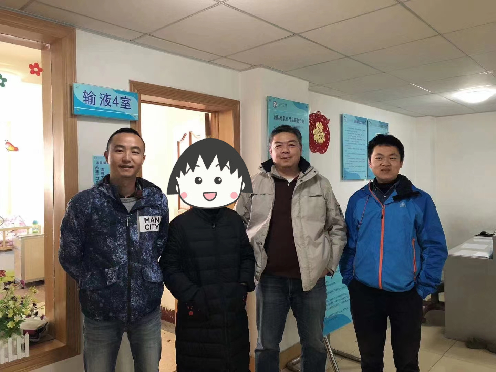

# 介绍

这个文档记录了来自大学同学对于陈皓的追思， 因为大学同学很多都不是从事IT技术类相关的工作，因此一些只言片语的记录都会汇集到我这里来进行汇总，当然也有一些同学的是独立成文的会按照一个个小Section的形式记录。

---

## 怀念陈皓同学 （来自同学MHC）

今天，陈皓永远的离开了，我们都感到无比悲伤。然而，回顾他的一生，我们为他感到欣慰，因为他一直按照自己的方式活着，他活成了他想要的样子。用他的话来说，他没有辜负这个时代，也没有辜负自己。当我们回顾他的一生，他有爱着他的父母，爱着他的妻子和女儿，还有那么多爱他的同学和朋友，还有成千上万受到过他帮助和支持的网友。我们应该为他感到骄傲，他始终坚守自己的原则和信念。就像他的座右铭所说：“芝兰生于深谷，不以无人而不芳；君子修身养德，不以穷困而改变志向。” 尽管他的一生短暂，但他为这个时代带来了一束光明，他的文章和行动改变了无数人的命运。我们应该为他的一生喝彩鼓掌。

1994年，我认识了陈皓，我们是大学的同学。当时，我们观点相左，因此我们经常因为一些简单的事情而激烈争吵。从那时起，我就知道陈皓是一个个性鲜明的人。

在大学期间，我就发现陈皓的文笔非常优秀，特别幽默。他观察事物也非常仔细。他写了许多诗，其中有一些描述我们的同学，非常巧妙风趣。我至今仍记得其中一首，是关于我们班上最聪明的男生的，他写道：“骨瘦如柴一米八，坑坑洼洼似蛤蟆。三天不洗油头发，纷纷扬扬似雪花。”同学们读后都哈哈大笑，知道他在写谁。他的文字把那个同学描绘得惟妙惟肖。尽管已经过去了20多年，我仍然记得他所写的每一个字。陈皓说话非常幽默，但内心却非常腼腆。上大学时，他大部分时间都花在电脑前。我记得他总是坐在那台UNIX终端前，无论女生如何跟他说话，他似乎都没有反应。他是一个非常注重学术的人。我经常取笑他说：“打五笔打得那么快有什么用？”但他总是轻蔑地看着我说：“哎，你不懂。”他代表了电脑刚刚进入我们生活那个时代，那种单纯质朴的程序员形象。

大学毕业后，陈皓进了工商银行。我们曾有过几次接触，他非常喜欢观察每个人的行为，并给我们描述。我至今记得他讲过许多关于工商银行的笑话。现在，无论我身在何处，只要我把他当年讲的那些事情讲给别人听，大家都会笑个不停。

陈皓在工行的领导们经常找他解决问题。后来，后来领导们觉得自己也能够应对，于是有一次，某位领导让陈皓将之前的所有步骤都做好，只留下最后一步给他来完成，领导要求陈皓将这一步骤记录下来。结果，陈皓完成最后一步后就回到宿舍了。几个小时过后，领导非常生气，冲到宿舍把陈皓叫了出来，说：“你给我的东西没用！”陈皓赶紧跑到机房一看，原来是该领导忘记按下回车键。这样的故事数不胜数。

上大学的时候，我就知道陈浩是个特别率真的人。他会因为自己观点跟我不一样，会跟我发生激烈的争执，但是陈皓也是一个open minded 的人，他愿意接受新的事物。工作以后，他遭到了社会的毒打。我觉得他对很多事情发生了一些变化。有一天他来找我，他说想跟我谈一谈。当时我对他的打算一无所知，因为我们对世界的认知有很大的差异。然后陈皓告诉我，他想离开工行，去外面闯一闯。那天下午，我们在翠湖边，我告诉他，人生只有一次，不要后悔。我觉得待在这个地方太狭隘了，他像是一个鱼被限制在小池塘里，他应该离开。他告诉我只有我一个人支持他的离开，其他人都希望他留下来。我鼓励他，外面世界有更广阔的天地，人生只有一次，他应该尽力去尝试。这么多年过去，我想起那个下午，我们坐在翠湖边上。也许他没有离开云南，他还很好健康的活着，可是我想。他一定更愿意看到今天的这个样子。看见有那么多的人，因为他而改变了命运。

后来陈皓离开了工行，前往上海和北京等地。我们之后的接触越来越频繁，因为我们的世界观和人生观越来越相似，我们之间的交流也越来越多。实际上，我们俩内心都是一样的人。用陈皓的话来形容我，就是简单直率热心。确实如此。我们从不太在意别人的看法，都按照自己的方式行事的生活。这么多年来，在这些方面，我与陈皓有着特别的共鸣。

在2004年的时候，陈皓来到多伦多出差，见面的次数增多，发现彼此更容易交流，对世界和价值观的看法也更加一致。我们和其他同学一起去了多伦多的湖心岛，聊了很多。陈皓那时可能正在路透社工作，与我们分享了许多国内外的见闻。

 

之后，在2015年，陈皓组织了一个大学同学团到美国来，其中一站是洛杉矶，我接待了他们。那时我们有很多交流，陈皓也分享了他的计划。那时的陈皓意气风发，开始了创业之路。

 

2018年我在中国北京时，陈皓亲自接待了我，并开车带我参观了很多地方。他带我去了鸟巢，还带我品尝了云南菜。我们还约定，下次我再来北京的时候，他会带我去爬长城。虽然现在已经无法实现，但我们仍然记得他给我们的承诺。

 

2018年同学聚会是我们最后一次面对面相聚。在那个20年的同学聚会上，他为每位同学设计了一件黑色T恤，上面写着"hello world"。对于学习计算机的人来说，这是最早接触的经典语句之一。每个人都从这个简单的程序开始了自己的编程生涯，它也成为了我们程序员认识世界的起点。

 

我们大学同学有一个群，陈皓记录了每个同学的生日。每当有人过生日时，他会提醒大家，我们一起祝福那位同学生日快乐。我真的很佩服陈皓，他有那么多事，但每件小事都会亲历亲为。他能够在许多事情上做到极致。他具有极高的创造力，而且非常直率、热情和热心。

陈皓深切了解网络暴力，因此他能够理解我。我在同学群中经常遭受网络暴力，针对我的言论和对社会的观点。在这种情况下，陈皓总是毫不犹豫地站出来支持我，用有条理的证据反驳其他同学。事实上，陈皓非常忙碌，有时我也很惊讶他如何有这么多时间，甚至愿意帮助我处理一些琐事。因此，每当我受到众人攻击时，我总是希望陈皓能够站在我这一边。在我心中，他是我坚强的精神支柱，让我知道世界上有人与我拥有相同的想法，并且支持我。尽管我们有时会与其他人发生争执，但陈皓会发消息给我说：“别浪费时间了，你无法唤醒那些沉睡的人。”他经过这么多网络暴力，他仍然乐意帮助大家解决问题。他在各种社交媒体上发表文章，激发了许多人的智慧。这可能与他的经历有关，他从一个简单的爱国者转变为一个真正洞察社会的人。他希望每个人都能像他一样，不成为被操纵的对象。我觉得陈皓内心中充满了大爱。尽管在那样的环境中，他能够说出那么多令人惊叹的话语，令人钦佩不已。

 

我们近年来的交流方式变成了偶尔打电话。我在美国，他在中国，有时他需要我的帮助，我会尽力协助他处理一些事务。我知道他非常关心自己的孩子，所以我安排了我的儿子与他们的孩子进行英语交流，他非常支持。通过这件事，我能感受到他对自己女儿的深深爱意。他有许多想法，是一个独立思考的人，从不为了权力或个人利益妥协。他是一个非常有原则的人，即使面对权贵，他也始终坚守自己的原则。他一直秉持着自己的人生信念，这是非常难得和可贵的品德。他一直追求完美。在他的人生中，他与许多人一起分享了知识和经验，只要你愿意找他，只要你有问题向他求助，他都愿意帮助你。我们最后一次通话是在今年二月份，那个时候我们又聊了一些对未来的看法和计划。我们约定在2023年在美国见面...

我一边撰写这篇文章，一边笑着，一边流泪。我非常怀念过去的点点滴滴。我也感激上帝给予我这样一位同学朋友，他在我困难时给予了帮助，在我低落时给予了鼓励。虽然他已经离开了，但这些记忆依然在我的心中。它将陪伴我走向未来几十年，直到我们再次相聚。

---

## 来自与同学XF的朋友圈回忆

悼念我大学同学陈，耗子

昨天在同学群里看到5月13日陈心梗离世的消息时，第一反应就是哥几个开玩笑开出新高度了，到现在都不愿意相信啊。。。

大学时其实也不熟，好像都没讲过几句话，记得他是班长，成绩优秀，傲气，印象最深的是那时反对奖学金评选办法，他是领头人，最终促成奖学金按绝大多数同学的想法评选。

他从省工行辞职前，来个旧出差，说是最后一次出差了，想去最前沿的公司学习更好的技术，说这一生怎么能浑浑噩噩的过，说个旧怎么这么安静适合养老。我硬带着他去吃他“听说很好吃的鳝鱼米线”，虽然晚饭吃的很饱，陈很给面子的吃了。

隔了20年，2019年春节，接到一个北京的电话，声音听不出来了，但猜着就是陈，哥几个到个旧泡温泉，难得一见留了个影，虽是在医院里，但当时是很高兴的。也没想到他会留着我的电话，他可能留着全班同学的电话，每个同学生日他都会在同学群里通告祝福。。。

我唯一一个QQ微信电话都留着通讯方式的，不太熟的同学陈，程序员天花板，技术领军人，一个棱角分明、温暖的人。
R.I.P

---

## 怀念耗子(jnj)

耗子，很庆幸能和你一起度过生命中那段青葱岁月，无论是学习、生活、还是工作，你都是一个十分有趣的灵魂。希望我们将来有缘再相见🙏❤️

> 陈皓突如其来的幽默让人印象深刻，记得大学毕业后，有一次在顺城街一个清真馆子吃饭，服务员小姑娘不小心把茶壶里的热水滴到他的大腿上，正在紧张想要道歉，陈皓闭眼做陶醉装说“啊，太爽了...” ，小姑娘被逗得捂嘴笑，尴尬顿时化解。

> 一次和陈皓、杨源去圆通电影院看电影，记得是《白头神探》，当片头出现华纳兄弟的logo时，陈皓脱口而出“...五笔”，杨源和我当场笑喷。

耗子大学时非常喜欢的歌曲，代他在这里和大家分享

---

## 追梦人陈皓

“我很幸运出生在这个时代——第三次工业革命的时代，也很幸运选对了专业，所以，可以算是一只'风口上的猪'了，就是运气好，赶上了这个好的时代，我要唯一要做的就是不要辜负这个时代，无它。”——这是他谦虚的一面。

“下面这个是我个人的'痛恨手册'，这足以证明，这是一个愚蠢的时代。……”——这是他骄傲的一面。

“芝兰生于幽谷，不以无人而不芳；君子修道立德，不为困穷而改节。”——这是他理想的一面。

“享受编程和技术所带来的快乐”——这是他小确幸的一面。

多面的耗子今天永远的离我们而去，在震惊和悲伤之后，剩下的只有不断的追忆。到底哪一面才是他呢？

站在我的这一面，是他一直在不断的挑战自己，在陌生的环境得到锻炼从而提升自我，获得成长。我想这是他的灵魂所在，对我们自己和我们的小孩，都将是一笔丰富的财富。

人生的意义是什么？可能每个人的心中都有自己的定义，而他用自己的价值观和行为，为他所喜欢的行业留下了不少有价值的东西，这是他人生的意义所在。

当然，他也有追星的一面——那个攀登了13.5座高峰的罗静女士。我想，她不断挑战自我的努力和坦诚正直的品质，也正是他所追求的东西吧。

---

## 纪念老友陈皓二三事

> ZWB 不是我们班的同学，只是工作后因为机缘认识的一位朋友， 那天她从网上看到陈皓离世的消息，知道我们在整理陈皓生前点滴，于是便整理了思绪，给我发了这篇纪念的文章

这是一个令人悲伤的春天，一个令人悲伤的五月。
古人云：“圣人忘情，最下不及情；情之所钟，正在我辈。”从手机新闻上刷到老友陈皓天不假年、英才不寿，看到了熟悉的网名和黑白照片，开始从情感上不能接受，消化了好几天，还是深觉错愕、心痛和惋惜。新闻上以IT大佬的标题介绍他，在我而言，是痛失了一位相识多年的朋友和兄弟，仅以此文纪念他。

认识陈皓是在千禧年前后，从时间线上看，就是他从云南工行辞职到上海闯荡的开始，他到南京来找大学同学玩，我通过同学的介绍认识了他，陈皓幽默风趣，大家都是年轻爱交友的年龄，几个同学的同学一起聊聊天、一起吃过饭、一起爬过紫金山，一起玩QQ聊天和5460（一个古早的同学录网站）。感谢这个缘分让我收获了一枚谈得来的有趣的朋友。

2001年我毕业前和2002年工作后去上海培训，都会趁机去找老友聚会。他对从体制内银行工作的辞职这件事有自己很成熟的想法，对自己想走的路也是深思熟虑而不是一时冲动。后来他有了一些成绩后在专门的访谈中他很谦虚地说自己当时什么都不懂，为了增加自信心每周都去不同的单位面试。当时的他把这些都当成是磨炼自己的一种方式。2012年前后他来南京，我们一起吃饭，说起来他已经去了杭州阿里，再后来2013年又去了北京。2015年他来南京做培训，我们一起吃饭又听说他已经开始了自己创业。这一路走来现在看来这是对自己的职业规划有很成熟的思考后的做法，对于我一直在一个单位呆着的人来说除了佩服还是佩服。从跟陈皓的聊天中，除了有趣外，感受到了他思想的深邃和成熟，我把他当成是一位难得的诤友，对于我很多事情的看法非常有帮助和促进。

他在自己的专业里发光发热，能够做成行业标杆，并且不吝于在网络上分享自己的经验和心得体会，到线下去做培训，成为了很多后来者的老师和领路人。看报道说他从2003年就开始在网络上分享自己的技术思考，这正是他对自己事业的热爱和坚持才能做到的，行业内的专家，真的是实至名归。他的突然离去，对行业、对自己的公司都是一个巨大的损失。

二十多年来，我们见面应该不超过十次。他后来创业后日益繁忙，来南京的机会不多，算起来2015年的那次见面已经是最后一次了。我们又各自忙于工作和家庭，网上聊天也不多，但作为多年的老友还时时关注他的讯息。得益于网络的发达，从看他的微博到微信朋友圈，他分享最多的是工作的感悟、技术的分享和对一些时事的看法，印象比较深的是去年底新冠疫情爆发后他还分享了自己生病和康复期的一些情况和注意事项，还有Chat GPT出现后他的一些专业的想法和看法。

陈皓除了是业务专家外，还是一位爱老婆和爱孩子的好丈夫、好爸爸。从他分享的一些日常生活中能看出对孩子的独立思考能力的教育和培养。他陪孩子做上网课的学习计划、支持孩子画二次元的动漫、支持孩子对老师的做法提出自己的想法等等。他的离去对于他自己的家庭来说，真的是天塌了一般，我自己是16岁时失祜，知道失去至亲的痛苦需要用很久的时间来疗伤，希望他的父母、爱人和女儿能够坚强。

年初看了《流浪地球2》的电影，刘德华扮演的工程师执着地希望女儿丫丫能在数字世界里永生并且最终做到了，可惜的是现在的人类还没有能真的实现能在数字世界永生。作为碳基生物的人类，躯体的羁绊还不可避免。以为来日方长，谁知已然天人永隔，意外的发生让我们痛失好友。只能是企望现在的陈皓已经永远地变成了天边的一颗星，默默地守护着这个星球上他所爱的家人和朋友。
故人安息！                                      

 
 

老友ZWB于南京

 2023年5月20日

---
## 纪念陈皓

> 本文来自于陈皓高中的同校的校友YB， 受朋友想托，整理转发到这里

耗子走了，突然得让人晃不过神。和他这个人一样，慢慢地走进你的生命，轻缓地，你甚至没有察觉，当他走时，没有预兆，你才发现他的好，竟已无法从生命中抹去。

读高中时，只是觉得他有些木讷，说话有点嚼舌，胖嘟嘟的脸、浓浓的眉，配上随时笑眯眯往下耷的眼角，像极了国宝熊猫，人畜无害的。可他叫“耗子”，从小就被同学起的外号，也许和他名字里带个“皓”字有关吧，他也坦然接受。至于他网名为什么叫“左耳朵耗子”，是因为他姓陈，耳东陈，左耳朵旁，加上习惯了大家叫他耗子，所以干脆就取姓加外号连一起自称了。洒脱，是他身上的标签。

我们同年级，但不是一个班，我怎么对他开始有极深的印象呢？是高三有一次去他们农大玩，晚上没有回家，我们一起躺在农大的草皮上看星星，那时候天比较蓝，昆明的星空还很明亮，尤其是在郊区的农大，星星闪闪的耀眼。我们没聊什么学习啊、理想啊，也没应景的去聊一下星座啊、银河啊什么的，尽聊些十七、八岁少年瞎扯蛋的事。他给我说，他暗恋一个女生，有天晚上做春梦了，梦见她的裸体，一不留神“跑马”了，然后就“梦遗落在弯弯的月亮上”……我们放肆淫邪地笑。我觉得他挺对我味口，真实、不做作，瞬间觉得和这人贴近了。

我们高考后进了不同的大学，他在云大计算机系，住在有名的“东方红”宿舍。去找他玩，本来是刻意去“打秋风”的，竟被他用两个白面馒头糊弄了，美其名曰：摸奶子去！我靠，无赖遇到真流氓了……无奈之下，只有换云大的其他同学去打秋风，还得带上他顺路蹭食，自然是更苦了我们另外的同学。

毕业后工作了，各乱各的，反倒联系得少了，听闻他辞职去了北京。在北京再见面的时候他已经是亚马逊的高级研发经理，已经算是中国业内的牛逼人物了，那年代时兴玩微博，他当时是一个有好几万粉丝的博主，是属于很专业那种，他的粉丝很多都是程序员和同行。他无私地分享技术，聊对人生的感悟、对行业的自我理解，指引了很多初入行业和限入迷茫的同行。时间长了，有的人甚至奉他为技术教父和人生导师。人生在世，如果能点亮或是指引过那怕一个生命，此生无憾，从这一点讲，他是一个拥有大爱的侠者。

侠者，抱世间之不平事，必嫉恶如仇，仗剑而行，虽死而无憾。耗子的剑，是他的思想，他的言论。在真理和真相面前，他是坚定的捍卫者，百度和他打官司、他和阿里打官司，都是因为他不计后果讲真话、辩真理、求道义的性情。试想，以功利论，中国业内会有几人有这勇气和胆量挑战这样的巨无霸？仅此一人！仅此一人矣！

他太累了，有太多的人去麻烦他。连我都因为渣渣精精的小问题都去骚扰过他几次，但他还是认真地帮我做了解答。其他人呢？至少我们的同学没少去麻烦过他。重情义的人总是负累要多一些，而生命的价值不正是负重前行吗？

他是个“独竖一指”的人，他没有娇柔，他属于自己。如他所信奉的“芝兰生于深谷，不以无人而不芳；君子修道立德，不为困穷而改节。”正因为这样，他从一个并不是天资特别聪颖的人，靠相信自己、认准事物之逻辑、不断从实践中学习，而达到今日之成就。他的人生，就是践行真理的一生，虽有憾而无憾！

耗子走了，化在茫茫的星空里，照样在看着我们，给我们以光亮…