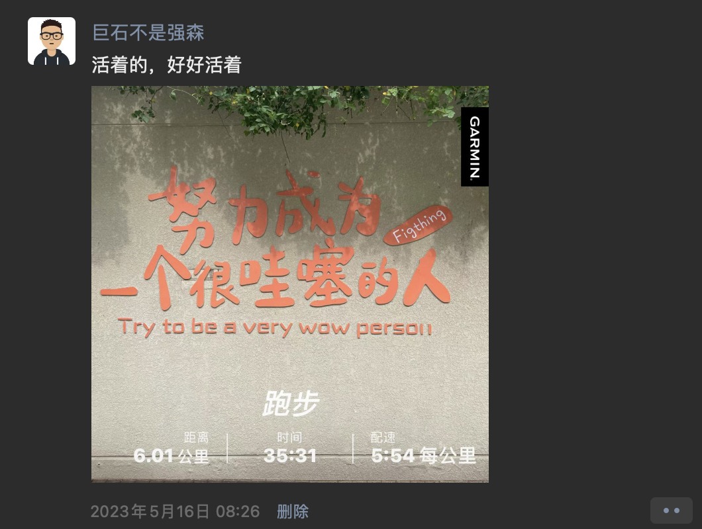

# 他在朝我挥手

我步履蹒跚，望向前方有些模糊地身影，他在朝我挥手……

## 提问

2012年，创业大厦，我在约定时间之前来到会议室，静候一场即将到来的技术面基[^gay]。

当憨态可掬的 **耗子** [^haoel]款步进门时，他愣了一下，小会议室里站着的人紧忙挪出道来，以便他能走到大家的中央。随后，他侃侃而谈，细节我已模糊不清了，但那天整个房间里的基情，余温尚存。

在最后的提问环节，我问到：“你觉得你在阿里能待多久？”

他轻轻一笑，答：“应该很久吧。”

我也笑着点了头。

## Rework

2016年下半年，公司发展势头很猛，团队扩张也很快。然而，我对自己的工作状态并不满意。尤其在读完《**Rework**》[^rework]之后，我就心念念国内怎么没有听说存在这样小而美的团队呢？

在朋友间的私下交流中得知 **耗子** 正在组建一个团队，与我非常对味。经朋友牵线，有了我们第二次面基，只不过这次只有我们俩。

我们聊起《**Rework**》，彼此兴奋不已。他依旧侃侃而谈：团队，产品，创业。

我也依旧想不起更多的细节，除了这一幕：

我问他，“你还记得上次我问你在阿里能待多久吗？”

他笑了，我也笑了。但他不知道的是，我暗自说了句：“**I'm in!**”

## 抚仙湖

2017年，团队已经有8个人了，**耗子** 考虑到大家没有见过彼此的真人，需要一次线下聚会来加深团队之间的联系，于是我们相约在了四月的昆明。

三维世界里的立体接触，让每个鲜活的个性得以被真实的感受到，这是二维世界[^2d]永远无法做到的。

席间，我有问他：“有没有说你像老罗[^lyh]啊？”

他认真的思考片刻，笑着回：“好像有吧。”

无论他是否认同，反正我眼中的他，和老罗一样，理想，偏执，还有点喘[^fat] :P。

## 司马台

有了上一次愉快的团队聚会，第二次又如期而至了。

爬长城对于 **耗子** 而言，着实是个挑战，好在叠上了团队鼓励的 Buff ，他登顶了，也就有了这张大家坐而论道的照片。

第二天，iPhoneX 发布了，我和他聊起我要第一时间订购一台。

他不解的问我为何。我讲，这次 FaceID 背后的软硬结合应用案例，对于应用开发者而言，是很有启发性的，极富想象空间，巴拉巴拉[^more]。他随即打断了我，说：“你别花钱了，我给大家人手配一部。”

## 试炼

临近年底，团队和产品有了一次意义重大的试炼。这次聚会的主要议题，就是产品的方向与边界，分歧时有发生。

当时，APM[^apm] 相关产品或解决方案，一方面，商业上海外有[New Relic](https://newrelic.com/), 国内有[One APM](https://www.oneapm.com/)；另一方面，开源社区有 [Skywalking](https://skywalking.apache.org/)。我有明显感受到来自竞品的压力，日常工作交流中，我禁不住将焦虑传递到团队中，并迫切的希望我的应对之策可以被团队采纳。

此时，**耗子** 的回应是：

> 我们的APM是帮助用户做体验和快速定位问题，也就是说，我们的产品灵魂是更高的维度。最关键的是，我们还能自动化的发现和解决问题。

> 2B的行业有数十万亿的市场，机会很多，没有哪个产品可以全部吃下来。一方面，一个软件的成功还有看三个事，底层是产品和技术，中层是案例，上层是商业或是服务。另一方面，就算是客户愿意投入时间和人力自己解决，也不一定能解决，这其中还有客户技术能力的问题。

> 总之，我觉得我们还是把心思花在怎么为用户提供更好的产品和体验上来。市场足够大，竞争总是会有的，都是好事。
> 创业就是要盲目的乐观，哈哈哈。

## 聚散有时

在上一个岔路口，我选择分道扬镳了，怀揣着自己的执念，继续了解这个世界。

可不知为何，总能看到前方一个模糊的身影，是他在向我挥手。

[^gay]: 戏指志趣相投的男人们在线下的聚会。
[^haoel]: 陈皓，网名左耳朵耗子，简称耗子，https://coolshell.cn/haoel 。
[^rework]: https://basecamp.com/books/rework ， 国内翻译为“重来”。
[^2d]: 意指各种屏幕。
[^lyh]: 罗永浩。
[^fat]: 体态圆润。
[^more]: 此处省略一万字。
[^apm]: Application Performance Management