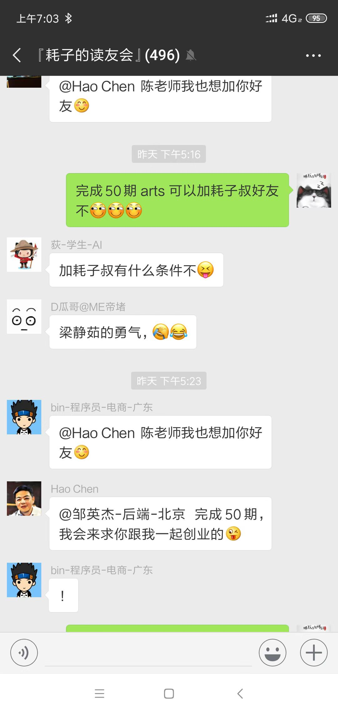
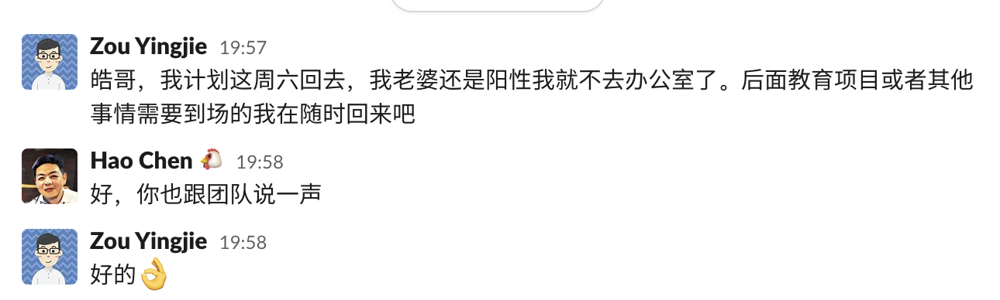
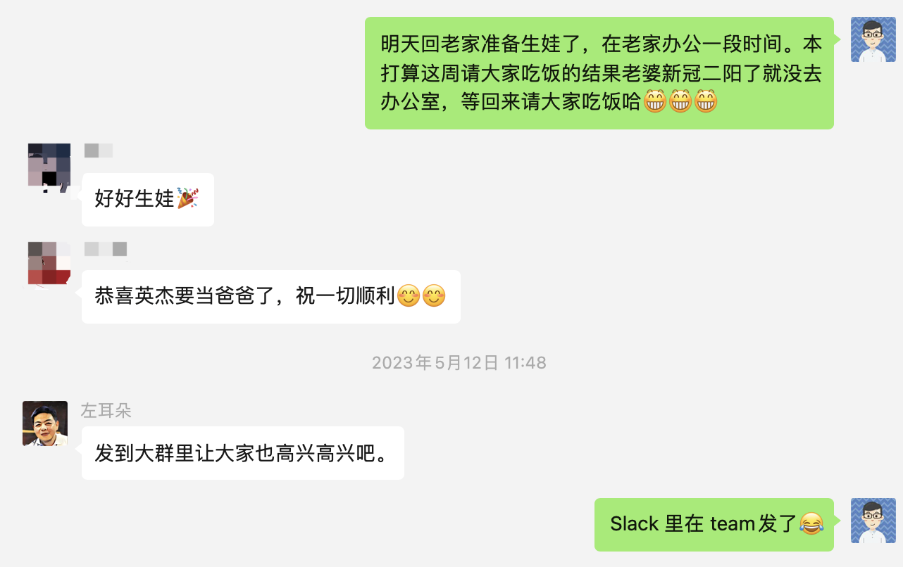

- 2017 上半年，初到北京后的一天拜访秋哥，秋哥说了句『我以为自个挺厉害了没想到陈皓比我还厉害』。当时纳闷了下陈皓是谁，秋哥提了句左耳朵耗子才想到微博上好像是关注了这么位大神。

- 2017.10.17 ，极客时间举行了发布会，自己看了直播和皓哥的演讲，随后订阅了皓哥的专栏。

- 2018.06.24，加入了皓哥组织的 ARTS 打卡，写下了第一期 ARTS。

- 2019.08.03，完成了第 52 期 ARTS 打卡，并心血来潮的写了《ARTS 周年记》 ，晚上皓哥问我要不要来一起创业。

- 2019.08.05，和皓哥面聊了下，很开心，得到了一个新的机会，也是一个挑战。

- 2019.09.02，学校开学了，自己也加入了皓哥的公司 MegaEase，开始了新的征程。

- 2023.05.13 自己离开北京回老家准备生娃，皓哥在这一天突发心梗离去。前两天发的告别，此刻竟变成了永别。

加入皓哥公司以来，自己一般隔段时间都会在周末找皓哥吃个饭、看个电影啥的，顺便聊关于工作、成长的各种问题。离开北京前一直想在约一次，但一直拖延，最后因为新冠二阳也没约成，现在也不会再有机会了。再也没有机会在吃饭时听皓哥激情澎湃的吐槽，再也没有机会在工作时听皓哥对自己各种严厉又细致的指导。自己少了一位工作中不断鞭策自己进步的老板，也失去了一位人生中指点迷津的导师。

真正的离别，没有桃花潭水，也没有长亭古道。只不过在那样一个洒满阳光的早晨，有些人就永远留在了昨天。皓哥走了，但 MegaEase 还在，皓哥未竟的事业还在，我会陪 MegaEase 一直走下去，我也会一直以皓哥为榜样，永远成长，永远斗志昂扬。

**芝兰生于深谷，不以无人而不芳**

**君子修身养德，不以穷困而改志**

---

### 起点

### 终点

